# 2026-08-27 总归档：Mass 动态 25 人控制组与双端平滑同步

- 对应需求文档：[Mass 双端同步架构草案 v0.3](../RequirementDocument/20260827-Mass双端同步架构草案.md)
- 对应开发文档：[Mass 双端同步架构草案 — 技术方案](../DevelopmentDocumentation/20260827-Mass双端同步架构草案.md)
- 对应玩法记录：[指挥官](../Gameplay/指挥官.md)
- 变更类型：C++ | Mass Entity | 网络同步 | Navigation | UI/HUD | 内容资产 | 地图 | 配置 | 自动化测试 | 开发工具
- 引擎基线：Unreal Engine 5.7.4，CL 51494982
- 实施地图：`/Game/Maps/LVL_CommanderMassPrototype`
- Landscape 来源：`/Game/Maps/LVL_Main`；原始 `LVL_Main` 未保存修改
- 单位代理来源：`/Game/Assets/Arma/FourFRobot`
- 归档口径：本篇归档本轮已经实现并有证据的 500 人功能、最终可靠命令链和受损网络平滑基线；它不是性能、复杂导航、流场默认开启、seamless travel 或正式 Dedicated Server 打包的最终验收

## 一、最终交付结论

本轮把早期“永久 25 人 CommandGroup + 5Hz 组摘要直驱客户端”的原型，迁移为“500 名永久独立 Soldier + 每次选择临时生成最多 25 人 ControlCohort + 每次命令生成独立 OrderFormation”的服务端权威架构。

玩家现在可以用三档圆形选区点击战场。即使只命中一名小兵，服务端也会把该兵作为种子，尝试从附近同队可控单位中补成最多 25 人；下一次选择可以重新组合，25 人不再是永久编制。右键移动后，服务端负责成员合法性、订单覆盖、NavMesh 路径、编队槽位、Mass Avoidance、位置、速度、朝向、生命与碰撞事实；客户端只负责即时反馈、插值和短时表现预测。

| 交付面 | 当前结果 | 证据边界 |
|---|---|---|
| 人口与身份 | 500 个独立服务端 Mass Entity；`SoldierId` 在本局唯一、不复用，与 Cohort/Order/复制块解耦 | FinalReliable PIE 记录 500 个独立 Soldier 和 500/500 Commander NavMesh 投射 |
| 动态选择 | 单兵命中可自动形成含该兵的 25 人 Cohort；26 个种子拆为两组；支持 Replace、Shift/Toggle、欠编、空圆、死亡不补员 | Cohort Automation 3 项通过；PIE smoke `dynamic_members=25` |
| 权威移动 | 每个 OrderFormation 一条共享 `CommanderSoldier` NavMesh 路径；途中 1–5 列弹性编队，到达完整 5×5；Mass Avoidance 与逐兵局部分离共同处理软碰撞 | Navigation Automation 6 项通过；PIE smoke 移动 1813cm |
| 网络事实 | Soldier FastArray 可靠复制身份、队伍、生命、Revision、ActiveOrderId；命令采用 Fast Intent + Reliable fallback | FinalReliable 首连、空服重连均 PASS |
| 网络运动 | 服务端 30Hz 模拟、10Hz 捕获全体精确帧；当前 500 人通常为 16 个动态 PoseChunk，错峰到 3 个模拟 Tick | 首连/重连带宽 p95 为 0.794/0.784Mbps；压缩错误和权威姿态不连续均为 0 |
| 客户端平滑 | 100ms Hermite/Yaw 插值、最多 100ms 外推、250ms/450cm 纯表现预测、150ms 阻尼收敛 | 受损网络 step p95 为 9.0/11.3cm，未标记硬跳为 0 |
| 表现与 UI | 稳定 ISM 池、三态脚环、动态 Cohort 卡、三档选区、小地图、视野框、相机聚焦、三态流水命令线 | 1920×1080 Final 截图和 PIE JSON 已核对 |
| 局部流场 | 500cm 单元、64×64 瓦片、异步积分和版本化安装代码已接入；失败时回退共享路径 | `LocalFlowField` Automation 通过；真实拥堵与性能 Gate 未完成，默认关闭 |

最终视觉证据：

截图可确认：Landscape 亮度可读、25 个金色选中脚环、其他单位队伍色脚环、右上地形小地图/兵点/相机视野框、底部 `COHORT 3 / 25/25 / ORDER 3` 卡片以及左下三档选区按钮。截图只证明视觉呈现，不替代小地图连续点击和跳转手感的人工验收。

## 二、需求澄清后锁定的架构决策

### 2.1 “25 人一组”的最终含义

- 25 人是玩家可操控的最小组织粒度，不是永久编制。
- Soldier 在整个 MatchEpoch 内永久独立；身份只由 `FGuLiSoldierId` 表示。
- `ControlCohort` 只属于一次已确认选择，容量 1–25；成员在当前 `SelectionRevision` 内冻结。
- `OrderFormation` 只属于一次已接受命令；它复制下令瞬间的存活成员，之后独立运行。
- `ReplicationCluster/PoseChunk` 只用于网络压缩和空间分块，没有玩家控制语义。
- 初始出生代码仍使用 5×5 阵列方便摆放 500 人，但这个“出生阵列”不构成永久控制组。

### 2.2 双端权威边界

服务端拥有以下唯一事实写入权：

- Soldier 身份、队伍、生命、摧毁状态和残骸生命周期。
- 选择请求合法性、动态 Cohort 成员、SelectionRevision。
- Move 请求合法性、OrderId、ActiveOrderId、路径接受/拒绝。
- NavMesh 路径、流场安装、槽位分配、速度、Transform、朝向、碰撞与伤亡。
- Reliable FastArray 和 10Hz PoseChunk 的生成。

客户端只拥有以下表现职责：

- 输入意图、选择圆、目标点与等待确认状态。
- 插值后的显示 Transform、ISM 实例和脚环颜色。
- 最长 250ms、最多 450cm 的纯表现预测。
- HUD、Cohort 卡片、小地图和命令线。

客户端预测不参与碰撞、命中、选择查询、伤亡或服务端状态；未知 SoldierId 的 Pose 样本不能创建权威身份。

### 2.3 四种 ID/容器不能混用

| 名称 | 生命周期 | 用途 | 禁止用途 |
|---|---|---|---|
| `SoldierId` | MatchEpoch | 永久士兵身份；可靠状态、Pose、选择和订单的连接键 | 不编码 Team、Cohort、Slot 或 Chunk |
| `ControlCohortId` | SelectionRevision | 临时控制组和底部 UI 卡片 | 不作为永久部队编号 |
| `OrderId/OrderFormation` | 一次已接受订单 | 路径、槽位、ActiveOrderId 和移动状态 | 不反向决定选择成员 |
| `FrameSequence/ChunkIndex` | 一次 10Hz 捕获帧 | 不可靠运动流的排序和分片 | 不具备控制或生命语义 |

文档语义版本为 v0.3；当前线协议常量 `GULI_COMMANDER_PROTOCOL_VERSION` 的数值为 `2`，两者不要混为同一编号。

## 三、完整变更清单

### 3.1 项目配置与 Target

| 文件 | 变更 |
|---|---|
| `Config/DefaultEngine.ini` | 保留默认 34cm Nav Agent，新增 `CommanderSoldier`：半径 750cm、高度 144cm、查询范围 750×750×5000cm；Recast TileSize 1000→5000、CellSize 19→50、CellHeight 10→25、同时生成任务 1024→8、ForceRebuildOnLoad True→False，RuntimeGeneration 保持 Dynamic；未把 Commander 半径覆盖到旧玩法的 Default Agent。 |
| `Config/DefaultGame.ini` | 增加 Authority 流场开关与采样预算；增加客户端插值、外推、硬校正、预测、纠偏和残骸时长默认值。 |
| `Source/GuLiStrike/GuLiStrike.Build.cs` | 增加 `NetCore`、MassEntity/MassCommon/MassActors/MassSpawner/MassSimulation/MassSignals/MassRepresentation/MassLOD/MassMovement/MassNavigation/MassNavMeshNavigation/MassZoneGraphNavigation/MassCrowd/MassAIBehavior、ZoneGraph 等依赖；沿用 NavigationSystem、UMG、Slate、EnhancedInput。 |
| `Source/GuLiStrikeServer.Target.cs` | 新增 `TargetType.Server` 目标定义；Launcher 引擎不能正式构建该 Target，保留给源码引擎环境。 |

`DefaultInput.ini` 没有新增 Commander 配置；当前输入全部由 `AGuLiCommanderPlayerController` 的 C++ Key Binding 建立。

当前仍是单一 `GuLiStrike` Runtime 模块，没有为了原型提前拆出新的网络或 UI 模块。Commander 公共反射类型集中在 `Commander/Network`；Framework、Mass、Navigation 和 Presentation 依赖保持单向语义，客户端表现层不持有 Authority 写入口。

### 3.2 Framework：比赛、角色、输入、命令通道

`Source/GuLiStrike/Commander/` 本轮共新增 40 个源码文件：17 个头文件、23 个 `.cpp`；按职责分为 Editor 1、Framework 14、Mass 14、Network 5、Presentation 6。

| 文件 | 类/职责 |
|---|---|
| `Commander/Framework/GuLiCommanderGameMode.h/.cpp` | `AGuLiCommanderGameMode`：设置 Commander GameState/PlayerState/Controller/CameraPawn/HUD；初始化比赛、500 人 Authority、SoldierStateReplicator 和 PresentationActor；连接时分配角色与 Bootstrap；每 3 个模拟 Tick 捕获 Pose 并把 Chunk 错峰分发；`bUseSeamlessTravel=true` 已设置，但真实 travel Gate 未完成。 |
| `Commander/Framework/GuLiCommanderGameState.h/.cpp` | `AGuLiCommanderGameState`：复制 ProtocolVersion、MatchEpoch、MatchId 和 10 个角色槽；每队 1 个 Commander、2 个 Ground、2 个 Air，额外连接为 Observer；只有 Commander 能下发本原型命令。 |
| `Commander/Framework/GuLiCommanderPlayerState.h/.cpp` | `AGuLiCommanderPlayerState`：复制 PlayerGuid、Team、Role、SlotIndex 和 `bSyncReady`，为服务器权限检查和客户端 UI 提供连接身份。 |
| `Commander/Framework/GuLiCommanderPlayerController.h/.cpp` | `AGuLiCommanderPlayerController`：LMB 选择、Shift+LMB Toggle、RMB 移动、Esc 清空、1/2/3 切换选区、WASD 平移、Q/E 旋转、滚轮缩放；阻断小地图和底部 UI 上的世界命令；管理预测和命令线生命周期。 |
| `Commander/Framework/GuLiCommanderNetSyncComponent.h/.cpp` | Owner Channel：Bootstrap/PoseReady、OwnerOnly SelectionState、Fast+Reliable 命令、ACK FIFO、PoseChunk 接收队列、Revision 串行化、重连清理和频率限制。 |
| `Commander/Framework/GuLiCommanderDebugCommands.cpp` | 非 Shipping 调试命令：`gs.DamageSelected`、`gs.Commander.SmokeCommandFlow`，用于选中成员伤害及完整选择/移动/死亡 smoke。 |
| `Commander/Framework/GuLiCommanderNetworkGateValidation.h/.cpp` | 受损网络 Gate 的证据结构和判定：RTT/抖动/丢包、ACK p95、带宽、fresh pose、步长 p95、移动距离、Pose gap 与硬跳。 |
| `Commander/Framework/GuLiCommanderNetworkGateCommands.cpp` | `gs.Commander.NetworkGate [move_ack_samples]`：在真实 Client 进程自动选择、连续下令、采样表现和输出 PASS/FAIL。 |

### 3.3 Mass：权威世界、选择、导航、编队与流场

| 文件 | 类/职责 |
|---|---|
| `Commander/Mass/GuLiCommanderMassFragments.h/.cpp` | `FGuLiMassIdentityFragment`、Health、Order、SlotTarget、AvoidanceOutput，以及 ServerAuthority/ClientSnapshotMirror 标签；客户端镜像没有 Movement/Avoidance 标签。 |
| `Commander/Mass/GuLiControlCohortBuilder.h/.cpp` | 纯确定性动态分组算法：圆内种子、动态质心、25 人容量、300m 补员与 SoldierId 平局规则。 |
| `Commander/Mass/GuLiBattleAuthoritySubsystem.h/.cpp` | `UGuLiBattleAuthoritySubsystem`：30Hz 固定步、500 人注册表、100m 空间哈希、选择、订单、Hungarian 槽位、共享路径、移动、避碰、地面贴合、生命、流场、可靠状态快照和 PoseChunk 捕获。 |
| `Commander/Mass/GuLiCommanderAvoidanceCaptureProcessor.h/.cpp` | 在引擎 Mass Avoidance 之后捕获 `FMassForceFragment` 到项目 Fragment，再清空源 Force；Authority 固定步消费已捕获值，避免渲染帧率重复积累。 |
| `Commander/Mass/Navigation/GuLiCommanderNavigationPolicy.h/.cpp` | 强制选择名为 `CommanderSoldier`、半径 750cm 的 NavData；终点 25 槽完整足迹、途中 1–5 列策略、最后有效路径方向、尾部过弯 Gate 和共享路径跟随方向。 |
| `Commander/Mass/Navigation/GuLiLocalFlowField.h/.cpp` | 64×64、500cm 单元的局部瓦片；8 邻域 Dijkstra 反向积分、方向采样、不可达回退，以及脱离 UObject 的异步构建数据。 |
| `Commander/Mass/Tests/GuLiControlCohortBuilderTests.cpp` | 3 个动态 Cohort Automation。 |
| `Commander/Mass/Navigation/Tests/GuLiCommanderNavigationPolicyTests.cpp` | 5 个导航策略 Automation；`GuLiLocalFlowField.cpp` 内另含 1 个流场 Automation。 |

### 3.4 Network：线协议、可靠事实与合同测试

| 文件 | 类/职责 |
|---|---|
| `Commander/Network/GuLiCommanderTypes.h/.cpp` | 所有 Commander 线类型与 NetSerialize：SoldierId、CohortId、Selection/Move Intent、SelectionState、CommandAck、Soldier FastArray Item、压缩 Pose Sample/Chunk；定义协议容量与量化常量。 |
| `Commander/Network/GuLiSoldierStateReplicator.h/.cpp` | `AGuLiSoldierStateReplicator`：可靠 FastArray 当前状态、SnapshotMatchEpoch、SnapshotRevision；处理名册、生命与 ActiveOrderId 的最终收敛。 |
| `Commander/Network/Tests/GuLiCommanderNetworkTests.cpp` | 9 个网络/协议 Automation，覆盖动态 Cohort、FastArray、PoseChunk、ACK FIFO、Bootstrap、Epoch、网络 Gate 证据和表现时钟。 |

### 3.5 Presentation：客户端镜像、相机和 HUD

| 文件 | 类/职责 |
|---|---|
| `Commander/Presentation/GuLiCommanderPresentationActor.h/.cpp` | 最多 500 人的客户端表现镜像；每兵最多 8 个姿态样本；服务器时钟估计、Hermite/Yaw 插值、外推、硬校正、预测收敛、诊断；稳定 Unit/Ring ISM 实例池和 `SoldierId -> InstanceIndex`。 |
| `Commander/Presentation/GuLiCommanderCameraPawn.h/.cpp` | 地形跟随 RTS 透视相机：WASD、Q/E、滚轮、Landscape 高度追踪和小地图聚焦；不是简单把摄像机固定抬高。 |
| `Commander/Presentation/GuLiCommanderHUD.h/.cpp` | 三档半透明圆形选区、动态 Cohort 卡、小地图地形/兵点/视野框、UI 命中保护及 Pending/Accepted/Rejected 流水命令线。 |
| `Commander/Editor/GuLiCommanderEditorCommands.cpp` | `gs.Commander.BuildFourFRobotProxy`：从 FourFRobot 资产构建本原型静态代理的编辑器工具命令。 |

### 3.6 内容资产与地图

| 资产 | 文件尺寸 | 结果 |
|---|---:|---|
| `/Game/Maps/LVL_CommanderMassPrototype` | 546,420,048B | 独立原型地图；使用从 `LVL_Main` 取得的 Landscape，显式使用 C++ Commander GameMode；原 `LVL_Main` 未保存改动。 |
| `/Game/Commander/Units/SM_CommanderFourFRobot` | 2,767,108B | 从 `/Game/Assets/Arma/FourFRobot/cannon_war_machine/SkeletalMeshes/cannon_war_machine` 制作的静态小兵代理；本轮不制作动画。编辑器命令在目标已存在时拒绝覆盖。 |
| `/Game/Commander/Units/M_CommanderUnitProxy` | 9,599B | 单位实例代理材质。 |
| `/Game/Commander/UI/M_CommanderUnitRing` | 15,055B | 脚环材质，通过 PerInstance CustomData 驱动队伍/选中/摧毁颜色。 |
| 原型图 NavMeshBounds | — | Origin `(0,0,8432)`，Extent `(280000,175000,40000)`；同一 Bounds 生成 Default 与 CommanderSoldier 两套 Recast NavData。 |

Commander Prototype 不是项目全局默认地图：`GameDefaultMap` 与 `EditorStartupMap` 仍为 `/Game/Maps/LVL_ShipTest`，全局默认 GameMode 仍是旧 Blueprint。所有本轮运行证据都依赖 `LVL_CommanderMassPrototype` 自身显式 GameMode Override。

### 3.7 编辑器自动化与证据脚本

| 脚本 | 用途 |
|---|---|
| `Scripts/commander_editor_probe.py` | 编辑器世界与 Commander 原型基础探针。 |
| `Scripts/configure_commander_nav_bounds.py` | 配置/检查原型图 NavMeshBounds。 |
| `Scripts/save_commander_level.py` | 保存 Commander 原型关卡并输出结构化结果。 |
| `Scripts/commander_start_pie.py` / `commander_stop_pie.py` | 可重复启动/停止 PIE，输出 JSON。 |
| `Scripts/validate_commander_nav_config.py` | 核对 SupportedAgents、RecastNavData 与 Bounds，输出 `CommanderNavConfigValidation.json`。 |
| `Scripts/validate_commander_pie.py` | 核对 UEDPIE World、角色、同步、ISM 数量和 NavData，并触发 smoke。 |
| `Scripts/capture_commander_instances.py` | 采集 Unit/Ring 实例状态。 |
| `Scripts/capture_commander_ui_final.py` | 请求 Final UI 截图并输出结构化 JSON。 |

## 四、服务端 Soldier 数据模型

### 4.1 线协议与容量

| 常量 | 当前值 | 说明 |
|---|---:|---|
| `GULI_COMMANDER_PROTOCOL_VERSION` | 2 | 线协议拒绝门；与文档 v0.3 分开维护 |
| `GULI_CONTROL_COHORT_TARGET_SIZE` | 25 | 临时 Cohort 上限/目标人数，允许欠编 |
| `GULI_MAX_CONTROL_COHORTS` | 400 | OwnerOnly SelectionState 协议上限，为未来规模预留 |
| `GULI_MAX_POSE_SAMPLES_PER_CHUNK` | 32 | 单 PoseChunk 最大样本数 |
| `GULI_POSE_CAPTURE_RATE_HZ` | 10 | 运动捕获频率 |
| `GULI_MAX_POSE_CHUNKS_PER_FRAME` | 512 | 未来万人帧与客户端队列共同上限 |
| `GULI_POSE_QUANTIZATION_CENTIMETERS` | 10cm | 位置/速度 int16 固定点量化单位 |

### 4.2 Mass Fragment

- `FGuLiMassIdentityFragment`：SoldierId、Team。
- `FGuLiMassHealthFragment`：Health、bDead、5 秒残骸窗口。
- `FGuLiMassOrderFragment`：ActiveOrderId、OrderRevision、FormationTarget、是否存在 MoveTarget。
- `FGuLiMassSlotTargetFragment`：当前订单的 LocalOffset 和 WorldTarget。
- `FGuLiMassAvoidanceOutputFragment`：引擎 Avoidance 计算结果的项目侧快照。
- 服务端 Archetype 名为 `GuLiServerAuthority500DynamicSoldiers`，包含 `FMassTransformFragment`、`FMassVelocityFragment`、`FMassMoveTargetFragment`、`FMassForceFragment`、`FAgentRadiusFragment=750cm`、NavigationEdges、NavigationObstacleGridCellLocation 及导航/避碰所需 Fragment。
- `FGuLiServerAuthorityMassTag` 只标记服务器 500 人 Archetype。
- `FGuLiClientSnapshotMirrorMassTag` 的客户端镜像故意不带 Movement/Force/Navigation/Avoidance 查询条件，避免双写 Transform。

### 4.3 初始人口

- `10 个出生阵列/队 × 2 队 × 25 人 = 500 人`，红蓝各 250。
- 每个出生阵列是 5×5 的初始摆位工具，不是永久 CommandGroup。
- SoldierId 从非零值单调分配；溢出时跳过 0，不复用本局旧身份。
- FinalReliable PIE 中 500/500 出生点成功投射到 `CommanderSoldier` NavData。
- 红方初始部署中心为 `(-221397,130463,0)`，蓝方为 `(221397,-130463,0)`；出生阵列间距 15000cm，成员间距 1800cm。

## 五、动态选择算法

### 5.1 客户端只发送意图

`FGuLiSelectionRequest` 只包含：

- 世界圆心 `Center`。
- `Small/Medium/Large` 半径档，分别为 8000/20000/45000cm，即 80/200/450m。
- `Replace/Toggle/Clear`；其中 Toggle 对应交互语义中的 Shift 整组切换。
- `ClientRequestId` 和 `KnownSelectionRevision`。

RPC 中没有 SoldierId 数组，客户端不能自报成员。

### 5.2 权威查询与分组步骤

1. 服务器使用最新 Authority Transform 更新 10000cm（100m）XY 空间哈希。
2. 只查询圆覆盖的格子，过滤死亡、敌军、不可控和重复 Soldier。
3. 圆内候选按距圆心升序，等距时按 SoldierId 升序。
4. 从最近未分配种子创建新 Cohort；以动态质心为基准继续吸收最近的圆内种子，最多 25 人。
5. 仅最后一个欠编 Cohort 尝试从圆外未分配友军补员；每加入一人更新质心，下一人距离新质心不得超过 30000cm（300m）。
6. 圆内没有有效种子时禁止从圆外凭空拉人；全场友军不足时允许欠编。
7. Replace 重新生成当前选择；Shift/Toggle 命中旧 Cohort 任一成员时整组移除，保留组不重新分配，新增成员另组。
8. 成员关系实际改变时服务器分配 CohortId 并递增 SelectionRevision；无变化请求仍可 Accepted，但不伪增 Revision。成员在该 Revision 内冻结。

### 5.3 死亡与选择关系

- Cohort 成员死亡不自动补员，AliveCount 和状态通过可靠状态刷新。
- 全组摧毁后从选择集中移除并递增 SelectionRevision。
- Soldier 摧毁后单位模型立即隐藏，暗红脚环按 5 秒残骸生命周期继续显示后再隐藏；摧毁单位不再可选。
- 仅重新选择、Clear 或 Esc 不会停止 Soldier 已在执行的旧订单。
- Cohort 卡片只有在所有存活成员的 ActiveOrderId 一致时才显示共同 Order；混合订单不会伪装成同一编队状态。

## 六、命令与 OrderFormation

1. `FGuLiMoveRequest` 只含 Target、SelectionRevision、ClientCommandId。
2. 服务端以请求的 SelectionRevision 原子解析当前冻结 Cohorts；旧 Revision 整体拒绝。
3. 每个 Cohort 复制下令时仍存活、同队、可控的成员，建立独立 OrderFormation。
4. 每个批次共享 BatchOrderId，但每个 Cohort 有独立 Accepted/Rejected 结果，允许部分成功。
5. 目标必须投射到 `CommanderSoldier` NavMesh，并通过完整 5×5 终点足迹检查；失败返回 `PathFailed`，不会直线穿越不可走区域。
6. 命令接受后写 Soldier 的最新 ActiveOrderId；同一 Soldier 自动退出旧 Formation。
7. 旧 Formation 的剩余成员继续执行，成员变化后重新进行确定性槽位分配。
8. OrderFormation 在全部成员死亡、被新订单接管、到达并停稳或服务器取消时结束。

## 七、服务端 Mass 移动、导航和碰撞

### 7.1 固定步与处理顺序

- Authority 使用 `1/30s` 固定步，最大只累计 4 个固定步，避免服务器卡顿后无限追帧。
- 每步顺序为：请求消费 → 路径/版本检查 → 槽位/流场 → 引擎 Mass steering/avoidance → 项目固定步积分 → Yaw/地面贴合 → 生命/空间哈希 → 状态与 Pose 捕获。
- 移动速度默认 1800cm/s，朝向变化默认 90°/s。
- 每个 Soldier 的碰撞语义是半径 750cm 的服务端 Mass Agent 与 Avoidance，不创建 500 个 Chaos 刚体或 500 个 Character Capsule。
- 每 6 个 Simulation Tick（约 5Hz）进行地面/Nav 重投影；固定步最多补跑 4 次，避免积压失控。

### 7.2 共享 NavMesh 路径

- 每个 OrderFormation 只请求一条共享、非 Partial 的 NavMesh 路径，不为 25 人重复寻路。
- 只允许名为 `CommanderSoldier` 且 AgentRadius=750cm 的 SupportedAgent；找不到时拒绝，不回退默认 34cm NavData。
- 导航 Generation 变化会增加 PathRevision 并重建路径；失败时清路径、清旧流场并冻结 Formation。
- 终点验证必须取得 25 个槽位全部可走；中心点可走但边缘槽位越界同样拒绝。

### 7.3 弹性编队

- 最终阵形为 5×5，成员中心距 1800cm。
- 途中根据走廊宽度选择 1–5 列，终点再恢复完整 5 列。
- 槽位/目标组块采用最多 25×25 Hungarian 确定性最小移动代价分配；代价相同时用 SoldierId/SlotIndex 破平。
- 共享路径引导权重 70%，槽位修正最多 30%，避免士兵为了抢槽位大幅横穿队伍。
- 编队 Guide 最大领先 9000cm；Waypoint 容差 1800cm；到达容差 500cm。
- 多 Cohort 同批目标锚点间距 14000cm；确定性手动分离强度为 0.85，并与 Mass MovingAvoidance 合流。
- 最后一段使用末尾非退化 Path Segment 固定朝向；只有所有仍存活且仍跟随本订单的成员越过最后转弯尾部 Gate 后才扩展 5×5，避免领队到达即横向展开、后排切角。

### 7.4 Mass Avoidance 合流

- 引擎 Mass Avoidance 先写 `FMassForceFragment`。
- `UGuLiCommanderAvoidanceCaptureProcessor` 在对应阶段把力复制到 `FGuLiMassAvoidanceOutputFragment` 并清空源值。
- 30Hz Authority 固定步读取该输出，与共享路径、槽位修正及当前保留的逐兵局部分离力合流。
- MovingAvoidance 当前 Detection Distance 为 AgentRadius×8，即 6000cm；Separation Radius Scale=0.95，Obstacle Separation 与 Predictive Avoidance 均为 Radius×0.35，并使用 Code Driven Movement。
- 这一方案只解决移动软碰撞；未来战斗命中代理仍需独立设计。

### 7.5 局部流场阶段

- 走廊半宽 15000cm（150m）。
- 单元 500cm，单瓦片 64×64，共 4096 单元。
- GameThread 每 Tick 最多采样 512 个 Walkability 单元；异步线程只接收已脱离 UObject 的 Walkable/TraversalCost 数据。
- 当前总预算为 512 格/Tick，单 Formation 每 Tick 最多使用 128 格；一个 64×64 Tile 的世界尺寸为 320m×320m。
- 后台以 8 邻域 Dijkstra 从目标反向积分，生成每格最低成本和下降方向。
- 安装键为 OrderId、NavigationGeneration、PathRevision、PathPointIndex、TileCoordinate；任何字段过期即丢弃异步结果。
- 有效 FlowDirection 是主方向，SlotCorrection 受 30% 限制，Mass Avoidance 最终修正。
- 无场、不可达、构建失败或结果过期时自动回退共享 NavMesh 路径。
- `bEnableLocalFlowField=False`；在真实拥堵、缓存、导航失效和性能 Gate 完成前不得改成默认开启。

## 八、双端网络同步

### 8.1 可靠状态面

`AGuLiSoldierStateReplicator` 使用 FastArray 复制：

- SoldierId。
- Team。
- LifeState/Health。
- StateRevision。
- ActiveOrderId。
- SnapshotMatchEpoch 和 SnapshotRevision。

Replicator 是 AlwaysRelevant、禁用移动复制的 `AInfo`，`NetUpdateFrequency=20Hz`、`MinNetUpdateFrequency=2Hz`；只有 Dirty Item 进入 FastArray 增量复制。

死亡、队伍和订单归属不依赖不可靠 Pose 包。新连接或重连必须先完成 GameState MatchEpoch、可靠名册和 SnapshotRevision 的 Bootstrap，再打开 PoseReady。

### 8.2 不可靠运动面

每个 `FGuLiSoldierPoseChunk` 包含：

- ProtocolVersion、AuthorityEpoch。
- FrameSequence、ServerSimTick、ServerTimeSeconds。
- ChunkIndex、ChunkCount、空间 Anchor。
- 最多 32 个 Soldier 样本。
- 每个样本包含 SoldierId、10cm int16 相对 XYZ、10cm/s int16 速度、uint16 Yaw、ActiveOrderId、PoseState、Flags。

分块流程不是固定每 32 人盲切：先按 Team、空间/Morton 近邻和 SoldierId 排序，以首成员/当前块 Anchor 检查 signed-int16 十厘米范围；候选加入会令自己或块中旧成员饱和时，必须在该成员前拆块。这样避免远距离红蓝单位被同一 Anchor 编码时钳到 int16 极限。

### 8.3 捕获和错峰发送

- 服务端每 3 个 30Hz 模拟 Tick 捕获一次完整 500 人帧，即 10Hz。
- 当前地图通常产生 16 个 Chunk；GameMode 在 3 个模拟 Tick 中约按 6/6/4 错峰发送。
- 每帧轮转 Chunk 起始索引，避免固定尾块一直承受同一带宽/丢包位置。
- Chunk 可独立消费，不要求一帧全部到齐；每 Soldier 自己判断 FrameSequence 新旧。
- 没有 SyncReady 客户端时仍推进并丢弃当前可丢 Pose，避免一帧长期滞留；下一位重连者只从新捕获开始。
- 客户端 PendingPoseChunks 上限与协议同为 512；未知 SoldierId 直接丢弃，不据此创建名册。

### 8.4 低延迟命令与最终可靠性

客户端 `SubmitSelectionRequest/SubmitMoveRequest` 的时序：

1. t0 发送 Unreliable Fast Intent。
2. 15ms 尚无匹配 ACK，以同一 ID、同一 payload 再发一次 Fast。
3. 150ms 仍无 ACK，发送一次 Reliable fallback。
4. Fast 入口只回 Unreliable ACK；Reliable 入口只回 Reliable ACK，避免双重放大。

服务端为 Selection 和 Move 分别保留最近 canonical 请求与 ACK：

- 同 ID、同 payload 不重复执行，只回放缓存 ACK。
- 同 ID、不同 payload 返回 InvalidRequest，不能改变 Authority。
- 每 ID 的 Fast 缓存 ACK 最多回放 2 次；Reliable 回放不受 Fast cap 阻断。
- 新 MatchEpoch 清理命令 ID、canonical 缓存、频率和 replay 状态。
- Commander 请求速率上限为 10 次/秒，并限制安全日志刷屏。

客户端并发规则：

- Selection 只有一个 in-flight；后续最多 64 条 FIFO。
- 前一个 Selection ACK 返回后，用 `ServerSelectionRevision` 改写下一条 Selection 和延后 Move。
- Selection 待确认时的 Move 只保留最新目标，即 latest-wins。
- ACK 通过 `CommandKind + ClientCommandId` 精确匹配；旧 Move ACK 不会清掉新的 Pending Move。
- 通用 ACK FIFO 最大 64；当前 HUD 去重只记最后一个 `(CommandKind, CommandId)`，交错迟到 ACK 理论上可能重复刷新一次 LastCommandAck，但 pending/expected ID 过滤保证不会推进错误队列、破坏预测或污染 NetworkGate。该项为非阻断 P2。
- 当前 canonical 幂等缓存是“最新一条 Selection + 最新一条 Move”的精确请求/ACK，不是 32–64 项历史环形缓存；更旧 Serial 作为 Duplicate 拒绝且不重新改变玩法状态。

## 九、客户端插值、外推和即时预测

### 9.1 Bootstrap 和镜像

- ClientSnapshotMirror 只在可靠 Soldier 名册存在后建立。
- SyncGeneration 或 MatchEpoch 变化会清空 Pending Pose、样本缓冲、命令 FIFO、延后 Move、ACK 去重与预测。
- 客户端未完成门禁时每 2 秒请求 Bootstrap 重发；服务端同一 MatchEpoch 不会因此反复递增 SyncGeneration。
- 客户端镜像没有 Movement/Avoidance Fragment；只有 PresentationActor 能写显示 Transform。
- 每个 Soldier 最多保留 8 个新鲜样本，按服务器时间和 FrameSequence 排序。

### 9.2 服务器时钟

- 首选 `UNetConnection::AvgLag` 作为 RTT 观测；不可用时回退 PlayerState RawPing。
- Pose 到达时以服务器时间戳加 RTT/2 估算“客户端收到包时的服务器现在”。
- 客户端每渲染帧推进估算时钟，只允许有限的向前修正，避免网络抖动直接造成显示时间跳变。
- 最终渲染时间为估算服务器时间减 100ms 插值回看窗口。

### 9.3 平滑规则

- 前后两个样本齐全时，位置使用带速度切线的 Hermite 插值。
- Yaw 使用最短弧插值；没有动画，但位置、旋转和地面贴合持续更新。
- 缺少下一帧时最多按最新速度外推 100ms，之后保持。
- Teleport flag 或表现误差超过 1000cm 才允许硬校正。
- 每兵记录 Pose 收包间隔、Frame/ServerTime gap、Anchor、相对坐标、最大表现步长和硬跳原因；服务器也记录超过 1000cm 的 Authority discontinuity 及超过 100cm 的压缩重建误差。

### 9.4 立即视觉预测

- RMB 点击后当帧显示目标和 Pending 流水线，并让已确认选择中的 Soldier 沿目标方向做表现预测。
- 预测最长 250ms，最大位移 450cm，不改碰撞、选取、命中或 Authority Fragment。
- 收到拒绝 ACK 后用 150ms 融回权威位置。
- 收到接受 ACK 后等待匹配 ActiveOrderId 的 Pose，同样以阻尼方式消除预测误差。
- 多 Cohort 部分失败时只回滚拒绝组，其他组继续。

## 十、表现、相机与指挥官 UI

### 10.1 稳定 ISM 实例池

- `AGuLiCommanderPresentationActor` 最多管理 500 名当前原型 Soldier。
- 永久维护 `SoldierId -> ISM InstanceIndex`；单位和脚环索引稳定。
- 每帧批量原位更新 Transform；数量变化只补实例或处理尾部，禁止周期性 `ClearInstances()`。
- 颜色只在选择或生命状态变化时更新 PerInstance CustomData。
- 选中金色 `(1.0, 0.82, 0.04, 0.95)`；红队红色、蓝队蓝色；摧毁为暗红色。
- 脚环高度 35cm，缩放 `(12,12,0.02)`；Soldier 摧毁后单位模型立即隐藏，暗红脚环继续保留 5 秒后隐藏。
- Unit/Ring ISM 均为 NoCollision、不影响导航、禁止复制；实例裁剪距离为 150000–500000cm，Ring 不投影。

### 10.2 RTS 相机

- 透视相机 FOV 45°、SpringArm 俯角 -55°、Camera Lag Speed 8。
- 默认臂长 80000cm；范围 20000–180000cm，滚轮倍率 1.18。
- W/A/S/D 或距屏幕边缘 8px 内平移、Q/E 旋转、滚轮缩放；移动速度随当前相机高度缩放并钳在 30000–230000cm/s。
- 相机 Pivot 每帧追踪 Landscape 高度，并在 ±380000cm 战场边界内活动。
- 小地图 LMB 可调用 `JumpToWorldLocation` 聚焦对应世界点。

### 10.3 HUD

- 当前实现为 C++ Canvas HUD，不是 UMG Widget；后续替换视觉层时不得绕过现有输入保护和网络状态来源。
- 1/2/3 三个半透明选区按钮；当前世界选区是 32 段青色半透明圆形轮廓而非填充 Decal，范围为 80/200/450m。
- 底部从固定 Group 卡迁移为当前 ControlCohort 卡，显示 CohortId、`Alive/25`、UNDER、ORDER 和 Pending/Moving/Rejected/Depleted 状态。
- 同屏最多画 10 张 Cohort 卡，超出时显示剩余数量。
- 右上小地图尺寸按屏高 28% 计算并钳在 190–512px；以 20×20 Landscape 高度采样生成简约地形底图。
- 小地图绘制可靠名册中的 Soldier、插值位置、队伍色、选中金色、摧毁状态和相机视野四边形。
- 小地图与底部 UI 是世界输入保护区；命中其 HitBox 后 LMB/RMB 不继续发选择/移动请求。
- 命令线分 Pending（橙黄虚线，2.5s）、Accepted（青绿发光实线，2.5s）、Rejected（红色反向流水和叉号，0.85s），均有 6–18 个流动箭头、目标脉冲和文字状态。
- 当前 CommandAck 不携带服务器修正后的 Nav 目标，因此命令线画的是客户端请求目标；若以后需要显示修正点，必须先扩展协议。

## 十一、关键问题与修复时间线

### 11.1 频闪

- 现象：动态单位和脚环持续闪烁。
- 根因：每 0.1 秒 `ClearInstances()` 全量重建，再叠加 HISM 动态层级树异步重建。
- 修复：改为 ISM 稳定实例池、SoldierId 稳定索引、批量 Transform 原位更新、状态变化时增量更新 CustomData。
- 保护规则：不得恢复周期性 ClearInstances 或 HISM 动态树重建。

### 11.2 场景过暗

- Directional Light 强度 `10 → 80`。
- SkyLight `1.5 → 2.0`。
- 固定曝光 EV100 `1 → 2`，曝光补偿 `1.0 → 1.25`。
- 雾密度 `0.036666 → 0.0025`，最大不透明度 `1.0 → 0.2`。
- Final 截图确认 Landscape 纹理、单位、脚环和 HUD 可同时辨认。

### 11.3 约 200ms 阶梯移动

- 根因不是服务器只以 5Hz 模拟；服务器原本已经 30Hz。
- 真正原因是客户端只收到 5Hz 组摘要，又以 10Hz 轮询直接套位置，没有样本缓冲和插值。
- 修复：10Hz 逐 Soldier Pose、每渲染帧 Hermite/Yaw 插值、100ms 回看、100ms 外推和短时预测。

### 11.4 Pose int16 饱和导致大跳

- 现象：客户端偶发约 1712cm 突跳。
- 根因：旧逻辑固定按 32 人切块，偶尔把远距离阵营/空间成员放在同一 Anchor 下；10cm signed-int16 相对位置被钳到边界。
- 修复：按 Team/空间/SoldierId 排序，并在每次加入候选前检查其与块内旧成员对新 Anchor 的可编码性，可能提前拆块。
- 诊断：Authority 压缩重建误差阈值 100cm、姿态不连续阈值 1000cm；FinalReliable 服务端两者计数均为 0。

### 11.5 空服重连先收到旧 Pose

- 现象：最后一个客户端离开时，PendingPoseChunks 不推进；同 MatchEpoch 重连后先消费长期滞留的旧帧。
- 修复：没有 SyncReady 客户端时照常推进/丢弃不可靠表现帧，下一连接完成 Bootstrap 后从当前新帧开始。
- 验证：服务端空服后新 Controller_1 重新 Join/Bootstrap，重连 Gate 未标记硬跳为 0。

### 11.6 受损网络 ACK 尾延迟

- 现象：仅 Reliable 命令在 5% 丢包环境受重传尾部影响，ACK p95 曾约 159–164ms，超过 150ms Gate。
- 修复：t0 Fast Intent、15ms 同 ID Fast retry、150ms Reliable fallback；server canonical payload 幂等、单运输 ACK、Selection FIFO 和 Move latest-wins。
- 最终：首连 ACK p95 97.8ms，重连 96.8ms。

### 11.7 最后一段编队切角/过早展开

- 根因：只按 Guide 到达判断展开，且重复终点可能提供退化方向；前排到达时后排尚未越过最后转弯。
- 修复：寻找最后非退化路径段冻结最终朝向，并要求所有仍跟随订单的活成员通过 TailClear Gate 后才恢复 5 列。
- 覆盖：`FinalPathFrameUsesTerminalSegment` 与 `FinalExpansionWaitsForTail` Automation。

## 十二、当前参数基线

| 分类 | 参数 | 当前值 |
|---|---|---:|
| 人口 | Soldier 总数 | 500（红/蓝各 250） |
| 控制 | ControlCohort 目标/上限 | 25 |
| 选择 | 小/中/大半径 | 80m / 200m / 450m |
| 选择 | 空间哈希单元 | 100m |
| 选择 | 自动补员最大动态质心距离 | 300m |
| 模拟 | Authority 固定步 | 30Hz |
| 移动 | 速度 | 1800cm/s |
| 移动 | 朝向速率 | 90°/s |
| 编队 | 到达阵形 | 5×5 |
| 编队 | 槽位中心距 | 1800cm |
| 编队 | 途中列数 | 1–5 |
| 编队 | 路径/槽位权重 | 70% / 30% |
| 碰撞 | Commander AgentRadius | 750cm |
| 网络 | Pose 捕获 | 10Hz，每 3 个模拟 Tick |
| 网络 | 单 Chunk 样本 | ≤32 |
| 网络 | 单帧 Chunk 协议上限 | 512 |
| 网络 | 量化 | 10cm / 10cm·s⁻¹ |
| 命令 | Fast retry / Reliable fallback | 15ms / 150ms |
| 命令 | Selection FIFO / ACK FIFO | 64 / 64 |
| 平滑 | 插值回看 / 最大外推 | 100ms / 100ms |
| 平滑 | 硬校正距离 | 1000cm |
| 预测 | 时长 / 最大位移 / 收敛 | 250ms / 450cm / 150ms |
| 残骸 | 显示时长 | 5s |
| 流场 | 走廊半宽 | 150m |
| 流场 | 网格 | 500cm，64×64 |
| 流场 | Walkability 预算 | 512 样本/Tick |
| 流场 | 默认状态 | OFF |
| Recast | TileSize / CellSize / CellHeight | 5000 / 50 / 25cm |
| Recast | 同时生成任务 / ForceRebuildOnLoad | 8 / False |
| Recast | RuntimeGeneration | Dynamic |

## 十三、验证证据

### 13.1 编译

- `GuLiStrikeEditor Win64 Development` 编译、链接通过。
- `GuLiStrike Win64 Development` 编译、链接通过。
- Progress 未单独保存最终 UBT build log，因此本归档不伪造编译日志链接；Final PIE 和 Game Client/Server 进程证明相应产物实际加载运行。
- `GuLiStrikeServer` Target 已定义，但 Launcher UE 5.7.4 明确拒绝正式 Server Target；正式 Dedicated Server 构建需要源码引擎。

### 13.2 Automation：18/18

最终日志：[CommanderDynamicCohortTests-FinalReliableFallback.log](../CommanderDynamicCohortTests-FinalReliableFallback.log)，`TEST COMPLETE. EXIT CODE: 0`。

| 分组 | 数量 | 通过项 |
|---|---:|---|
| Cohort | 3 | `FillDistanceAndEmptySelection`、`SingleSeedBuildsDynamicTwentyFive`、`TwentySixSeedsPartition` |
| Navigation | 6 | `DestinationFootprintGate`、`FinalExpansionWaitsForTail`、`FinalPathFrameUsesTerminalSegment`、`LocalFlowField`、`NamedNavDataContract`、`TransitColumnPolicy` |
| Network/Protocol | 9 | `AckRoutingAndFifo`、`BootstrapMatchEpochLifecycle`、`BootstrapSnapshotGate`、`DynamicCohortContract`、`NetworkGateEvidence`、`PoseChunkContract`、`PoseMatchEpochGate`、`PresentationServerClock`、`SoldierFastArrayContract` |

`PoseChunkContract` 的 32 样本全字段往返细节来自已编译测试源码；512 Chunk 上限是协议/客户端队列一致性合同，不是单独一项 Automation 测试。

### 13.3 PIE

- 日志：[CommanderDynamicPIE-FinalReliable.log](../CommanderDynamicPIE-FinalReliable.log)。
- Spawn：500 个 independent server-authoritative Mass Soldiers，500/500 投射 `CommanderSoldier` NavMesh，无永久 25 人组。
- 首次 Final smoke：`PASS nav=CommanderSoldier radius=750cm dynamic_members=25 moved=1813cm destroyed=25 unknown_id=rejected sim_tick=542`。
- [CommanderPIEValidation.json](../CommanderPIEValidation.json)：正确 UEDPIE World；Commander `sync_ready=true`、`is_commander=true`、Team=Red；UnitInstances=500、RingInstances=500；Default+CommanderSoldier 两套 NavData；1 个 Bounds；顶层 `errors=[]`。
- JSON 中 roster 三个 `ERROR` 字符串只是 Python 反射无法读取 C++ 私有属性，不能当作功能错误，也不能据此声称 roster 私有字段探针成功。
- [CommanderNavConfigValidation.json](../CommanderNavConfigValidation.json)：Default 34cm、CommanderSoldier 750cm、两套 Recast、1 Bounds、`errors=[]`。

### 13.4 严格受损网络首连

证据：[客户端](../CommanderNetworkFinalReliableClient.log)、[服务端](../CommanderNetworkFinalReliableServer.log)。测试配置为 `-PktLag=50 -PktLagVariance=30 -PktIncomingLagMin=50 -PktIncomingLagMax=50 -PktLoss=5 -PktIncomingLoss=5 -PktOrder=1`，Gate 解释为 100ms nominal RTT、±30ms 单向配置抖动（报告 jitter 60ms）、5% 丢包和乱序。

| 指标 | 结果 |
|---|---:|
| Selection ACK | 100.3ms |
| Move ACK | 20/20，平均 79.0ms，p95 97.8ms |
| 入站带宽 | 平均 0.761Mbps，p95 0.794Mbps |
| Fresh Pose Frame | 76 |
| 表现时钟 RTT | 71.4ms，来源 NetConnection |
| 表现步长 | 412 样本，p95 9.0cm |
| 实际表现行程 | 1809.4cm |
| 最大 Seed Pose Gap | 203.6ms |
| 未标记硬跳 / Teleport Snap | 0 / 0 |
| Presented Frame / 最大单步 | 1533 / 145.6cm |

### 13.5 空服后断线重连

证据：[重连客户端](../CommanderNetworkFinalReliableReconnectClient.log)、[同一服务端](../CommanderNetworkFinalReliableServer.log)。首个 Client 关闭后服务器保持空服，第二个 Client 以 Controller_1 重新 Join 并完成 Bootstrap Ready；这证明断开重连，不是 seamless travel。

| 指标 | 结果 |
|---|---:|
| Selection ACK | 84.1ms |
| Move ACK | 5/5，平均 86.2ms，p95 96.8ms |
| 入站带宽 | 平均 0.762Mbps，p95 0.784Mbps |
| Fresh Pose Frame | 34 |
| 表现时钟 RTT | 68.8ms，来源 NetConnection |
| 表现步长 | 433 样本，p95 11.3cm |
| 实际表现行程 | 3323.5cm |
| 最大 Pose Gap | 264.4ms |
| 未标记硬跳 / Teleport Snap | 0 / 0 |
| Presented Frame / 最大单步 | 686 / 310.3cm |

FinalReliable 服务端精确计数：`Authority pose compression error=0`、`Authority pose discontinuity=0`、冲突 duplicate/payload conflict=0、`LogGuLiStrike Error/Warning=0`。

## 十四、权限、安全与故障回退

- 所有选择/移动请求必须来自拥有该 NetSyncComponent 的连接，并要求 PlayerState 为 Commander、队伍可玩、Bootstrap SyncReady。
- 客户端不传 SoldierId；服务器使用权威空间位置和 Team 重建选择。
- 请求验证数值有限、Revision 新鲜、目标可投射、路径非 Partial；非法请求不会改变状态。
- 每连接 10 请求/秒限流，安全日志 1 秒节流。
- 同 ID 冲突 payload 返回 InvalidRequest；重复同 payload 幂等回放 ACK。
- Reliable Soldier State 与 Unreliable Pose 分离；丢运动包不会复活 Soldier 或改变 ActiveOrderId。
- ProtocolVersion、MatchEpoch、SyncGeneration、SnapshotRevision、RosterCount 共同控制 PoseReady。
- 流场无效、过期或失败回退共享路径；共享路径失败则冻结/拒绝，不走直线作弊路径。
- 客户端预测失败时阻尼回滚，不提交预测 Transform 给 Authority。

## 十五、未完成 Gate 与已知限制

以下内容没有足够证据，不能因为本次归档而改写为“已完成”：

1. 500 人可见、1080p 客户端 frame time p95≤16.7ms；Final 截图是 1080p，但不是性能采样。
2. 服务端 30Hz GameThread p95≤20ms、p99≤25ms。
3. 长时间会话、多客户端的带宽、内存、Actor Channel 队列和服务器扩展性。
4. 真实复杂场景矩阵：动态重组全边界、逐 Cohort 部分拒绝、交叉路线、复杂窄口 1–5 列压缩/恢复、坡地、NavMesh 边缘/不可达、终点完整足迹失败、500 人同时移动和长期重叠/穿地。
5. 流场真实局部障碍、拥堵、缓存复用、NavMesh 重建失效、异步过期、路径回退与默认开启前性能压力；当前必须保持 OFF。
6. 真正 seamless travel；现有证据只是断开、空服、新 Controller Join/Bootstrap。
7. 小地图点击聚焦命中范围、落点和连续操作手感人工复核。
8. 源码引擎正式 Dedicated Server Target、打包和部署验证。
9. 万人动态 ReplicationCluster Backend、Iris/Replication Graph 及同队多 Commander 控制权。
10. 低服务器帧率或一个 World Tick 内补跑多个固定步时，Pose 分片派发仍依赖 GameMode Tick，长期节奏需压力测试。

已知外部/非阻断问题：

- `Content/GuLiStrike/Blueprints/BP_GuLiStrikeGameMode.uasset` 是受版本控制的 130B 文件，AssetRegistry 报 Invalid PACKAGE_FILE_TAG，形态符合未还原的 Git LFS pointer。原型图显式使用 C++ `AGuLiCommanderGameMode`，本轮不受阻；默认图或打包前必须恢复。未经用户授权，本轮未执行 LFS 拉取或覆盖。
- Final PIE 启动阶段有两条无上下文 `LogAutomationTest: Error: Condition failed`，并有末尾 `LogCrowdFollowing` 找不到 Recast 的 warning；核心 smoke 在此前已经 PASS。这些被记录为编辑器/插件噪声与后续清理项，不能写成“PIE 全日志零错误”。
- 通用 HUD ACK 去重只记最后一个 key 的 P2 风险已记录；不影响 Authority、Selection FIFO、Move latest-wins、预测匹配或 NetworkGate。

## 十六、复现与后续接手顺序

1. 启动 UE 5.7.4，打开 `/Game/Maps/LVL_CommanderMassPrototype`；不要直接修改 `/Game/Maps/LVL_Main`。
2. 确认地图覆盖为 C++ `AGuLiCommanderGameMode`，并确认 Default/CommanderSoldier 两套 RecastNavMesh 与一个 Bounds。
3. PIE 后执行 `gs.Commander.SmokeCommandFlow`；预期记录 500 人、25 动态成员、有效移动、25 人摧毁和 unknown SoldierId 拒绝。
4. Automation 过滤 `GuLiStrike.Commander`；预期 Found 18、18 success、Exit Code 0。
5. 受损网络用独立 `UnrealEditor.exe -server` 与 Game Client 验证 `gs.Commander.NetworkGate`；不要把 Editor `-server` smoke 称为正式 Server Target。
6. 做任何性能结论前先退出 PIE，使用固定分辨率、固定单位可见范围和可复现订单脚本采样客户端/服务器 p95/p99。
7. 只有流场全部专项 Gate 通过后才把 `bEnableLocalFlowField` 改为 true。
8. 恢复项目默认地图或打包前先处理 130B Git LFS Blueprint；不要静默覆盖用户资产。

## 十七、当前游戏架构图（双端）

```mermaid
flowchart LR
    subgraph CLIENT["客户端：表现与输入域（无玩法权威）"]
        INPUT["玩家输入\nLMB/Shift 选择 · RMB 移动\n1/2/3 半径 · WASD/QE/滚轮"]
        PC["AGuLiCommanderPlayerController\n意图组装 · UI 命中保护\n预测/命令线生命周期"]
        CNS["UGuLiCommanderNetSyncComponent\nBootstrap/PoseReady\nSelection FIFO · Move latest-wins\nACK/Pose 接收队列"]
        MIRROR["ClientSnapshotMirror Mass\nSoldierId · Health · Transform\n无 Movement/Avoidance Fragment"]
        BUFFER["逐 Soldier 样本缓冲\n最多 8 样本 · Epoch/Sequence 过滤"]
        SMOOTH["AGuLiCommanderPresentationActor\n服务器时钟 - 100ms\nHermite/Yaw · 100ms 外推\n250ms/450cm 预测 · 150ms 收敛"]
        ISM["稳定 ISM 实例池\nSoldierId → InstanceIndex\n单位 Transform/朝向 · 三态脚环"]
        CAMERA["AGuLiCommanderCameraPawn\n透视 RTS 相机\n地形跟随 · 平移/旋转/缩放"]
        HUD["AGuLiCommanderHUD\n三档圆选 · Cohort 卡\n小地图/兵点/视野框\n三态流水命令线"]
        INPUT --> PC
        PC --> CNS
        CNS --> BUFFER
        BUFFER --> SMOOTH
        CNS -->|"可靠名册就绪后建立"| MIRROR
        SMOOTH -->|"唯一客户端显示 Transform 写者"| MIRROR
        SMOOTH --> ISM
        MIRROR --> ISM
        PC --> CAMERA
        PC --> HUD
        CAMERA --> HUD
        ISM --> HUD
    end

    subgraph WIRE["双端网络合同：Owner Actor Channel"]
        FAST["Unreliable Fast Intent\nt0 + 15ms 同 ID 重试"]
        RELCMD["Reliable Command Fallback\n150ms · canonical 幂等"]
        ACK["Fast/ Reliable ACK\nCommandKind + ClientCommandId\n逐 Cohort Accepted/Rejected"]
        STATE["Reliable FastArray\nSoldierId/Team/Life/Revision/ActiveOrderId\nSnapshotEpoch/Revision"]
        POSE["Unreliable PoseChunk @10Hz\n≤32 Soldier/Chunk · 10cm 量化\n动态 Anchor 拆块 · 当前约 16 Chunk/帧"]
        BOOT["Reliable Bootstrap Gate\nProtocol · MatchEpoch · SyncGeneration\nRosterCount · SnapshotRevision"]
    end

    subgraph SERVER["服务端：唯一玩法权威域"]
        GM["AGuLiCommanderGameMode\n连接/角色分配 · 500 人启动\n状态发布 · Pose 3 Tick 错峰"]
        GS["AGuLiCommanderGameState / PlayerState\nMatchEpoch · Team/Role/Slot\n每队 1 Commander · SyncReady"]
        SNS["Server NetSyncComponent\n权限/速率/Revision 校验\ncanonical payload · ACK 缓存"]
        AUTH["UGuLiBattleAuthoritySubsystem\n30Hz 固定步 · Soldier 注册表\n唯一 Authority Transform 写者"]
        HASH["100m 空间哈希\n存活/同队/可控过滤"]
        COHORT["动态 ControlCohort Builder\n圆内种子 · 动态质心\n≤25 · 300m 补员 · Replace/Shift"]
        ORDER["OrderFormation\nSelectionRevision 原子解析\nActiveOrderId 覆盖 · Hungarian 槽位"]
        NAV["CommanderSoldier NavMesh\nAgentRadius 750cm\n共享非 Partial 路径\n途中 1–5 列 · 终点 5×5"]
        FLOW["局部流场（默认 OFF）\n500cm · 64×64 · 异步积分\n版本过期丢弃 · 失败回退共享路径"]
        MASS["ServerAuthority500 Mass Archetype\nTransform/Velocity/MoveTarget/Force\nAgentRadius + Mass Avoidance\nYaw/地面贴合/生命/残骸"]
        CAPTURE["Avoidance Capture Processor\n引擎 Force → 项目输出 Fragment"]
        SNAP["快照生成\n可靠 SoldierState + 10Hz Pose\n压缩误差/Authority 跳变诊断"]
        GM --> GS
        GM --> AUTH
        SNS -->|"合法选择意图"| AUTH
        SNS -->|"合法移动意图"| AUTH
        AUTH --> HASH --> COHORT --> ORDER --> NAV
        NAV --> FLOW
        NAV --> MASS
        FLOW -. "有效时主方向" .-> MASS
        MASS --> CAPTURE --> AUTH
        AUTH --> SNAP
        SNAP --> GM
    end

    CNS --> FAST --> SNS
    CNS --> RELCMD --> SNS
    SNS --> ACK --> CNS
    GS --> BOOT --> CNS
    SNAP --> STATE --> CNS
    GM --> POSE --> CNS

    classDef authority fill:#501b1b,stroke:#ff7d6b,color:#ffffff,stroke-width:2px;
    classDef client fill:#12364a,stroke:#5bd6ff,color:#ffffff,stroke-width:2px;
    classDef wire fill:#463b13,stroke:#ffd45b,color:#ffffff,stroke-width:2px;
    class AUTH,HASH,COHORT,ORDER,NAV,FLOW,MASS,CAPTURE,SNAP,GM,GS,SNS authority;
    class INPUT,PC,CNS,MIRROR,BUFFER,SMOOTH,ISM,CAMERA,HUD client;
    class FAST,RELCMD,ACK,STATE,POSE,BOOT wire;
```

