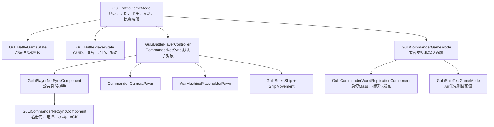

# 公共战局框架与三类角色接入 — 技术方案

- 对应需求：[公共战局框架与三类角色接入](../RequirementDocument/20260831-公共战局框架与三类角色接入.md)

## 技术选型
保留单一 GuLiStrike 运行时模块，以 Battle 基类、角色 Pawn 和指挥官发布组件组合。旧 Commander 反射类成为兼容派生层，不继承旧 TwinStick 模板业务。按公共框架、指挥官拆分、载具接入的顺序验证。

公共连接在 PlayerController 的默认网络组件上运行一套身份握手；CommanderNetSync 继承该组件并保留专业 RPC。公共 Ready 与 SoldierStreamReady 分离，飞船配置有独立代次。

飞船延续 ACharacter/CharacterMovement：新增专属 MovementComponent、SavedMove/MoveData/MoveResponse，输入与积分状态分别记录；初版禁止合并移动步。纠正恢复对应时间戳的权威旋转、偏航角速度和倾斜后再重演。服务器拒绝越权输入，移动参数来自服务器配装和 GM 状态。

热换装以服务器名册驱动客户端重建，初始复制与 BeginPlay 可以任意先后。换装和 GM 改变飞行参数共用版本切换屏障，清理旧代预测和纠正后恢复。开火按下/松开上传意图，服务器执行既有射速、炮口和弹丸；客户端不结算命中。

## 涉及模块
| 变更点 | 路径/类 | 类型 |
|---|---|---|
| 战局/身份/连接/复活 | Source/GuLiStrike/Battle | C++ |
| 专业命令、发布器、角色视图 | Source/GuLiStrike/Commander | C++ |
| 飞船移动、配置和开火 | Source/GuLiStrike/Gameplay/Ship | C++ |
| 权威弹丸 | Source/GuLiStrike/Gameplay/GuLiStrikeProjectile | C++ |
| 可操控 Ground 占位 | Gameplay 下独立 WarMachine 角色 | C++ |
| 已有飞船与测试预设 | 经编辑器核验的现有蓝图/地图配置 | 蓝图配置 |

## 当前实现与接入方式

- [公共 GameMode](../../Source/GuLiStrike/Battle/Framework/GuLiBattleGameMode.cpp) 在 `GenericPlayerInitialization` 中先恢复/分配身份，再执行引擎后续初始化。`RolePawnClasses` 是角色到 Pawn 类的唯一出生依据，缺失/抽象配置会释放席位并进入观察；`DefaultPawnClass` 不充当其他玩法的回退。初始分配优先顺序只影响服务器挑选空席位，不能越过席位校验。
- `CopyProperties` / `OverrideWith` 保留恢复所需的 GUID、角色和席位；连接就绪重新握手。重连时引擎会拿新建的空 PlayerState 调用旧实例的 `OverrideWith`，必须拒绝用空 GUID 覆盖恢复身份。
- Pawn 销毁后的重生统一由服务器安排，再调用 `RestartPlayer`。定时回调核对 Controller、GUID、席位、战局及比赛阶段；退出、结束和切图取消待执行回调。本轮没有添加伤害、血量、死亡判定或载具切换接口。
- [公共连接组件](../../Source/GuLiStrike/Battle/Network/GuLiPlayerNetSyncComponent.cpp) 只检查协议 v3、MatchEpoch、连接 Generation 及身份；`BattleReady` 不涉及 Mass。旧 Controller 通过 `SetDefaultSubobjectClass` 将同一个 `"CommanderNetSync"` 升级成专业组件，没有第二套公共握手。
- [士兵发布组件](../../Source/GuLiStrike/Commander/Framework/GuLiCommanderWorldReplicationComponent.cpp) 唯一控制士兵模拟启停；纯 BattleGameMode 不自动生成 500 兵。保留 30 Hz 模拟、目标 10 Hz 捕获和原分块调度。所有角色均可走名册门观察士兵，只有 Commander 加上两道就绪门才能下令。`SoldierBootstrapBinding` 绑定公共连接代次与士兵同步代次，避免旧名册 ACK 被新连接接受。
- [Ground 占位](../../Source/GuLiStrike/Gameplay/WarMachine/GuLiWarMachinePlaceholderPawn.cpp) 使用原生键绑定、CharacterMovement、引擎 Cube 和观察相机，武器入口始终不支持。指挥官按键和 HUD 均有角色门；组件解绑只清理自身输入上下文。

### 飞船：配置屏障与移动时间线

[ShipMovement](../../Source/GuLiStrike/Gameplay/Ship/GuLiShipMovementComponent.cpp) 扩展 CMC 的 packed move 和 correction response。每步保存推进、转向、侧移、加力、配置版本及屏障代次；服务器按自己的配置重建加速度。偏航角速度、倾斜等积分状态与纠正时间戳成组保存，旧 SavedMove 不能覆盖已纠正的积分基线。新的本地帧也从纠正后的舰体旋转重算推进方向。初版禁止合并移动步。

配置屏障包含完整参数、连接身份、装配版本、配置版本、屏障代次和权威位置/速度/转向基线。两端暂停到装配完整、公共握手有效且精确 ACK 完成；旧代包仍经过 CMC 时间戳处理，不能执行旧物理或污染新纠正。清理旧预测队列时保留 CMC 时间戳连续性。引擎在重占有/确认占有时会重置 CMC 时间戳，此路径另建生命周期屏障，早于新下限的旧 move 不能推进新时钟；普通换装屏障仍保留连续时间线。飞船就绪还要求引擎 `AcknowledgedPawn` 正确；占有确认沿用 UE 原生流程，不额外补发 ACK。客户端、服务器和重演共用模拟步骤，远端副本由 CMC 平滑 `CharacterMesh0` 下的静态舰体，Actor Tick 不抢写根朝向。

[Ship](../../Source/GuLiStrike/Gameplay/Ship/GuLiStrikeShip.cpp) 负责本地相机、输入上下文、装配和武器。换装 RPC 只带目录索引/槽位与所见版本；服务器验证后复制完整装配名册。`OnRep` 与 `BeginPlay` 共用应用入口，半套装配不确认就绪。服务器 GM 参数与换引擎最终都提交给同一移动屏障。

开火 RPC 只发送开始/停止意图，连续出弹按服务器现有冷却执行；校验当前 Air Pawn、公共与配置就绪以及比赛阶段。服务器炮口使用权威 Actor 与原始网格基准组合，排除 Listen Server 的视觉平滑偏移。弹丸仅服务器模拟碰撞、沿用原 NPC 命中行为并销毁；客户端只展示复制位置。不扩展飞船或 Mass 伤害。固定 5v5 中的 Ground/Air 玩家 Pawn 常相关，避免远距相机将近旁玩家按默认 150m 相关距离剔除；弹丸默认相关距离扩到 10km，仍按距离复制，后续大规模武器带宽需另测。

### 已有资产的兼容处理

`BP_ShipGameMode` 改为 `GuLiShipTestGameMode` 的轻量派生蓝图；`BP_PC_Ship` 改为兼容 Commander Controller 的派生蓝图，保留原资产路径和空事件图。二者共用公共 GameState/PlayerState，不复制登录代码。项目全局默认地图未调整。

已核验 `BP_CombatAvatarFly01` 使用现有 IMC、动作和三张数据表，但舰体没有 socket、没有默认部件；空名册也是合法装配。母 `BP_GuLiStrikeShip` 有七个 socket 和四个默认部件，换装/射击专项使用它进行运行时验证，不往无畏舰强加挂点。旧母蓝图保存过 `CharacterMovementComponent`，需重新编译母/子蓝图才能迁移默认子对象到专用移动组件；否则源码明确报错并关闭移动，不能带错误配置继续运行。

飞船测试图没有 `CommanderSoldier` NavMesh，士兵名册保持未就绪符合当前地图条件；Air 公共就绪与移动不能因此被阻断。混合士兵世界验证使用现有指挥官原型图，不为飞船图临时新增地面/导航资产。

## 任务清单
- [x] 审核已有试提取草稿，不覆盖用户其他改动。
- [x] 公共 GS/PS/连接握手；保留旧反射入口及默认子对象名。
- [x] GenericPlayerInitialization 分配；角色 Pawn 校验；服务器统一复活。
- [x] 士兵发布从 GM 移到单一组件；消费方改公共身份类型。
- [x] 角色输入、相机、HUD 启停与专业 Bootstrap 重试解耦。
- [x] 公共/指挥官阶段冷编译及已有测试。
- [x] Ground 可操控占位（无射击）。
- [x] 只读核验飞船 CDO/输入/装配与现有测试资产。
- [x] 飞船预测移动与静态舰体平滑。
- [x] 服务器热换装、参数切代、开火和弹丸复制。
- [x] Listen Server / Dedicated Server 双客户端及三角色混合冒烟验证。
- [ ] 全部网络验收门通过：最终 NetworkGate 的 ACK P95=138.1ms 达标，但未标记硬跳变 1 次，仍为 FAIL。
- [x] 更新约 5000–8000 字教材、玩法总册、索引与正式归档。

## 本轮验证结果

最终冷编译成功（14.17 秒），`GuLiStrike` 过滤下已有自动化 50/50 通过、进程退出码 0，没有新增测试。Listen 原型图与飞船图原生往返、Dedicated 原生无缝重建、同一客户端重连都保留身份和席位，战局更新后重新完成相应握手。

Ground 双端移动、同席复活、结束比赛取消复活；Fly01 原生销毁复活后的移动与纠正；母船弱网换装/调参、17 枚服务器弹丸双端可见、松键与原生失去占有停火均取得实测证据。混合会话填满 2C/4G/4A，满席玩家进入观察状态。细节、测试注入边界与旧的无效尝试见归档。

尚未取得整套网络验收 PASS：指挥官硬跳变需继续定位；完整人工键鼠/画面体验、真实 NPC 命中及长时弹丸压力没有全部覆盖。现有测试图出生区不适合同时容纳全部大型舰体；Fly01 本身没有挂点，换装/射击使用既有母船验证。

## 风险与备忘
- 现有草稿没有验证通过；移动反射属性及替换默认 MovementComponent 必须冷编译并检查旧蓝图。
- 出生缺少配置时明确转观察者，不静默改用其他玩法 Pawn。
- 不新增胜负公式、血量系统或跨玩法伤害；复活仅统一服务器生命周期入口。
- CMC 回放不能以旧预测积分状态覆盖服务器纠正；配装版本不匹配不能简单丢包而破坏时间线。
- 旧现有测试通过不等同新飞船网络验收。所有实际运行结果在归档逐项标注。
- 不生成额外报告附件；UE 自身构建/运行缓存不作为项目文档交付。

## 结果链接
[本次归档：改动、测试配置、真实结果与未通过项](../Archive/20260831-公共战局框架与三类角色接入.md)。
