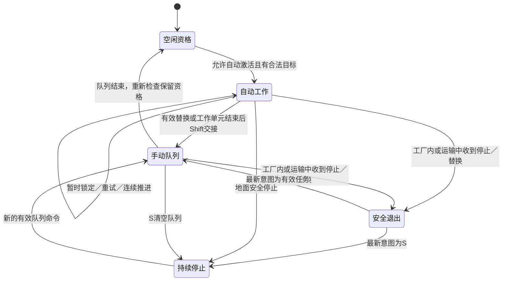

# 指挥官部队操作与特殊任务系统 — 技术方案

## 边界

保留GuLiStrike单模块。Excel→生成结构/DataTable→特殊任务目录→服务端调度→按类共享的原生执行器→已有业务。任务实例独立保存单位状态，执行器不能共享单个单位可变进度。初始资格保留消耗记录，持续资格与S抑制位分开。

采矿旧Grace恢复、单项PendingCommand及据点独立授予入口迁入调度所有权。规划冻结成员，不依赖后续选择。复用预算规划、工程车移动、矿点占用、施工和据点路由。

## 实施清单

- [x] Excel源表、导出验证、原生目录和三类执行器。
- [x] 队列、停止、生命周期及可靠命令入口。
- [x] 采矿/施工/据点迁移与安全退出。
- [x] 选择、编队、镜头和HUD。
- [x] 授权回归、Editor/Game构建与BuildId。
- [x] 导入回读、玩法文档及证据。
- [x] Progress索引及全量链接检查。

## 代码与数据入口

| 层 | 入口 | 职责 |
|---|---|---|
| 配置 | [特殊任务Excel](../../data/Excel/GuLiStrikeSpecialTasks.xlsx)、[生成JSON](../../data/Json/DT_GuLiStrikeSpecialTasks_Tasks.json) | 稳定ID、适用兵种、Tag、自动激活、生命周期、原生类路径 |
| 目录 | [GuLiSpecialTaskCatalog](../../Source/GuLiStrike/Commander/Orders/GuLiSpecialTaskCatalog.cpp) | 启动时严格校验；同World按类复用执行器 |
| 契约 | [GuLiUnitTaskTypes](../../Source/GuLiStrike/Commander/Orders/GuLiUnitTaskTypes.h) | 单位身份、任务参数、资格、独立进度、HUD摘要 |
| 调度 | [GuLiUnitTaskSubsystem](../../Source/GuLiStrike/Commander/Orders/GuLiUnitTaskSubsystem.cpp) | 32项手动队列、停止、交接、重试、版本和死亡清理 |
| 业务 | [GuLiSpecialTaskExecutor](../../Source/GuLiStrike/Commander/Orders/GuLiSpecialTaskExecutor.cpp) | 复用矿车、工程车施工、据点推进；执行器无跨单位可变进度 |
| 输入/网络 | [OrderedCommands](../../Source/GuLiStrike/Commander/Framework/GuLiCommanderOrderedCommands.cpp) | 选择/编队/任务共用可靠顺序和连接代次；服务端冻结成员 |
| HUD | [TaskPanel](../../Source/GuLiStrike/Commander/UI/GuLiCommanderTaskPanel.cpp) | 当前来源、完整单选队列、多选共同前缀/差异、停止与错误 |

配置参数位于 `[/Script/GuLiStrike.GuLiUnitTaskSettings]`：`MaximumManualTasks=32`、`AutomaticRetrySeconds=1`、`DoublePressSeconds=0.3`、`SameTypeRadiusCentimeters=50000`。前三行表元数据不变；维护方式见[数据管线说明](../../Tools/DataPipeline/README.md)。

## 生命周期与执行边界

- 资格按单位身份、出生代次、任务ID保存。当前World内兵员及工程车ID单调分配、不复用，出生代次为1；真正新生单位使用新ID。任务版本独立递增，专门拦截旧寻路/取消结果，不把再次注册当新出生。
- 所有匹配兵种获得资格；`AutoActivate`只控制自动启动。InitialOnce消耗记录保留在单位状态/墓碑中，HUD不再列为可恢复任务。Persistent资格不会被手动接管删除。
- S立即清空未来命令并设置持续停止。工厂/运输必须安全退出；退出期间保留最新有效意图。已取消但等待安全退出的旧操作不占新手动队列容量，HUD仍显示安全退出状态。
- 自动施工按完整地面路径选择目标，等长以实例ID决胜；无工地保持资格，每秒重试，注册/完成/销毁事件唤醒检查。失效、易主目标不能恢复旧施工引用。
- 据点推进仍按原分批、目标选择和接敌规则连续工作；调度仅在阶段交接时消费初始资格，S/普通替换可立即接管单个成员。
- 手动采矿末尾循环，有后续任务时完成采集、返厂、卸载、出厂一轮后交接；排队期间矿区耗尽，空车完成、有货先返厂。建筑/运输目标在开始执行时再次验证。
- 矿车已经进厂但工厂易主或失效时，先完成安全出厂；未卸货则保留货物并报告失败，不把带货退出误报为完成，也不因矿区耗尽吞掉返厂失败。
- 死亡清除活动状态；运输临时隐藏不注销任务与编队成员。武器行为未改，Q、编队、选择、镜头不解除S，也不消费资格。

## 网络与反馈

协议由14递增至15，不兼容客户端沿用公共握手拒绝。客户端只提交任务ID/目标，没有任意类路径RPC。新选择、Replace、Append、Stop、编队使用同一可靠有序入口；Append不经过旧移动合并。服务端校验身份、连接代次、顺序、选择和各成员能力；容量或目标无效时不改变该单位原任务。接收回执按冻结的25人成员掩码或工程车实例ID分别反馈接受/拒绝；拒绝原因进入对应单位的HUD摘要，不消耗资格，也不解除持续停止。

任务/编队摘要改为按版本分块的可靠拥有者快照：每次最多4块、每块最多2组完整队列，客户端组装后整体替换，并检查连接与选择版本。旧属性方案在真实客户端停留初始值，失败证据保存在 `network1`–`network3`，修复后同场景 `network4`、`network5-rendered`、`network6-rendered` 及最终 `network8-final` 均通过。首次选择确认后的任务不会因后续改选被取消；自动伤亡刷新同时清理选择和编队。

新任务面板具有独立定位/停止按钮；原命令矩阵的停止按钮也已启用S标识。按钮文字尺寸及横向填充已按1920×1080实拍修正，避免越出屏幕。未实现的攻击/坚守/巡逻继续保持不可用。

## 验证记录

本次基线：工作区只有两份星际拆解参考文档未跟踪，源码无未提交改动；Battle协议版本14，本次递增为15。

| 验证 | 结果与证据 |
|---|---|
| Excel → JSON → DataTable → 原生 | 三行、全部字段、三类引用回读一致：[导入证据](../../TestResults/CommanderOrders/special_task_import.json) |
| 导出错误 | 错生命周期、兵种引用/重复/分隔符、类文件路径、Tag格式全部拒绝：[7项](../../TestResults/CommanderOrders/export-validation.json) |
| 原生自动化 | 85项通过（84成功、1带警告成功），0失败；包括Orders、网络、选择、镜头、Mass、Resources、Building：[报告](../../TestResults/CommanderOrders/AutomationFinal2/index.json)。最后货物边界修正后，Orders/Resources/Building再跑13项，0失败：[增量复验](../../TestResults/CommanderOrders/AutomationBusinessFinal/index.json) |
| 业务World专项 | 31项通过；同长路径实例ID、最近可达工地、多车协作、恢复、Shift交接、目标销毁/易主、混编部分接受、矿车货物、完整采矿轮次、安全出厂/运输、工厂易主未卸货失败、初始资格、新生与死亡：[报告](../../TestResults/CommanderOrders/business5-final/report.json) |
| 双客户端与输入 | 两个独立客户端各19项通过，100ms延迟、2%丢包；逐成员回执、有序接令、重复拒绝、编队重叠/移出/空召回、持续停止、Q不解锁、真实S/Ctrl+F5/F5、定位按钮、键盘重复：[客户端1](../../TestResults/CommanderOrders/network8-final/client1.json)、[客户端2](../../TestResults/CommanderOrders/network8-final/client2.json)、[服务器](../../TestResults/CommanderOrders/network8-final/server.json) |
| 画面复验 | [队列/停止按钮](../../TestResults/CommanderOrders/network8-final/client1.queue.png)、[停止/定位](../../TestResults/CommanderOrders/network8-final/client1.stopped.png)，两客户端均渲染 |
| 既有500单位移动基线 | 双客户端往返，服务器25秒/客户端15秒，123500次移动更新；客户端1收到149帧姿态，三端无采样错误：[服务器](../../TestResults/CommanderOrders/Movement/orders-n500-c2/server/summary.json)、[客户端1](../../TestResults/CommanderOrders/Movement/orders-n500-c2/client1/summary.json)、[客户端2](../../TestResults/CommanderOrders/Movement/orders-n500-c2/client2/summary.json) |
| 源码Editor构建 | `D:/UnrealEngine-5.7`，GuLiStrikeEditor Win64 Development，退出码0：[日志](../../TestResults/CommanderOrders/editor-final-build.log) |
| 源码Game构建 | 同引擎，GuLiStrike Win64 Development，退出码0：[日志](../../TestResults/CommanderOrders/game-development-build.log) |
| BuildId | 项目及6个原生插件均为 `dd506ae0-11d1-48e9-95ed-8becd4c36a75`，与源码引擎一致：[清单](../../TestResults/CommanderOrders/build-ids.json) |
| Progress | 索引构建及检查通过，0错误；12项既有文档长度/任务数警告：[日志](../../TestResults/CommanderOrders/progress-final-check.log) |

业务专项在原地图运行真实调度和业务组件，为控制测试耗时仅在一次性测试World调整矿车采集/出厂速度、货物和边界间位置；不改Excel、不保存关卡。推进阶段结束通过业务通知触发，未把此夹具当作完整对局占领时长或自然行驶性能证据。

一次中间Editor构建因系统虚拟内存不足失败，保留[日志](../../TestResults/CommanderOrders/editor-resource-limit.log)。停止本次测试进程并将编译并发降至2后构建成功，未修改系统配置；当时启动的 `network7-final`、`business3-final` 已标记为不采纳，后续使用新构建重新验证。

首轮全量扫描126项：118成功、4带警告成功、4失败。旧协议断言已修复并在最终回归通过；另三项表现断言与本次起点HEAD生产常量已经不符：两个测试期望100000cm裁剪距离，实际20000cm；血条测试期望20cm边距，实际4cm。本次不改相关渲染行为或无关断言，保留[原报告](../../TestResults/CommanderOrders/Automation1/index.json)和[HEAD证据](../../TestResults/CommanderOrders/baseline-assertions.json)。本页的“通过”指本次功能门禁，不代表整个项目的历史测试均绿色。

## 复现命令与边界

- `Scripts/run_commander_order_business.ps1 -Label <新证据目录>`：业务World专项。
- `Scripts/run_commander_order_network.ps1 -Label <新证据目录> -RenderClients`：两客户端有序输入、HUD与截图；无参数则NullRHI。
- `Scripts/run_commander_move_stress.ps1 -Population 500 -Clients 2 -Seconds 15 -HeadlessClients -JoinBeforePopulation`：复用既有移动基线。
- 原生自动化过滤器与完整命令保存在 `automation-final.log`；运行器使用源码版 `UnrealEditor-Cmd.exe`。

不修改窄口通行算法，不新增玩家A移动、点杀、坚守或巡逻。不新增插件，不保存跨对局任务，不运行中热换配置。完整断网后不同登录凭据的身份恢复、万级异构长队列的HUD时延和自然整局采矿/占领耐久压测不在上述实测证据中；已有断线检查验证世界中的消耗资格和持续停止不被恢复入口重置。

## 需求

[需求文档](../RequirementDocument/20260920-指挥官部队操作与特殊任务系统.md)

[实施归档](../Archive/20260920-指挥官部队操作与特殊任务系统.md)
