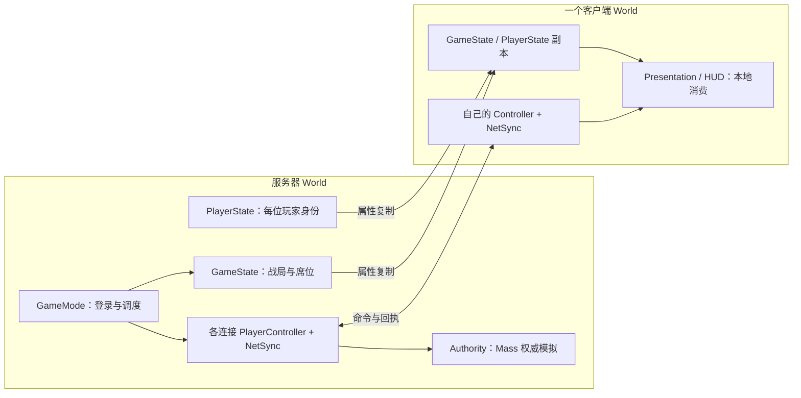

# 01 UE 网络模型与对象职责

[教材目录](D:/UE5.7/test1/Progress/DevelopmentDocumentation/UE网络教材/README.md) · [下一章](D:/UE5.7/test1/Progress/DevelopmentDocumentation/UE网络教材/02-所有权与RPC.md)

## 学习目标

分清“谁决定结果”“谁处理输入”“谁展示结果”，并能在项目中找到各自的对象。

## UE 概念

Standalone 在一个 World 内兼具服务器和本地玩家逻辑；Listen Server 还接收远端玩家；Dedicated Server 没有本地玩家，不承担界面呈现。Authority 判断 Actor 的权威角色，本地控制判断输入归谁，两者不能互换；主机玩家可以同时满足二者。[Epic UE 5.7 网络概览](https://dev.epicgames.com/documentation/en-us/unreal-engine/networking-overview-for-unreal-engine?application_version=5.7)

项目里的 GameMode 负责服务器规则，GameState 保存公开战局信息；PlayerState 保存身份、阵营和角色，PlayerController 连接输入与该玩家的通信组件。服务器拥有每个连接的 Controller，客户端通常只有自己的 Controller 副本。

## 项目调用链与源码

对象分布图只描述当前项目的职责，不代表每个对象都互相发送 RPC。



从 [AGuLiCommanderGameMode::PostLogin](D:/UE5.7/test1/Source/GuLiStrike/Commander/Framework/GuLiCommanderGameMode.cpp:81) 进入席位分配；从 Controller 的资格查询理解客户端按钮为何可用：


项目源码节选（[bool AGuLiCommanderPlayerController::CanIssueCommanderOrders()](D:/UE5.7/test1/Source/GuLiStrike/Commander/Framework/GuLiCommanderPlayerController.cpp:140)）：

```cpp
bool AGuLiCommanderPlayerController::CanIssueCommanderOrders() const
{
	const AGuLiCommanderPlayerState* CommanderPlayerState = GetPlayerState<AGuLiCommanderPlayerState>();
	return CommanderPlayerState
		&& CommanderPlayerState->IsCommander()
		&& CommanderPlayerState->IsSyncReady();
}
```


它只读本端 PlayerState，没有发送网络请求，也没有调用寻路。客户端通过这个检查后，服务器仍须按自己的 PlayerState 再查一次。权威士兵运行于 [UGuLiBattleAuthoritySubsystem](D:/UE5.7/test1/Source/GuLiStrike/Commander/Mass/GuLiBattleAuthoritySubsystem.h:35)，不等于客户端表现用的 Mass 镜像。

## 易错点

WorldSubsystem 不因继承关系就自动复制。单机能运行只证明本地路径成立，不能证明远端所有权、延迟和初始同步正确。相机 Pawn 只对拥有者相关，并关闭移动复制；相机移动与士兵移动命令不是同一通路。

## 练习与答案

1. **理解题：主机的本地玩家是否也是 Authority？** 是，因此不能用 HasAuthority 排除所有本地玩家。
2. **理解题：客户端能直接向自己的 GameMode 发请求吗？** 不能，远端客户端没有服务器 GameMode 实例，应从拥有的 Controller/组件发 RPC。
3. **源码题：身份已分配为何仍不能选兵？** 检查 CanIssueCommanderOrders 的 IsSyncReady；分配身份不等于名册 Bootstrap 已完成，服务器还会重新验证。
