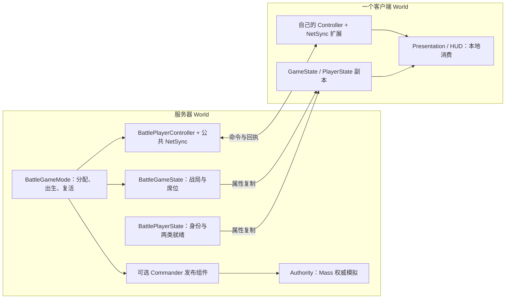

# 01 UE 网络模型与对象职责

[教材目录](D:/UE5.7/test1/Progress/DevelopmentDocumentation/UE网络教材/README.md) · [下一章](D:/UE5.7/test1/Progress/DevelopmentDocumentation/UE网络教材/02-所有权与RPC.md)

## 学习目标

分清“谁决定结果”“谁处理输入”“谁展示结果”，并能在项目中找到各自的对象。

## UE 概念

Standalone 在一个 World 内兼具服务器和本地玩家逻辑；Listen Server 还接收远端玩家；Dedicated Server 没有本地玩家，不承担界面呈现。Authority 判断 Actor 的权威角色，本地控制判断输入归谁，两者不能互换；主机玩家可以同时满足二者。[Epic UE 5.7 网络概览](https://dev.epicgames.com/documentation/en-us/unreal-engine/networking-overview-for-unreal-engine?application_version=5.7)

同一 World 使用一个 GameMode 管整场比赛，角色差异不要求另开 GameMode。GameState 保存公开战局，PlayerState 保存身份；服务器拥有各玩家的 Controller，客户端通常只有自己的 Controller 副本。玩法能力可以组合在 Pawn、组件与 Subsystem 中。

## 项目调用链与源码

对象分布图只描述当前项目的职责，不代表每个对象都互相发送 RPC。



当前 [AGuLiBattleGameMode::GenericPlayerInitialization](D:/UE5.7/test1/Source/GuLiStrike/Battle/Framework/GuLiBattleGameMode.cpp) 在实际 RestartPlayer 出生前分配角色，通过 RolePawnClasses 选择 Pawn；未配置有效类则转观察者，不偷偷生成其他角色的默认 Pawn。旧 CommanderGameMode 继承公共规则，配置角色 Pawn、兼容框架类、HUD 与士兵发布组件。无缝切图中，引擎可能更早查询默认 Pawn 类以寻找出生点；纯查询不承担身份分配，真正出生仍校验席位。

项目源码节选（[AGuLiCommanderPlayerController::CanIssueCommanderOrders](D:/UE5.7/test1/Source/GuLiStrike/Commander/Framework/GuLiCommanderPlayerController.cpp)）：

```cpp
bool AGuLiCommanderPlayerController::CanIssueCommanderOrders() const
{
    const AGuLiBattlePlayerState* CommanderPlayerState = GetPlayerState<AGuLiBattlePlayerState>();
    return CommanderPlayerState
        && CommanderPlayerState->IsCommander()
        && NetSyncComponent && NetSyncComponent->IsConnectionReady()
        && NetSyncComponent->IsSoldierStreamReady();
}
```

这个本地查询要求 Commander 身份、公共连接及士兵流同时就绪，没有发送 RPC 或执行寻路；服务器还会再查。权威士兵运行于 [UGuLiBattleAuthoritySubsystem](D:/UE5.7/test1/Source/GuLiStrike/Commander/Mass/GuLiBattleAuthoritySubsystem.h)，客户端 Mass 镜像只承担表现。

## 易错点

WorldSubsystem 不会自动复制。旧 Commander 类名保留是兼容已有配置，不是同时运行两套 GameMode。Ground/Air 的 Pawn 配置、移动与武器通信仍需各自接入；公共类并未替它们实现玩法。相机的本地移动也不是士兵移动命令。

## 练习与答案

1. **理解题：主机的本地玩家是否也是 Authority？** 是，因此不能用 HasAuthority 排除所有本地玩家。
2. **理解题：客户端能直接向自己的 GameMode 发请求吗？** 不能，远端客户端没有服务器 GameMode 实例，应从拥有的 Controller/组件发 RPC。
3. **源码题：Ground 已完成公共握手，为何仍不能选兵？** CanIssueCommanderOrders 还要求 Commander 身份和士兵流就绪；公共连接资格不授予指挥权限。
