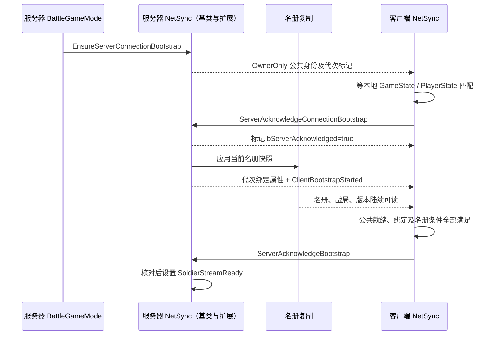

# 05 登录、分配与初始同步

[教材目录](D:/UE5.7/test1/Progress/DevelopmentDocumentation/UE网络教材/README.md) · [上一章](D:/UE5.7/test1/Progress/DevelopmentDocumentation/UE网络教材/04-项目协议与序列化.md) · [下一章](D:/UE5.7/test1/Progress/DevelopmentDocumentation/UE网络教材/06-选兵与移动请求全过程.md)

## 学习目标

区分公共连接与士兵流的两道就绪门，追踪晚加入、角色变化和战局切换。

## UE 概念

不同 Actor 的属性和 RPC 不保证按业务期待的顺序到达。Bootstrap 检查业务依赖是否可读，不是另建网络连接。重试间隔决定何时再检查，不能代替实际就绪条件。

## 项目调用链与源码

[AGuLiBattleGameMode::GenericPlayerInitialization](D:/UE5.7/test1/Source/GuLiStrike/Battle/Framework/GuLiBattleGameMode.cpp) 创建或恢复 GUID、分配席位，再启动公共握手。角色没有有效 Pawn 配置或席位不足时转观察者。公共 NetSync 不查 Mass；同一组件的指挥官扩展在公共就绪后继续名册握手。Air 配置另走 Pawn 的移动屏障，不等待士兵名册。



[EnsureServerConnectionBootstrap](D:/UE5.7/test1/Source/GuLiStrike/Battle/Network/GuLiPlayerNetSyncComponent.cpp) 核对协议、非零战局、GUID、阵营、角色和席位。客户端等属性匹配后 ACK，服务器再核对当前身份，才设置 BattleReady 和标记确认位。IsConnectionReady 不只读 PlayerState 的旧就绪值，因此旧身份的 ACK 不能为新身份开门。

专业同步额外绑定两种代次，避免同战局换角色后旧名册标记迟到。项目源码节选（[StartServerBootstrap](D:/UE5.7/test1/Source/GuLiStrike/Commander/Framework/GuLiCommanderNetSyncComponent.cpp)）：

```cpp
SoldierBootstrapBinding.ConnectionGeneration = GetConnectionGeneration();
SoldierBootstrapBinding.SoldierSyncGeneration = SyncGeneration;
```

[TryCompleteClientBootstrap](D:/UE5.7/test1/Source/GuLiStrike/Commander/Framework/GuLiCommanderNetSyncComponent.cpp) 等绑定匹配，再查名册战局、最低版本和有效唯一 SoldierId 数量。版本允许更高值；实际源码中的判定为：

```cpp
const bool bSnapshotRevisionAccepted = SnapshotRevision == ExpectedSnapshotRevision
    || static_cast<int32>(SnapshotRevision - ExpectedSnapshotRevision) > 0;
```

客户端满足条件后打开本地姿态门并确认；ServerAcknowledgeBootstrap 设置服务器士兵流资格。旧 IsSyncReady 仍是这个士兵位。组件自己的 Tick 等待名册并每两秒重发未完成标记，不再依赖 Controller 轮询；重复标记不会不断新增代次。

## 易错点

公共握手不证明客户端真实执行了所有逻辑，服务器仍校验玩法权限。零士兵不妨碍公共握手，但当前士兵握手要求非零名册。换身份/战局会撤销两门并清专业缓存；专业代次递增，不归零重用。早到的名册标记需等公共绑定，由后续重发补齐。

## 练习与答案

1. **理解题：Ground 必须先等士兵生成才能公共就绪吗？** 不必，公共握手只等战局和身份；需要显示士兵时才另外等待专业流。
2. **理解题：观察者完成两次握手后能下令吗？** 不能，CanProcessCommanderRequest 仍要求 Commander 身份。
3. **时序题：晚加入者先收到版本 9，标记要求版本 8，但名册缺人，会怎样？** 版本合格但人数/唯一 ID 不足，继续等待；满足后才确认，不因版本更新太快卡住。
