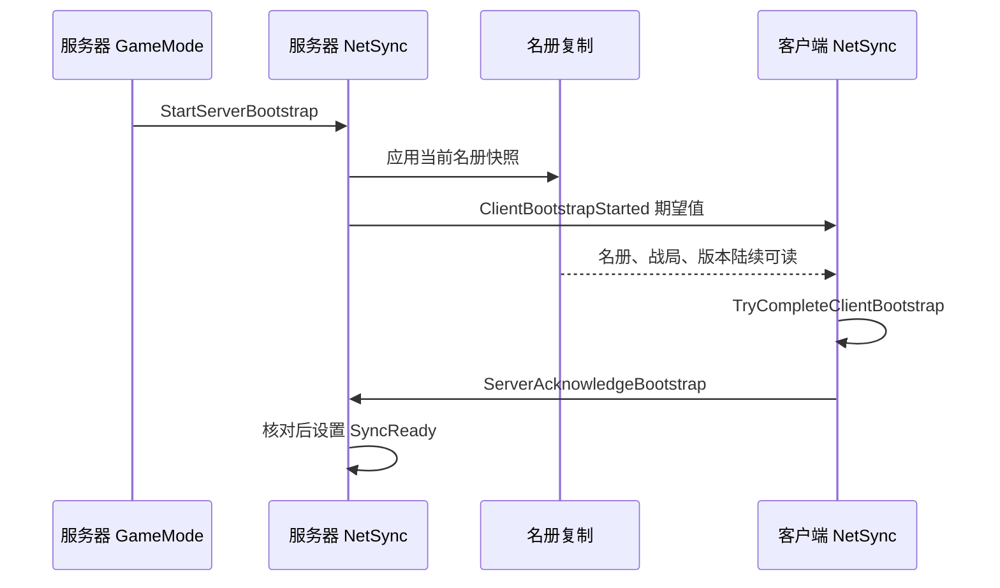

# 05 登录、分配与初始同步

[教材目录](D:/UE5.7/test1/Progress/DevelopmentDocumentation/UE网络教材/README.md) · [上一章](D:/UE5.7/test1/Progress/DevelopmentDocumentation/UE网络教材/04-项目协议与序列化.md) · [下一章](D:/UE5.7/test1/Progress/DevelopmentDocumentation/UE网络教材/06-选兵与移动请求全过程.md)

## 学习目标

解释为什么“已连接”“已分配角色”“可以接收姿态”是不同阶段，并能追踪晚加入与换战局的处理。

## UE 概念

不同 Actor 的状态、属性通知和 RPC 不保证按业务期待的顺序到达。初始化应检查依赖条件，不用固定等待几秒替代状态判断。项目的 Bootstrap 就是这道业务准备检查，并非另一套网络连接协议。

## 项目调用链与源码

[AGuLiCommanderGameMode::AssignRoleAndBootstrap](D:/UE5.7/test1/Source/GuLiStrike/Commander/Framework/GuLiCommanderGameMode.cpp:239) 从 PlayerState 取得或创建 GUID，向 GameState 申请席位；前两个连接分获两方 Commander，超出十个席位的连接转观察者。随后 NetSync 启动同步，名册未生成时暂不启动，由后续调度和客户端两秒重试继续尝试。



标记携带代次、协议、战局、预期人数和最低快照版本。[UGuLiCommanderNetSyncComponent::TryCompleteClientBootstrap](D:/UE5.7/test1/Source/GuLiStrike/Commander/Framework/GuLiCommanderNetSyncComponent.cpp:989) 检查 GameState 与 Replicator 都属于预期战局、版本不旧、名册数量足够，再统计有效唯一 SoldierId。核心版本条件允许更高版本：


项目源码节选（[const bool bSnapshotRevisionAccepted =](D:/UE5.7/test1/Source/GuLiStrike/Commander/Framework/GuLiCommanderNetSyncComponent.cpp:64)）：

```cpp
const bool bSnapshotRevisionAccepted = SnapshotRevision == ExpectedSnapshotRevision
	|| static_cast<int32>(SnapshotRevision - ExpectedSnapshotRevision) > 0;
```


满足条件后客户端先打开本地姿态门，再发确认；服务器验证确认后设置 PlayerState/公开席位的就绪位。[UGuLiCommanderNetSyncComponent::ServerAcknowledgeBootstrap_Implementation](D:/UE5.7/test1/Source/GuLiStrike/Commander/Framework/GuLiCommanderNetSyncComponent.cpp:712) 是服务器放行入口。

## 易错点

就绪握手不是客户端数据真实性的密码学证明。SnapshotRevision 到达不单独证明名册完整。换战局会清旧选择、回执与样本；MatchEpoch 不同就隔离，不能认为较大数字必是新局。同局未完成时重发标记，不不断增加代次。当前预期名册人数必须大于零。

## 练习与答案

1. **理解题：收到 Bootstrap 标记可立即发成功确认吗？** 不行，必须等待本地名册和战局条件满足。
2. **理解题：观察者 SyncReady 后能下指令吗？** 不能，CanProcessCommanderRequest 还要求 Commander 身份。
3. **时序题：晚加入者先收到版本 9，标记要求版本 8，但名册缺人，会怎样？** 版本合格但人数/唯一 ID 不足，继续等待；满足后才确认，不因版本更新太快卡住。
