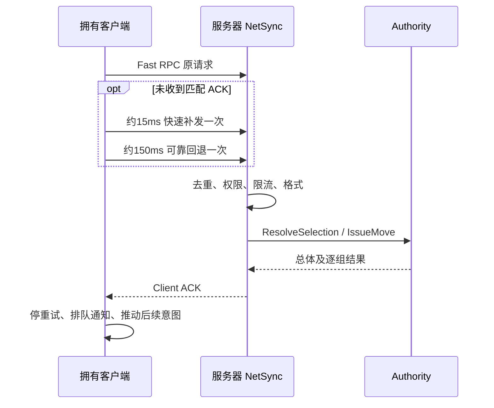
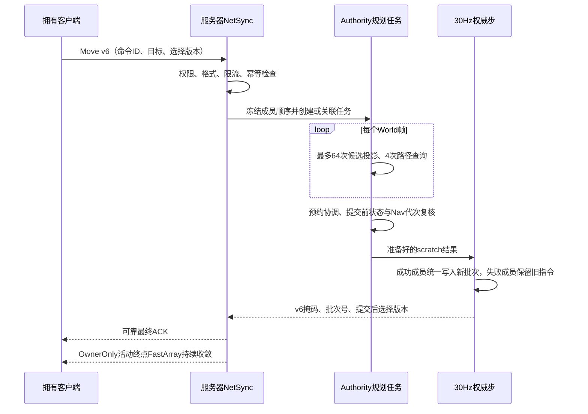

# 06 选兵与移动请求全过程

[教材目录](D:/UE5.7/test1/Progress/DevelopmentDocumentation/UE网络教材/README.md) · [上一章](D:/UE5.7/test1/Progress/DevelopmentDocumentation/UE网络教材/05-登录分配与初始同步.md) · [下一章](D:/UE5.7/test1/Progress/DevelopmentDocumentation/UE网络教材/07-士兵状态与姿态发送.md)

> 版本状态：本章按当前v6描述。移动已改为跨帧自由落位规划和固定步提交，源码与网络自动化19/19已复核；Standalone双客户端与Dedicated Server仍未验证。

## 学习目标

沿一条请求理解快速发送、可靠回退、网络校验、权威判定和回执消费，而不是只看 RPC 宏。

## UE 概念

传输层确认解决“消息投递”，业务 ACK 解决“意图是否被接受”。应用自行重试可能让服务器收到相同意图多次，因此还需要幂等处理；Reliable 不能代替业务去重。

## 项目调用链与源码

[AGuLiCommanderPlayerController::TryIssueMoveAtCursor](D:/UE5.7/test1/Source/GuLiStrike/Commander/Framework/GuLiCommanderPlayerController.cpp) 用已确认的选择版本生成移动 ID，先显示 Pending 并启动有限预测，然后 SubmitMoveRequest。



时间阈值由 Tick 检查，不保证恰好在该毫秒发包。服务器本机路径直接走可靠入口。[UGuLiCommanderNetSyncComponent::HandleSelectionRequest](D:/UE5.7/test1/Source/GuLiStrike/Commander/Framework/GuLiCommanderNetSyncComponent.cpp) 与 HandleMoveRequest 分别保存最近请求/ACK：

| 情况 | 当前实现 |
|---|---|
| 最近同 ID、同内容 | 重放缓存，不重复执行业务 |
| 同 ID、不同内容 | 拒绝；不是覆盖原请求 |
| 比最近 ID 更旧 | 返回 Duplicate，受限流约束 |
| 新请求公共连接/士兵流未就绪或非指挥官 | Unauthorized |
| 新请求超过窗口额度 | RateLimited |
| 选择版本不一致 | Authority 返回 StaleSelectionRevision |

指挥官窗口每连接一秒十次；公共握手另有预算，不能让未来载具输入共用该额度。快速缓存 ACK 每命令最多补发两次。部分超限请求静默丢弃，不保证都有拒绝回执。

[UGuLiBattleAuthoritySubsystem::BeginMovePlanning](D:/UE5.7/test1/Source/GuLiStrike/Commander/Mass/GuLiBattleAuthoritySubsystem.cpp)冻结成员和请求依赖并创建或关联Pending任务；Authority跨帧查成员、候选、预约和路径，下一次30Hz权威步提交最终结果。选兵仍在候选副本上处理，接受后才替换SelectionState。

选兵队列串行等待；收到 ACK 后下一请求直接接上回执版本：

项目源码节选（[ReceiveCommandAck 中衔接下一选择请求](D:/UE5.7/test1/Source/GuLiStrike/Commander/Framework/GuLiCommanderNetSyncComponent.cpp)）：

```cpp
NextSelectionRequest.KnownSelectionRevision = Sanitized.ServerSelectionRevision;
bStartNextSelection = true;
```

[UGuLiCommanderNetSyncComponent::ReceiveCommandAck](D:/UE5.7/test1/Source/GuLiStrike/Commander/Framework/GuLiCommanderNetSyncComponent.cpp) 即使收到拒绝也会推进此队列。选兵期间仅保留最新延后移动；普通移动同样不是无限 FIFO。

### v6当前实现：Pending规划、固定步提交与单兵回执

自由落位把`IssueMove`从一次同步裁决拆成服务器Pending任务：



Pending期间单位继续执行旧命令；相同ID同内容的快速补发和可靠回退只关联同一任务，不能重复投影、建Formation或分配批次。最终ACK缓存包含完全相同的成员掩码、`BatchOrderId`和`ServerSelectionRevision`，后续重放不重新规划。

提交粒度变为单兵：成功单位进入共同新批次，失败单位保留旧指令但从权威选择中移除，空cohort删除，整次命令最多推进一次选择版本。全部Eligible成员失败时选择变空且批次号为0；Unauthorized、Stale、无导航系统等整单系统错误不修改选择。

客户端预测必须保留发令时成员下标。`AcceptedMemberMask`确认成功成员，其他Eligible成员回滚；后续选择或移动只有在复制的选择状态追上ACK中的`ServerSelectionRevision`后才能继续。活动终点FastArray与ACK没有可靠的相对到达顺序，静态绿线和预测都要按SoldierId、`ActiveOrderId`与版本配对。

## 易错点

服务器只缓存最近同类请求；客户端只抑制与上次种类/ID 相同的通知。公共重握手清业务缓存，但保留同一组件的请求 ID 高水位，防旧快速请求重新执行；新 Controller 的组件从零开始。接令成功不等于已抵达。

## 练习与答案

1. **理解题：第一次成功但 ACK 丢了，重发会再建批次吗？** 最近同 ID 同内容命中缓存，不重新调用 IssueMove。
2. **理解题：一组寻路失败，其他组必须回滚吗？** 不需要。v6用Eligible/Accepted掩码表达同一组内的单兵部分接受；成功成员进入共同新批次，失败成员保留旧指令并退出当前选择。
3. **时序题：选兵拒绝后排队移动如何处理？** 用拒绝 ACK 携带的选择版本继续提交；服务器独立校验，可能针对原有选择接受，也可能再次拒绝。
