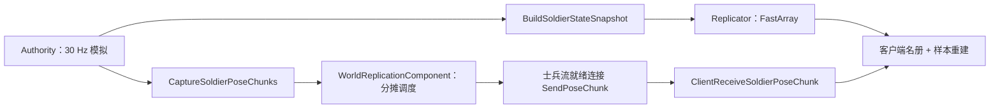

# 07 士兵状态与姿态发送

[教材目录](D:/UE5.7/test1/Progress/DevelopmentDocumentation/UE网络教材/README.md) · [上一章](D:/UE5.7/test1/Progress/DevelopmentDocumentation/UE网络教材/06-选兵与移动请求全过程.md) · [下一章](D:/UE5.7/test1/Progress/DevelopmentDocumentation/UE网络教材/08-客户端重建与平滑.md)

## 学习目标

找到“谁压缩分块”和“谁真正发网络”，理解离散名册与连续运动为什么分开传输。

## UE 概念

身份、生命、当前命令适合持续状态同步；连续位置更新具有时效性，旧帧反复补传可能增加延迟。项目把名册交给 FastArray，把姿态交给不可靠 Client RPC。两条通路并行，但客户端必须先有合法名册身份。

## 项目调用链与源码



调度已从 GameMode 移到 [UGuLiCommanderWorldReplicationComponent::PublishSoldierSnapshotAndPoses](D:/UE5.7/test1/Source/GuLiStrike/Commander/Framework/GuLiCommanderWorldReplicationComponent.cpp)。旧 CommanderGameMode 组合该组件，公共 GameMode 不直接引用 Mass 发布细节。

项目源码节选（[PublishSoldierSnapshotAndPoses 的捕获节拍](D:/UE5.7/test1/Source/GuLiStrike/Commander/Framework/GuLiCommanderWorldReplicationComponent.cpp)）：

```cpp
constexpr uint32 SimulationTicksPerPoseFrame = 30u / GULI_POSE_CAPTURE_RATE_HZ;
```

目标为每三个模拟步捕获一次，即 10 Hz；上一帧块尚未发完就不捕获下一帧。同一帧分摊到三个模拟步，并轮换起始块。实际频率受模拟推进和运行负载影响，不能当成稳定收包承诺。

[UGuLiBattleAuthoritySubsystem::CaptureSoldierPoseChunks](D:/UE5.7/test1/Source/GuLiStrike/Commander/Mass/GuLiBattleAuthoritySubsystem.cpp) 按阵营、空间格与身份排序，计算公共 Anchor，量化每名士兵的相对位置、速度、朝向。每块最多 32 样本，每帧最多 512 块；即使未满 32，加入样本导致相对位置无法用 int16 表示时，也会提前拆块。组内锚点变化后要重新检查已有样本。

真正的发送在 [UGuLiCommanderNetSyncComponent::SendPoseChunk](D:/UE5.7/test1/Source/GuLiStrike/Commander/Framework/GuLiCommanderNetSyncComponent.cpp)：

项目源码节选（[SendPoseChunk 的发送入口](D:/UE5.7/test1/Source/GuLiStrike/Commander/Framework/GuLiCommanderNetSyncComponent.cpp)）：

```cpp
ClientReceiveSoldierPoseChunk(Chunk);
```

发布组件遍历 PlayerController，查找专业 NetSync，仅向 IsSoldierStreamReady 的连接发送；单独公共就绪不会放行。没有就绪玩家时仍消耗旧帧，换战局清发送缓存。`StartServerBootstrap` 可额外构造一份名册快照，不是第二个周期姿态调度者。BeginPlay 限制只有权威 GameMode 上首个发布组件工作，避免误添加造成重复发送。

纯 Battle 世界默认不生成士兵；只有发布组件取得调度权后，才通过 `SetSoldierSimulationEnabled(true)` 启动 Authority 人口与模拟，退出时撤销。飞船图没有专用 NavMesh 时，名册为空，公共/飞船就绪仍可独立完成。

## 易错点

32 样本是项目载荷限制，不是“一个块必等于一个物理网络包”的保证。FastArray 20 Hz 更新参数、模拟 30 Hz、捕获 10 Hz、显示帧率是四种不同节奏。协议上限也不等于当前士兵数量或客户端表现容量。

## 练习与答案

1. **理解题：NetSync 负责计算空间分块吗？** 不负责，Authority 生成块，WorldReplicationComponent 调度，NetSync 调用 RPC。
2. **理解题：服务器空服时应保留第一帧等新玩家吗？** 当前不保留；过时帧继续被消耗，新玩家应接收新样本。
3. **源码题：为何一个块只有 12 人就结束？** 到 CaptureSoldierPoseChunks 检查相对坐标可表示范围；空间跨度可能先达到限制，并非必须填满 32。
