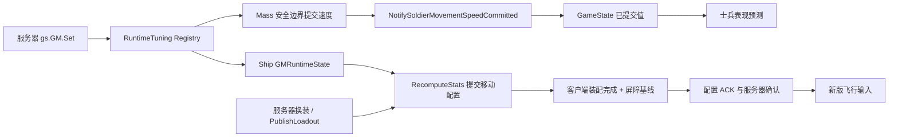

# 09 GM 调参与跨模块复制

[教材目录](D:/UE5.7/test1/Progress/DevelopmentDocumentation/UE网络教材/README.md) · [上一章](D:/UE5.7/test1/Progress/DevelopmentDocumentation/UE网络教材/08-客户端重建与平滑.md) · [下一章](D:/UE5.7/test1/Progress/DevelopmentDocumentation/UE网络教材/10-联机验证与故障定位.md)

## 学习目标

区分目标值、已提交值和复制值，追通飞船调参、换装、开火。

## UE 概念

WorldSubsystem 不自动复制；setter 成功也不表示客户端已应用。属性收敛不能替代跨对象确认：飞船必须等公共身份、装配和移动配置匹配后才能开始预测。

## 项目调用链与源码



[IsMutationAllowedForNetMode](D:/UE5.7/test1/Source/GuLiStrike/Gameplay/Tuning/GuLiRuntimeTuningSubsystem.cpp) 的真实限制是：

```cpp
return NetMode == NM_Standalone
    || NetMode == NM_ListenServer
    || NetMode == NM_DedicatedServer;
```

客户端控制台不会自动转成 Server RPC。ApplyChangedResults 发现目标速度尚未提交时暂缓发布；Authority 回调 NotifySoldierMovementSpeedCommitted 后仍核对当前目标，避免 Set/Reset 期间旧回调泄漏。PublishReplicatedState 经 GameState 发布，BeginPredictedMove 读取已提交值。

[WorldReplicationComponent](D:/UE5.7/test1/Source/GuLiStrike/Commander/Framework/GuLiCommanderWorldReplicationComponent.cpp) 在服务器生命周期内启停士兵模拟；纯 BattleGameMode 不会自动生成隐藏部队。SetSoldierSimulationEnabled 是服务器本地调用，不是 RPC，停用时仍可预存调参。

[Ship::SetGMRuntimeMultipliers / OnRep_GMRuntimeState](D:/UE5.7/test1/Source/GuLiStrike/Gameplay/Ship/GuLiStrikeShip.cpp) 更新并消费 GMRuntimeState。ApplyGMRuntimeStateLocally 先移除旧层再重建，重复通知不累乘；早于 BeginPlay 的状态先缓存，待表配置、默认装配及 bRuntimeStatsInitialized 就绪再 RecomputeStats。客户端重算供显示，只有服务器能 CommitServerMovementConfig。

同文件的 InstallPart、CycleParts 将目录索引、槽位、所见版本及屏障交给 ServerRequestPartChange / ServerRequestCycleParts。服务器核对当前 Air 占有者、比赛、就绪、0.1 秒间隔及真实 socket，再选择服务器目录内的部件。PublishLoadout 发布完整名册，空名册也是有效裸舰；客户端 ApplyReplicatedLoadout 全部成功才 SetAppliedLoadoutRevision，失败每秒重试。

[BeginServerMovementBarrier / RefreshClientMovementSynchronization](D:/UE5.7/test1/Source/GuLiStrike/Gameplay/Ship/GuLiShipMovementComponent.cpp) 保存位姿、速度、角速度和侧倾基线，关闭新版模拟。客户端匹配身份及装配后应用一次基线，清旧 SavedMoves 但保留 CMC 时间戳，再可靠 ACK。服务器复核版本和身份，复制确认；首个新版启用 move 通过引擎验证后才开始积分。普通旧配置 move 通过 CMC 时间戳检查后仅维护网络时间、不积分；更早占有生命周期的 move 还受时间戳屏障下限限制，不能一概视为可推进新时钟。

开火从 [SetFiringIntent / ServerSetFiring](D:/UE5.7/test1/Source/GuLiStrike/Gameplay/Ship/GuLiStrikeShip.cpp) 的按下、松开可靠 RPC 进入服务器 Tick。每件武器在 [Fire_Implementation](D:/UE5.7/test1/Source/GuLiStrike/Gameplay/Ship/GuLiStrikeWeaponPart.cpp) 校验安装归属、射速，按权威胶囊与原始网格基准计算炮口，生成复制弹丸。[Projectile::NotifyHit](D:/UE5.7/test1/Source/GuLiStrike/Gameplay/GuLiStrikeProjectile.cpp) 仅服务器结算并销毁；客户端关闭独立碰撞和飞行模拟。当前只沿用旧 NPC 的 ProjectileImpact，没有新增 Mass、飞船伤害或护盾。

## 易错点

装配与配置到达顺序不固定，不能收到任一属性就开门。停火允许在就绪撤销后执行；旧屏障的迟到开火不能重启武器。拥有飞船不代表可以提交任意部件类或炮口位置。

## 练习与答案

1. **理解题：为何不能立即发布 Registry 目标速度？** Mass 可能尚未提交，客户端会提前使用未来速度。
2. **理解题：重复 OnRep 会叠乘飞船倍率吗？** 不会，旧 GM 层先移除；移动基线也按屏障代次只应用一次。
3. **时序题：换装配置先到、名册后到，期间还收到旧开火和 move，怎么办？** 等装配完全匹配才 ACK；旧开火因版本/屏障拒绝，旧 move 不积分，新版确认后再恢复。
