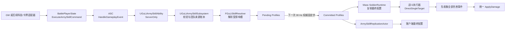

# GAS 基础：从 UE 概念到 GuLiStrike 军队技能桥接

[返回 GAS 目录](./README.md)

- 源码核对日期：2026-09-01。
- 引擎版本：UE 5.7；项目源码基线：`1bdf385`。
- 读者前置：能读懂 UE C++，了解 Actor、Component、PlayerState 和服务器权威。
- 验证边界：本文按当前源码、数据表与既有测试静态核对；本轮只写文档，没有重新构建或运行 PIE。运行结论引用[既有实现归档](../../../Archive/20260901-小兵扫射与指挥官GAS桥接实现与验证.md)，不把历史结果写成本轮实测。

## 学习目标

读完后应当能够：

1. 区分 ASC、Gameplay Ability、Ability Spec、Gameplay Tag、Gameplay Event、AttributeSet、Gameplay Effect、Gameplay Cue 和 Ability Task。
2. 解释项目为何让公共 `BattlePlayerState` 持有一个 ASC，而不是让 500 名或更多 Mass 小兵各持有一个 ASC。
3. 顺着真实代码讲清一条军队技能修改如何从指挥官进入 GAS，再在下一次 30 Hz 权威固定步作用于小兵。
4. 判断新增内容应该只填表、注册新的战斗执行器，还是确实需要引入 AttributeSet、Gameplay Effect 或新的 Gameplay Ability。
5. 用现有 GM 命令检查基础值、来源、最终值、技能替换和单兵战斗状态。

## 阅读路线

- 先读[核心对象与项目映射](#gas-核心对象与项目映射)，建立 UE 标准名词。
- 再读[项目整体结构](#项目整体结构)、[ASC 为什么放在 PlayerState](#为什么-asc-放在-playerstate)和[命令激活过程](#一条军队命令怎样激活-ability)，理解 GAS 入口。
- 接着读[最终配置解析](#修改来源如何解析成最终配置)、[固定步提交](#为什么变更要等到下一固定步)和[Mass 扫射执行](#mass-怎样真正执行扫射)。
- 最后用[扩展判断](#添加或扩展技能时怎么判断)、[GM 练习](#用-gm-做一次完整练习)和[练习答案](#练习与答案)巩固。

## 先用一句话理解 GAS

GAS（Gameplay Ability System）是 UE 提供的一套**能力授权、激活、状态标签、数值效果和联网协作框架**。它擅长回答这些问题：谁拥有某项能力、能力何时可以启动、启动后处于什么状态、成本与冷却怎样处理、效果如何修改属性、状态和表现怎样跨网络同步。Epic 的 [Gameplay Ability System 总览](https://dev.epicgames.com/documentation/en-us/unreal-engine/gameplay-ability-system-for-unreal-engine?application_version=5.7)给出了引擎标准对象的完整入口。

GAS 并不要求把整个战斗循环都写进 `UGameplayAbility`。GuLiStrike 当前采用的是混合结构：

- GAS 承载指挥官军队能力的授予与触发；BattlePlayerState、GameState 和桥接子系统共同提供并校验权威身份。
- World 子系统保存团队级修改来源并解析最终技能配置。
- Mass 权威子系统批量执行每名士兵的寻敌、冷却、移动中开火、伤害和死亡。

这正是理解当前实现的关键。项目“使用了 GAS”，但“扫射的每一发攻击”并不是一次 Gameplay Ability 激活。

## GAS 核心对象与项目映射

下表将 [Epic 的 GAS 组件说明](https://dev.epicgames.com/documentation/en-us/unreal-engine/understanding-the-unreal-engine-gameplay-ability-system?application_version=5.7)映射到当前源码；“UE 支持”与“项目已接入”是两件事。

| 概念 | UE 中的职责 | GuLiStrike 当前状态 |
|---|---|---|
| Ability System Component（ASC） | 保存已授予能力、活动效果、属性、标签，并负责能力激活和相关网络协作 | 已使用。`AGuLiBattlePlayerState::ArmyAbilitySystem` 是指挥官军队能力入口 |
| Owner Actor | GAS 语义中的长期拥有者，通常承载身份和 ASC 生命周期 | 当前是 `AGuLiBattlePlayerState` |
| Avatar Actor | 能力实际作用或表现所依附的对象，常见为当前 Pawn | 当前仍是同一个 `AGuLiBattlePlayerState`，因为军队命令不依赖 Pawn 动画或位置 |
| Gameplay Ability | 一段可授权、激活、取消并结束的能力执行逻辑 | 已使用一个通用的 `UGuLiArmySkillAbility`，负责把军队修改命令送入桥接子系统 |
| Ability Spec | ASC 中“已授予某能力”的运行时记录，含能力类、等级和句柄等 | 服务器用 `FGameplayAbilitySpec(UGuLiArmySkillAbility::StaticClass(), 1)` 授予一次 |
| Gameplay Tag | 注册过的层级语义标签，用于触发、筛选、阻挡和分类 | 已使用，例如 `Event.ArmySkill.Command`、`Skill.Attack.Basic`、`Weapon.MachineGun` |
| Gameplay Event | 用 Tag 和 `FGameplayEventData` 向能力传递一次事件 | 已使用。军队命令通过 `HandleGameplayEvent` 激活通用 Ability |
| AttributeSet / Attribute | 由 ASC 管理的可复制、可被效果修改的数值集合 | **尚未使用**。小兵生命、伤害、攻速和射程不是 GAS Attribute |
| Gameplay Effect（GE） | 即时或持续修改 Attribute、Tag 等状态的数据化效果 | **尚未使用**。当前加成来源是项目自定义 `FGuLiSkillSource`，不是 GE |
| Gameplay Cue | 面向音效、粒子和其他表现的标签化通知 | **尚未制作**。配置只把未来 Cue 搜索路径限制在 `/Game/GuLiStrike` |
| Ability Task | Ability 内等待动画、输入、目标或异步结果的任务节点 | **尚未使用**。当前命令 Ability 同步转交后立即结束 |
| 本地预测 | 客户端先执行，服务器确认或回滚 | **尚未用于军队技能**。当前 Ability 是 `ServerOnly` |

还要区分几个项目自定义名词：

- `FGuLiSkillSource` 是中性的“修改来源记录”，不是 Gameplay Effect。
- `FGuLiResolvedSkillProfile` 是解析好的最终技能快照，不是 AttributeSet。
- `FGuLiCombatExecutorRegistry` 是 Mass 战斗行为注册表，不是 GAS 内置类型。
- `BasicAttack` 是项目技能槽 ID，不是 `FGameplayAbilitySpecHandle`。

## 项目整体结构



从职责上看，GAS 只处在调用链前半段。每兵目标、下次开火时间和射击次数保存在 `FGuLiSoldierAttackState`；每兵权威生命保存在 `FSoldierRuntime`。这些数据不会塞进指挥官 ASC。

## 工程如何启用 GAS

项目在 [`GuLiStrike.uproject`](../../../../GuLiStrike.uproject) 中启用了 `GameplayAbilities` 插件，并在 [`GuLiStrike.Build.cs`](../../../../Source/GuLiStrike/GuLiStrike.Build.cs) 中加入三个公共模块：

```csharp
"GameplayAbilities",
"GameplayTags",
"GameplayTasks",
```

三个模块的分工可以简单理解为：

- `GameplayAbilities` 提供 ASC、Ability、Effect、AttributeSet 等主体类型。
- `GameplayTags` 提供注册式层级标签。
- `GameplayTasks` 是 Ability Task 的底层任务框架。

[`DefaultGame.ini`](../../../../Config/DefaultGame.ini) 还配置了：

```ini
[/Script/GameplayAbilities.AbilitySystemGlobals]
+GameplayCueNotifyPaths=/Game/GuLiStrike
```

当前没有正式 Gameplay Cue。这个配置只是避免未来 Cue 扫描项目外的大资产目录，不能当作“扫射特效已经接入”的证据。

## 为什么 ASC 放在 PlayerState

[`AGuLiBattlePlayerState`](../../../../Source/GuLiStrike/Battle/Framework/GuLiBattlePlayerState.h) 实现了 `IAbilitySystemInterface`，并返回自己的 `ArmyAbilitySystem`。构造时 ASC 开启复制并使用 `Minimal` Gameplay Effect 复制模式：

```cpp
ArmyAbilitySystem = CreateDefaultSubobject<UAbilitySystemComponent>(TEXT("ArmyAbilitySystem"));
ArmyAbilitySystem->SetIsReplicated(true);
ArmyAbilitySystem->SetReplicationMode(EGameplayEffectReplicationMode::Minimal);
```

初始化时项目执行：

```cpp
ArmyAbilitySystem->InitAbilityActorInfo(this, this);
```

第一个 `this` 是 Owner，第二个 `this` 是 Avatar。这里有意让两者都指向 PlayerState，因为命令能力的宿主和授权不依赖当前 Pawn 的身体、动画、位置或生命周期；已经接受的团队修改来源则保存在 World 子系统的 Team 账本中。Pawn 销毁和重生后，ASC 仍有稳定宿主；生命周期测试也检查了 ASC 不会因为 Pawn 更换而重复授予能力。

如果以后开发“指挥官本人释放一个需要角色位置和蒙太奇的冲刺技能”，更常见的做法会是 Owner 继续使用 PlayerState，Avatar 改为当前 Pawn，并在占有关系变化后重新调用 `InitAbilityActorInfo`。这和本期军队桥接不是同一需求，不能直接照搬当前 `this, this`。

服务器只授予一次通用军队 Ability：

```cpp
if (HasAuthority() && !bArmySkillAbilityGranted)
{
    ArmyAbilitySystem->GiveAbility(
        FGameplayAbilitySpec(UGuLiArmySkillAbility::StaticClass(), 1));
    bArmySkillAbilityGranted = true;
}
```

`GiveAbility` 的结果是 ASC 内的一条 Ability Spec。项目没有给 `Strafe`、`StrafeTest` 或每种科技组合各授予一个 GA；它只授予一个稳定的命令入口。

## 标准 Gameplay Ability 生命周期

[Epic 的 Gameplay Ability 文档](https://dev.epicgames.com/documentation/en-us/unreal-engine/using-gameplay-abilities-in-unreal-engine?application_version=5.7)描述了能力的授权、激活、取消和结束。把标准流程与当前项目并排看，更容易理解哪些工作由 GAS 完成：

| 阶段 | 标准 GAS 含义 | 当前军队命令 |
|---|---|---|
| Grant | 服务器用 `GiveAbility` 把 Ability Spec 放入 ASC | 公共 PlayerState 只授予一个 `UGuLiArmySkillAbility` |
| Actor Info | `InitAbilityActorInfo` 绑定 Owner 与 Avatar | Owner/Avatar 都是 PlayerState |
| Can Activate | GAS 检查标签、阻挡、成本等激活条件，也可由 Ability 自定义 | 使用基类检查；真正的指挥官席位与 Ready 校验在桥接子系统 |
| Activate | 输入、事件或句柄触发 `ActivateAbility` | `Event.ArmySkill.Command` 触发 ServerOnly Ability |
| Commit | `CommitAbility` 常用于正式提交 GAS Cost 与 Cooldown | 当前**没有调用**，也没有 GAS Cost/Cooldown |
| Running / Task | Ability 可等待蒙太奇、输入、目标或异步任务，并可被 Cancel | 当前没有 Ability Task，也没有持续阶段 |
| End | `EndAbility` 释放活动状态并结束本次执行 | 命令同步转交桥接后立即结束 |

扫射的 `NextFireSeconds`、攻速变化和完整换技冷却属于 Mass 的 `FGuLiSoldierAttackState`，不是 Gameplay Ability Cooldown。以后若开发指挥官个人主动技能，才可能在新的 Ability 中使用 `CommitAbility`、Cost、Cooldown 和 Ability Task。

## 一条军队命令怎样激活 Ability

入口是 [`AGuLiBattlePlayerState::ExecuteArmySkillCommand`](../../../../Source/GuLiStrike/Battle/Framework/GuLiBattlePlayerState.cpp)。它只允许在服务器执行，构造 `UGuLiArmySkillCommandPayload`，再发送带有 `Event.ArmySkill.Command` 的 Gameplay Event：

```cpp
FGameplayEventData Event;
Event.EventTag = TAG_GuLi_ArmySkillCommand;
Event.Instigator = this;
Event.Target = this;
Event.OptionalObject = Payload;
ArmyAbilitySystem->HandleGameplayEvent(TAG_GuLi_ArmySkillCommand, &Event);
```

[`UGuLiArmySkillAbility`](../../../../Source/GuLiStrike/Gameplay/Skills/GuLiArmySkillAbility.cpp) 在构造函数中声明：

```cpp
InstancingPolicy = EGameplayAbilityInstancingPolicy::InstancedPerActor;
NetExecutionPolicy = EGameplayAbilityNetExecutionPolicy::ServerOnly;
```

它还注册了同一 Gameplay Event Tag 作为触发器。因此 `HandleGameplayEvent` 会找到已经授予的 Ability Spec 并激活它。`ActivateAbility` 随后检查：

1. Payload 确实存在。
2. Owner 是权威 `AGuLiBattlePlayerState`。
3. Payload 的 Outer 就是该 PlayerState，避免拿其他对象拼装请求。
4. 当前 World 中存在 `UGuLiArmySkillSubsystem`。

检查通过后才调用桥接的 `ExecuteCommand`，然后立即 `EndAbility`。当前没有蒙太奇、等待输入、异步目标或持续阶段，因此不需要 Ability Task。

这里的 Gameplay Event 是服务器本地的能力触发方式，不是一个让客户端任意提交阵营、兵种和数值的 RPC。GM 和后续玩法适配器必须先进入服务器认可的 `BattlePlayerState`，桥接还会再次核验指挥官席位。

## Gameplay Tag 在项目里做什么

项目使用 Native Gameplay Tag，在 [`GuLiSkillTags.cpp`](../../../../Source/GuLiStrike/Gameplay/Skills/GuLiSkillTags.cpp) 中注册：

| Tag | 当前含义 |
|---|---|
| `Event.ArmySkill.Command` | 激活通用军队命令 Ability |
| `Skill.Attack.Basic` | 技能属于普攻 |
| `Skill.Usage.Common` | 技能可被不同兵种复用 |
| `Weapon.MachineGun` | 当前扫射的机枪分类 |
| `Weapon.Test` | 替换接口测试分类，不代表正式火炮 |

Tag 不是随手填写的普通字符串。数据表加载时会用 `RequestGameplayTag(..., false)` 查询注册表；未知 Tag 会使技能目录校验失败。GM 命令也会拒绝未知 Tag。

Tag 的层级让后续规则可以面向一类技能。例如来源可以要求最终技能同时具有 `Skill.Attack.Basic` 和 `Weapon.MachineGun`。技能替换后，测试变体仍保留普攻和通用标签，但武器分类从 `Weapon.MachineGun` 变为 `Weapon.Test`；机枪专属加成会自动失效，而普攻槽通用加成仍可保留。

## 数据表、技能槽与执行器

基础配置来自 [`data/Excel/GuLiStrikeCommander.xlsx`](../../../../data/Excel/GuLiStrikeCommander.xlsx)，经 JSON 和 DataTable 管线进入 `UGuLiCommanderDataSubsystem`。在 GitHub 上可直接审阅生成的 [`Skills JSON`](../../../../data/Json/DT_GuLiStrikeCommander_Skills.json) 和 [`UnitSkills JSON`](../../../../data/Json/DT_GuLiStrikeCommander_UnitSkills.json)。当前涉及三张表：

| 表 | 管理内容 |
|---|---|
| `Soldiers` | 兵种生命、移动速度、模型和防御等单位属性 |
| `Skills` | `SkillId`、显示名、`ExecutorId` 和 Gameplay Tags |
| `UnitSkills` | `UnitTypeId + SlotId + SkillId` 对应的伤害、攻速、射程，以及该槽默认技能 |

当前调试数据如下：

| 兵种 | 生命 | 默认技能 | 伤害 | 攻速 | 射程 |
|---|---:|---|---:|---:|---:|
| UnitType 1 | 100 | `Strafe` | 10 | 2 次/秒 | 10000 cm（100 m） |
| UnitType 2 | 300.5 | `Strafe` | 7.5 | 4 次/秒 | 15000 cm（150 m） |

两个兵种复用同一个技能定义和 `DirectSingleTarget` 执行器，但从各自的 `UnitSkills` 行取得不同基础数值。生命来自 `Soldiers`，并不属于技能配置，更不是 AttributeSet。

`StrafeTest` 也使用 `DirectSingleTarget`，只为验证技能替换和不同基础数值。它不是已经完成的火炮，因为它没有范围爆炸、实体弹道或另一套行为执行器。

三个标识的职责不能混淆：

- `SlotId` 表示单位身上的逻辑装备位，例如 `BasicAttack`。
- `SkillId` 表示该槽当前装备的技能，例如 `Strafe`。
- `ExecutorId` 表示技能实际采用的行为算法，例如 `DirectSingleTarget`。

因此“同一行为，不同配置”只需复用 Executor；“同一槽，更换技能”由 SkillId 替换；“完全不同的攻击行为”才需要注册新的 Executor。

## 修改来源如何解析成最终配置

核心结构在 [`GuLiSkillTypes.h`](../../../../Source/GuLiStrike/Gameplay/Skills/GuLiSkillTypes.h)，纯解析规则在 [`GuLiSkillResolver.cpp`](../../../../Source/GuLiStrike/Gameplay/Skills/GuLiSkillResolver.cpp)。一次来源 `FGuLiSkillSource` 包含：

- 稳定的 `SourceInstanceId`。
- 仅供诊断的 `DebugLabel`。
- 零个或多个数值 Modifier。
- 零个或多个技能槽 Replacement。

`DebugLabel` 本身不参与 Resolver 的匹配或计算。GM 命令参数中的 `label` 会同时用于显示，并按 Team+label 派生稳定的 `SourceInstanceId`。

同一 `SourceInstanceId` 再次提交表示更新整个来源，不会再叠一层。这让未来科技、卡牌、装备或光环系统都可以用自己的实例 ID 安全地提交和撤销，而不需要直接改 Mass 小兵。

解析顺序是：

1. 按队伍、兵种和槽找到默认技能。
2. 检查所有替换来源，最高优先级决定最终 SkillId。
3. 加载“该兵种使用最终技能”的 `UnitSkills` 基础行。
4. 用最终 SkillId 和 Tags 筛选仍适用的 Modifier。
5. 计算普通来源数值。
6. 最后应用 GM 数值覆盖。
7. 生成 `FGuLiResolvedSkillProfile`，等待下一个权威固定步提交。

普通数值公式为：

```text
最终值 =（基础值 + 所有固定加值之和）× 各独立来源百分比倍率的乘积
```

假设基础伤害为 10：

- 来源 A：伤害 `+20%`，倍率为 `1.2`。
- 来源 B：伤害 `+20%`，倍率为 `1.2`。
- 最终伤害：`10 × 1.2 × 1.2 = 14.4`。

两个来源不会得到 14。独立来源按乘法组合，所以结果是 `×1.44`。同一个来源内针对同一属性的多个百分比先相加：一个来源同时给 `+20%` 和 `+10%` 时，该来源倍率为 `1.3`；拆成两个独立来源则是 `1.2 × 1.1 = 1.32`。

替换规则也有确定性约束：

- 同一优先级要求两个不同 SkillId 时，整次变更被拒绝。
- 高优先级来源移除后，重新解析仍保留的低优先级来源。
- Replacement 不允许按当前技能或 Tag 做链式条件，避免 A 换 B、B 又触发 C 的顺序依赖和循环。
- 每个被替换的 `UnitTypeId + SlotId + SkillId` 必须存在基础配置。

数值必须有限且非负；伤害上限 `1e9`、攻速上限 `30/s`、射程上限 `1e6 cm`。百分比在单个来源内合计不得低于 `-100%`。非法候选会整体拒绝，不会静默限幅，也不会留下部分修改。

## World 子系统为什么是桥接核心

[`UGuLiArmySkillSubsystem`](../../../../Source/GuLiStrike/Gameplay/Skills/GuLiArmySkillSubsystem.h) 是 `UWorldSubsystem`。它负责：

- 缓存技能定义和兵种技能配置。
- 保存红蓝队各自的来源账本和 GM 覆盖。
- 验证发令者确实占有当前战局的指挥官席位，并且 Battle/Soldier 两道就绪门都已通过。
- 只重算受影响的 `UnitTypeId + SlotId`。
- 把通过校验的结果先放进 `PendingProfiles`。
- 在权威固定步边界提交为 `CommittedProfiles`；只有最终配置内容变化的 Profile 才分配新 Revision，相同内容的重复 Upsert 保留原 Revision。
- 向客户端发布当前 MatchEpoch 的最终配置。

账本属于 World 和 Team，不属于某个 Pawn。Pawn 重生不会删除来源；同队指挥官换人后，新占位者通过权威席位校验后可以继续管理原账本，旧 PlayerState 不能再写。战局 Epoch 改变时，来源和 GM 覆盖清空并重新解析默认配置。

`StageTeam` 会先在临时结果上完成目录、目标、替换冲突、数值范围和 Executor 注册检查，全部通过后才替换账本并写入 Pending。这就是“失败保留旧状态”的原子性来源。

## 为什么变更要等到下一固定步

服务器的 Mass 权威模拟以 30 Hz 固定步运行。在 [`UGuLiBattleAuthoritySubsystem::TickAuthority`](../../../../Source/GuLiStrike/Commander/Mass/GuLiBattleAuthoritySubsystem.cpp) 中，顺序是：

1. 提交准备好的移动和导航任务。
2. `CommitCombatProfiles()` 提交待生效技能配置。
3. 推进本步移动、到达和恢复状态。
4. `TickSoldierCombat()` 使用本步移动后的权威位置采样攻击。
5. 先收集所有伤害事件，再统一 `ApplyDamage`。

这样可以避免同一帧中一半士兵读到旧技能、一半士兵读到新技能。统一收集再扣血也允许同一步双方同时击杀，而不会因为数组遍历顺序让后处理的一方失去本来应该发生的攻击。

技能配置变化时，Authority 按 Revision 更新受影响士兵的 `CombatProfile`。纯攻速变化保留冷却完成比例；SkillId 或 ExecutorId 变化会清除旧目标，并等待新技能的完整冷却。这些是 Mass 战斗规则，不是 GAS 自动提供的行为。

## 为什么不为每名 Mass 小兵创建 ASC

ASC 是面向 UObject/Actor 的有状态组件，而 Mass 用紧凑 Fragment 和批处理遍历大量实体。当前战场以 500 兵为正常验证规模，还会采样 10000 兵。如果每名小兵都创建 Actor、ASC、Ability Spec、Effect 容器和复制状态，会破坏当前批量数据路径，并显著增加对象数量、内存、Tick/复制管理和调试复杂度。

更关键的是，当前需求属于“指挥官选择一条规则，影响全队某类单位”，不是“每名士兵独立按玩家输入激活复杂技能”。让指挥官 ASC 承载授权入口，让 World 子系统解析团队最终配置，再让 Mass 批量读取，和需求的粒度一致。

这不是永远禁止逐兵 ASC。如果以后某类单位必须拥有独立预测技能、复杂持续 GE、独立资源和大量 Ability Task，可以重新评估 Actor 化或混合代理。但不能只因为“攻击叫技能”，就默认给每个 Mass Entity 配一个 ASC。

## Mass 怎样真正执行扫射

[`FGuLiCombatExecutorRegistry`](../../../../Source/GuLiStrike/Commander/Mass/GuLiSoldierCombat.cpp) 默认注册 `DirectSingleTarget`。它不关心技能叫“扫射”还是“测试变体”，只把最终 Profile 的伤害写成一个 `FGuLiCombatDamageEvent`：

```cpp
Events.Add({
    Source.SoldierId,
    Target.SoldierId,
    Source.Profile->SkillId,
    Source.Profile->Damage
});
```

`CollectAttacks` 负责目标合法性、200 ms 分批寻敌、稳定的 SoldierId 同距离决胜、冷却、移动中开火、每步最多一发和不积攒补射。`UGuLiBattleAuthoritySubsystem` 再统一结算伤害。

因此：

- GAS 让一项团队规则以受控方式进入系统。
- Resolver 把所有来源折叠为小而稳定的最终配置。
- Executor 决定技能行为。
- Mass 固定步决定每名士兵何时、对谁执行。

## 当前网络策略

军队 Ability 使用 `ServerOnly`，没有客户端预测激活。ASC 设置为复制且使用 `Minimal` 模式，但当前没有 Gameplay Effect 或 AttributeSet 依赖 ASC 做战斗数值复制。

最终技能配置由 [`AGuLiArmySkillReplicationActor`](../../../../Source/GuLiStrike/Gameplay/Skills/GuLiArmySkillReplicationActor.h) 单独发布。它是 Always Relevant、无移动复制、无 Tick 的轻量 Actor，只复制：

- `MatchEpoch`。
- `TArray<FGuLiResolvedSkillProfile>`。

客户端 `OnRep_State` 把快照交给本地 `UGuLiArmySkillSubsystem` 重建查询表。客户端只能读取最终配置，不能用复制回来的 Team 或 Profile 反向修改服务器。

每次开火不会发送一次 RPC。权威服务器统一结算，生命和死亡通过现有士兵状态/快照链路同步。这样避免 500 兵交战时把网络压力变成“射击次数 × RPC 数量”。

`MatchEpoch` 防止旧战局配置泄漏到新战局：本地快照 Epoch 与当前 GameState 不一致时，`FindResolvedSkill` 返回空，而不是继续使用旧数值。

## 当前没有使用的 GAS 功能

这些能力的标准用途可对照 Epic 的 [Gameplay Attributes 与 AttributeSet](https://dev.epicgames.com/documentation/en-us/unreal-engine/gameplay-attributes-and-attribute-sets-for-the-gameplay-ability-system-in-unreal-engine?application_version=5.7)和 [Gameplay Ability Tasks](https://dev.epicgames.com/documentation/en-us/unreal-engine/gameplay-ability-tasks-in-unreal-engine?application_version=5.7)；以下各项都只是说明边界，不代表项目已完成。

### AttributeSet

项目没有 `UAttributeSet` 或 `FGameplayAttributeData`。小兵生命是 Mass 权威运行时的 `float`，技能伤害、攻速和射程来自解析后的 Profile。不要把“已经支持浮点生命”写成“已经接入 GAS Attribute”。

如果以后指挥官本人需要法力、耐力、技能充能，并且这些值要被多种 GE 修改和复制，AttributeSet 才是自然选择。Mass 小兵是否也使用 AttributeSet，仍需单独做规模评估。

### Gameplay Effect

当前科技/卡牌尚未开发，团队加成使用中性 `FGuLiSkillSource`。它提供稳定 ID、原子更新、目标筛选和撤销，但没有 GE 的持续时间、堆叠策略、周期执行或 Attribute 捕获。

后续科技和卡牌可以先做适配器，把自己的实例状态转成 Source，而不需要立刻改为 GE。对于指挥官自身的短时 Buff、资源成本或冷却，GE 可能更合适。

### Gameplay Cue

扫射当前没有正式特效、动画或音效。Gameplay Cue 适合表现，不应承载命中、扣血或其他必须可靠执行的权威逻辑。

### Ability Task 与预测

当前 Ability 同步提交命令后立即结束，不等待输入、目标、蒙太奇或网络确认。以后如果加入指挥官主动瞄准、蓄力、选区确认或蒙太奇阶段，再考虑 Ability Task 和合适的 Net Execution Policy。

## 添加或扩展技能时怎么判断

### 情况一：新技能复用现有单体直伤行为

只需：

1. 在 Excel `Skills` 添加 SkillId、显示名、`DirectSingleTarget` 和 Tags。
2. 在 `UnitSkills` 为每个允许使用它的兵种和槽补齐基础数值。
3. 导出 JSON、生成行结构并导入 DataTable。
4. 用 Resolver 测试和 GM 替换验证。

不需要复制一份攻击循环，也不需要创建新的 Gameplay Ability。

### 情况二：新技能有真正不同的行为

例如范围爆炸、穿透或治疗，需要：

1. 实现新的 Mass 战斗 Executor。
2. 通过 `UGuLiBattleAuthoritySubsystem::RegisterCombatExecutor` 同时注册到战斗表和技能桥接。
3. 让 `Skills.ExecutorId` 指向新 Executor。
4. 给每个兵种/槽/技能组合提供 `UnitSkills` 基础配置。
5. 补行为、替换、网络和性能测试。

桥接还预留 `RegisterEffectHook`，但当前没有燃烧、穿透等具体 Hook，生产战斗路径也没有调用 `ExecuteEffectHook`。仅注册 Hook 不会产生行为；未来必须由 Executor 或统一结算阶段显式调用。

### 情况三：科技或卡牌改变团队规则

后续系统应生成稳定 `SourceInstanceId`，构造 `FGuLiArmySkillCommand`，再通过当前权威 `BattlePlayerState::ExecuteArmySkillCommand` 进入 ServerOnly GA；不要绕过能力入口直接调用 World 子系统。命令中的动作是 Upsert 或 Remove：

- 获得或升级时 Upsert 同一来源 ID。
- 失去或洗掉时 Remove 同一来源 ID。
- 不直接改 `FSoldierRuntime`。
- 不直接写最终 Profile。
- 不为每张卡复制一套技能代码。

### 情况四：指挥官本人释放主动技能

这可能需要新的 Gameplay Ability、AttributeSet、Gameplay Effect、Ability Task 和 `Owner=PlayerState / Avatar=Pawn` 生命周期。应和团队桥接分开设计，避免把个人施法状态塞进 `FGuLiSkillSource`。

## 用 GM 做一次完整练习

以下命令只在非 Shipping、服务器权威 World 中使用。对应阵营还必须存在当前指挥官，并通过 BattleReady、SoldierStreamReady 和权威席位校验。日志分类为 `LogGuLiSkillGM`。

先查看红方 1 号兵种普攻：

```text
gs.GM.Skill.Get Red 1 BasicAttack
```

给它添加第一个独立 `+20%` 伤害来源：

```text
gs.GM.Skill.Source Red 1 Damage20A damage percent 0.2 * * BasicAttack
```

再添加第二个独立 `+20%` 来源：

```text
gs.GM.Skill.Source Red 1 Damage20B damage percent 0.2 * * BasicAttack
```

再次 `Get`，基础伤害 10 应解析为 14.4。移除一个来源后应回到 12：

```text
gs.GM.Skill.Remove Red Damage20A
```

修改会在下一次权威固定步统一提交。如果命令后立刻执行 `Get`，日志可能先同时显示当前 `Committed final` 和 `Accepted pending final`；下一固定步后再查才是新的已提交结果。

把普攻替换为测试变体：

```text
gs.GM.Skill.Replace Red 1 ReplaceTest StrafeTest 100 BasicAttack
```

这只验证技能替换和新基础配置，不代表火炮完成。移除来源恢复底层技能：

```text
gs.GM.Skill.Remove Red ReplaceTest
```

直接覆盖最终伤害，再清除覆盖：

```text
gs.GM.Skill.Set Red 1 damage 42.25 BasicAttack
gs.GM.Skill.Reset Red 1 BasicAttack
```

检查某名士兵当前技能、目标、生命、冷却、移动状态、射击次数和 Profile Revision：

```text
gs.GM.Skill.Soldier 63
```

可用命令总览：

| 命令 | 用途 |
|---|---|
| `gs.GM.Skill.List` | 列出所有已提交最终配置 |
| `gs.GM.Skill.Get <Team> <UnitTypeId> [Slot]` | 解释基础值、来源、最终值、Pending 和最近拒绝原因 |
| `gs.GM.Skill.Set ...` | 在正常解析后覆盖单项最终数值 |
| `gs.GM.Skill.Reset ...` | 只清 GM 数值覆盖，保留其他来源 |
| `gs.GM.Skill.Source ...` | 添加或更新中性数值来源 |
| `gs.GM.Skill.Replace ...` | 添加或更新技能替换来源 |
| `gs.GM.Skill.Remove <Team> <Label>` | 按稳定派生 ID 移除 GM 来源 |
| `gs.GM.Skill.Soldier <Id>` | 查询单兵战斗与导航状态 |
| `gs.GM.Skill.Spawn ...` | 生成指定兵种调试士兵 |
| `gs.GM.Skill.Bench [500 或 10000] [Steps]` | 只测生产战斗帮助函数，不含渲染、导航和网络 |

## 常见误区

1. **“用了 GAS，所有伤害都必须由 Gameplay Effect 扣。”**
   GAS 支持这种做法，但当前 Mass 权威伤害接口更符合大规模批处理。项目没有逐兵 AttributeSet。

2. **“扫射应该是 500 个 GA 同时激活。”**
   当前 GA 表示指挥官提交团队规则的入口。逐兵攻击由 Mass 固定步和 Executor 执行。

3. **“Gameplay Tag 就是一个不会出错的字符串。”**
   Tag 必须注册；未知 Tag 会被数据加载或 GM 校验拒绝。层级匹配也和普通字符串相等判断不同。

4. **“创建 ASC 后直接 GiveAbility 就够了。”**
   ASC 还需要正确的 `InitAbilityActorInfo`，并要在 Owner/Avatar 生命周期改变时重新绑定。当前项目恰好让两者都稳定地使用 PlayerState。

5. **“PlayerState 的 Owner 和 Avatar 永远都应相同。”**
   这是当前军队命令的选择。依赖 Pawn 位置、动画或碰撞的个人技能通常需要当前 Pawn 作为 Avatar。

6. **“来源更新时先改账本，失败再撤销。”**
   当前实现先解析候选并完成全部校验，通过后才替换账本和 Pending，避免半应用。

7. **“客户端拿到最终 Profile 后也可以结算伤害。”**
   客户端快照用于展示和查询。权威攻击、伤害和死亡只在服务器 Mass 模拟中结算。

8. **“销毁旧 Pawn 或旧指挥官时，应顺便清掉团队加成。”**
   来源属于 World 中的 Team 账本。旧宿主失效后失去写权限，但账本由新指挥官继续管理；新战局 Epoch 才清空。

## 源码阅读路线

建议按以下顺序阅读：

1. [`GuLiStrike.Build.cs`](../../../../Source/GuLiStrike/GuLiStrike.Build.cs)：模块依赖。
2. [`GuLiBattlePlayerState.h`](../../../../Source/GuLiStrike/Battle/Framework/GuLiBattlePlayerState.h) / [`GuLiBattlePlayerState.cpp`](../../../../Source/GuLiStrike/Battle/Framework/GuLiBattlePlayerState.cpp)：ASC 所有权、ActorInfo 和能力授予。
3. [`GuLiArmySkillAbility.h`](../../../../Source/GuLiStrike/Gameplay/Skills/GuLiArmySkillAbility.h) / [`GuLiArmySkillAbility.cpp`](../../../../Source/GuLiStrike/Gameplay/Skills/GuLiArmySkillAbility.cpp)：Gameplay Event 如何进入 ServerOnly Ability。
4. [`GuLiSkillTags.h`](../../../../Source/GuLiStrike/Gameplay/Skills/GuLiSkillTags.h) / [`GuLiSkillTags.cpp`](../../../../Source/GuLiStrike/Gameplay/Skills/GuLiSkillTags.cpp)：原生 Tag 注册。
5. [`GuLiSkillTypes.h`](../../../../Source/GuLiStrike/Gameplay/Skills/GuLiSkillTypes.h)：项目技能数据合同。
6. [`GuLiSkillResolver.cpp`](../../../../Source/GuLiStrike/Gameplay/Skills/GuLiSkillResolver.cpp)：替换、筛选、公式和原子校验。
7. [`GuLiArmySkillSubsystem.cpp`](../../../../Source/GuLiStrike/Gameplay/Skills/GuLiArmySkillSubsystem.cpp)：团队账本、Pending/Committed、Epoch 和诊断。
8. [`GuLiArmySkillReplicationActor.h`](../../../../Source/GuLiStrike/Gameplay/Skills/GuLiArmySkillReplicationActor.h) / [`GuLiArmySkillReplicationActor.cpp`](../../../../Source/GuLiStrike/Gameplay/Skills/GuLiArmySkillReplicationActor.cpp)：最终配置复制。
9. [`GuLiSoldierCombat.h`](../../../../Source/GuLiStrike/Commander/Mass/GuLiSoldierCombat.h) / [`GuLiSoldierCombat.cpp`](../../../../Source/GuLiStrike/Commander/Mass/GuLiSoldierCombat.cpp)：逐兵攻击状态和 Executor。
10. [`GuLiBattleAuthoritySubsystem.cpp`](../../../../Source/GuLiStrike/Commander/Mass/GuLiBattleAuthoritySubsystem.cpp)：固定步提交、移动后攻击和统一伤害结算。
11. [`GuLiSkillResolverTests.cpp`](../../../../Source/GuLiStrike/Gameplay/Skills/Tests/GuLiSkillResolverTests.cpp) 与 [`GuLiSkillLifecycleTests.cpp`](../../../../Source/GuLiStrike/Gameplay/Skills/Tests/GuLiSkillLifecycleTests.cpp)：把规则当作可执行规格阅读。

## 练习与答案

### 练习 1

同一来源内有两个伤害 `+20%` Modifier，与两个独立来源各有一个 `+20%`，结果是否相同？

**答案：**不同。同一来源先相加，倍率是 `1.4`；两个独立来源相乘，倍率是 `1.2 × 1.2 = 1.44`。

### 练习 2

指挥官 Pawn 被销毁后，为什么军队来源不应该自动消失？

**答案：**ASC 的 Owner/Avatar 当前都是 PlayerState，团队来源又保存在 World 子系统的 Team 账本中。Pawn 只是可替换表现宿主，不是来源所有者。删除来源应由来源生命周期或新战局 Epoch 决定。

### 练习 3

新增一个仍为单体直接伤害、但数值和标签不同的技能，需要新建 `UGameplayAbility` 吗？

**答案：**通常不需要。添加 Skills 和 UnitSkills 数据，继续使用 `DirectSingleTarget` 即可。只有能力入口或行为执行方式真正不同，才需要新的 GA 或 Executor。

### 练习 4

为什么最终技能 Profile 还要单独复制，ASC 不是已经开启复制了吗？

**答案：**最终 Profile 是项目桥接生成的自定义团队快照，不是 ASC 内的 Attribute 或 Active Gameplay Effect；Mass 小兵也没有 ASC。专用复制 Actor 明确同步最终配置，且避免逐发 RPC。

## 官方参考与项目关联

- [Epic：Gameplay Ability System 总览](https://dev.epicgames.com/documentation/en-us/unreal-engine/gameplay-ability-system-for-unreal-engine?application_version=5.7)
- [Epic：理解 Gameplay Ability System](https://dev.epicgames.com/documentation/en-us/unreal-engine/understanding-the-unreal-engine-gameplay-ability-system?application_version=5.7)
- [Epic：使用 Gameplay Abilities](https://dev.epicgames.com/documentation/en-us/unreal-engine/using-gameplay-abilities-in-unreal-engine?application_version=5.7)
- [Epic：Gameplay Attributes 与 AttributeSet](https://dev.epicgames.com/documentation/en-us/unreal-engine/gameplay-attributes-and-attribute-sets-for-the-gameplay-ability-system-in-unreal-engine?application_version=5.7)
- [Epic：Gameplay Ability Tasks](https://dev.epicgames.com/documentation/en-us/unreal-engine/gameplay-ability-tasks-in-unreal-engine?application_version=5.7)
- [项目技术方案](../../20260901-小兵扫射与指挥官GAS桥接.md)
- [项目玩法记录](../../../Gameplay/战斗.md)
- [实现与验证归档](../../../Archive/20260901-小兵扫射与指挥官GAS桥接实现与验证.md)

本文描述的是当前项目选择，而不是 GAS 的能力上限。判断新需求时，先问清它的所有者、生命周期、执行频率、网络权威和数据规模，再决定使用 GAS 标准对象、现有军队桥接、Mass 执行器，或三者组合。
