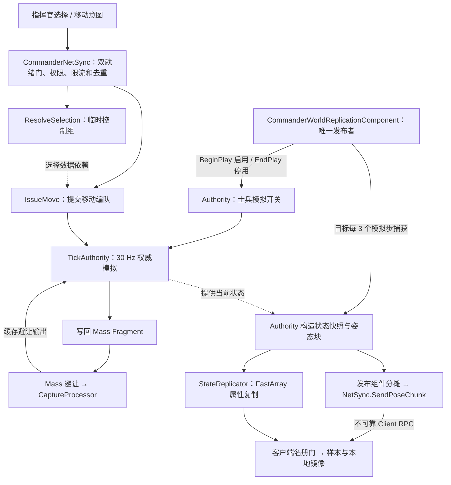

# 精读笔记：GuLiBattleAuthoritySubsystem.cpp —— 从选兵意图到服务端权威移动

- 源码核对日期：2026-08-31（初稿：2026-08-30）
- 源码增补日期：2026-09-01（自由落位、单兵部分接受与NavMesh分帧修复已按当前源码复核）
- 对应需求：UE 网络教材与 Mass 精读笔记同步修订；本文是现有源码导读，不是新功能方案。
- 状态：已同步公共 Battle 框架；本文是源码导读，验证事实与未通过项见文末。
- 阅读基线：当前工作区源码，包含本次开始前已有的未提交修改，不以旧归档或 Git HEAD 代替现状。
- 主文件：[GuLiBattleAuthoritySubsystem.cpp](../../../../Source/GuLiStrike/Commander/Mass/GuLiBattleAuthoritySubsystem.cpp)
- 接口与配置声明：[GuLiBattleAuthoritySubsystem.h](../../../../Source/GuLiStrike/Commander/Mass/GuLiBattleAuthoritySubsystem.h)

`UGuLiBattleAuthoritySubsystem` 把指挥官的选择、移动意图变成服务端认可的士兵状态，以固定步长推进位置，再提供给网络复制与表现层。读懂它的关键，是分清“士兵身份”“临时控制组”“一次移动的编队”，以及谁最终写入位置。

> 2026-09-01提示：[移动命令自由扩散与静态寻路线](../../20260901-移动命令自由扩散与静态寻路线.md)已经把固定终点整组裁决改为自由候选、单兵部分接受和分帧规划。下方第5节按当前源码描述；构建、自动化与无头冒烟已经通过，交互PIE、双客户端和完整性能仍以文末边界为准。

## 1. 先看全貌，再看辅助算法

这个类继承 `UTickableWorldSubsystem`。它不是一个 Mass Processor，也不要求读者从文件开头的数学辅助函数一路顺读。

建议分三遍阅读：

| 阅读顺序 | 入口 | 先回答的问题 |
|---|---|---|
| 第一遍：数据与生命周期 | 三个运行时结构、`ShouldCreateSubsystem`、`SetSoldierSimulationEnabled`、`TrySpawnAuthorityPopulation` | 谁启用士兵？何时生成 500 人？客户端是否模拟？ |
| 第二遍：完整业务链 | `ResolveSelection` → `IssueMove` → `TickAuthority` | 一次点击如何改变哪些士兵的移动？ |
| 第三遍：支撑机制 | `AssignFormationSlots`、`TickLocalFlowFields`、热调参、快照输出 | 槽位如何分配？异步结果如何防止过期？数据如何出网？ |



图中的 `ResolveSelection → IssueMove` 表示选择数据的依赖关系，不是选兵函数会自动调用移动函数；避让箭头表示数据往返，不保证同一世界帧内先后次序。

公开的选择、移动、伤害、调参入口是服务器本地 C++ API。导航重建回调的 `UFUNCTION` 不是移动 RPC。请求从 [CommanderNetSync::HandleSelectionRequest / HandleMoveRequest](../../../../Source/GuLiStrike/Commander/Framework/GuLiCommanderNetSyncComponent.cpp) 进入；公共身份握手由 [PlayerNetSync](../../../../Source/GuLiStrike/Battle/Network/GuLiPlayerNetSyncComponent.cpp) 承担。

指挥命令要求公共连接就绪、士兵流就绪和 Commander 权限。Ground/Air 可在公共握手后使用自己的 Pawn，也可通过专业名册门观察士兵；公共就绪不授予选兵权限。公共 GameMode 的玩家 Pawn 复活与本文的士兵死亡/残骸清理是两条生命周期。

## 2. 四种身份不能混用

| 名称 | 表示什么 | 存续与用途 |
|---|---|---|
| `FGuLiSoldierId` | 一名独立士兵 | 选择、指令和网络协议使用；换组、改令不换身份 |
| `FMassEntityHandle` | 本地 EntityManager 中的实体访问键 | 访问 Fragment；不跨网络发送，也不能拿客户端句柄与服务端对比 |
| `FGuLiControlCohortId` | 一次选兵形成的临时控制组 | 组目标人数为 25，可以不足；成员集合在选择状态中保存 |
| `FormationId` / `BatchOrderId` | 一个移动编队 / 一次移动请求的成功批次 | 每个接令组有自己的编队；同批编队共享指令号与目标 |

一次选择得到 A、B 两组，再向一个地点移动：A、B 可以生成两个 `FOrderFormationRuntime`，但两者的 `BatchOrderId` 相同。士兵保存的是这个批次号，而不是 `FormationId`。

重新下令时，士兵的 `ActiveOrderId` 被新批次覆盖。旧编队可能仍保留这个 SoldierId，但每次模拟都检查 `Soldier.ActiveOrderId == Formation.BatchOrderId`，因此不能继续控制已经改令的成员。旧编队清理时也做相同检查，防止把新指令清空。

`AllocateNonZero` 会跳过保留值 0。它提供的是非零序号分配，不能理解成跨进程、跨战局或无限时间范围的全局唯一 ID。

### 三个运行时结构的分工

| 结构 | 主要数据 | 阅读重点 |
|---|---|---|
| `FSoldierRuntime` | 身份、位置、速度、生命、当前指令、死亡时间 | 服务端业务记录；实际移动由本类计算 |
| `FOrderFormationRuntime` | 成员、槽位、引导点、共享路径、流场、到达状态 | 一条移动指令在一个控制组中的执行现场 |
| `FGuLiBattleAuthorityState` | EntityManager 弱引用、全体士兵、ID 索引、空间格、编队、计数器 | 当前 World 的总容器，由 `AuthorityState` 独占持有 |

`AuthorityState` 使用 PImpl：头文件只声明不完整类型，实现细节留在 `.cpp`。自定义 Deleter 在完整类型可见的位置执行删除。

`FSoldierRuntime` 与 Fragment 中存在重复信息，这是当前实现的实际边界：本类修改运行时记录，再把对应字段写回 Mass。不要假定“另一个 Processor 改了 Transform，本类就会自动回读并同步自己的 Location”。继续开发时要明确每个字段由谁写、何时同步。

## 3. 生命周期：必须整批生成成功

`ShouldCreateSubsystem` 要求是游戏 World 且 `NetMode != NM_Client`。单机、Listen Server 和 Dedicated Server 可以运行；普通客户端不创建这个权威子系统。

`Initialize` 声明 Mass 与运行时调参依赖，分配权威状态、读取有效数值；这不等于已经生成部队。模拟开关 `bSoldierSimulationEnabled` 默认 false。`OnWorldBeginPlay` 订阅导航事件并尝试生成，但仍受开关约束。

[GuLiCommanderWorldReplicationComponent::BeginPlay](../../../../Source/GuLiStrike/Commander/Framework/GuLiCommanderWorldReplicationComponent.cpp) 取得本 World 唯一调度权后，本地调用 `SetSoldierSimulationEnabled(true)`。组件可能晚于 Subsystem BeginPlay，因此启用时再尝试生成，导航未就绪则由后续 Tick 重试。组件 EndPlay 调用 false，停止模拟并清理部队；纯公共 BattleGameMode 没有此模块，不会自动生成 500 兵。

`TrySpawnAuthorityPopulation` 的顺序值得完整读一遍：

1. 确认模拟已启用、世界已开始运行、Mass 子系统存在、尚未生成部队。
2. 找到 **CommanderSoldier 专用 NavData**，并确认红蓝双方部署中心都能投影。
3. 创建包含移动、导航、身份、生命、指令等 Fragment 的 Archetype。
4. 预建仅 Even/Odd 调参标签不同的基础组合，添加只读共享移动/避让参数。
5. 用 `BatchCreateEntities` 一次申请 500 个 Entity，并保持创建上下文存活到初始化结束。
6. 按两队、每队 10 个出生方阵、每方阵 25 人分配身份和位置，填好 Fragment 与 ID 索引。
7. 确认 **500 个出生位置全部投影成功**，构建空间格，最后设置 `bPopulationSpawned`。

这里容易误读一个 `else`：单个位置投影失败时，会暂存 `RequestedLocation`。但函数末尾会检查成功数，不足 500 就销毁本批 Entity、清空记录并返回 false。因此不能据此理解成“允许失败士兵在 NavMesh 外出生”。

模拟保持启用时，生成失败会由后续 `Tick` 重试。导航没有准备好时没有部队，先看这个生成条件，而不是先排查表现网格。

`OnWorldEndPlay` 解绑导航回调并清理部队；`Deinitialize` 再次清理并释放状态。清理函数通过 `bPopulationSpawned` 避免重复处理，在世界仍处于 BeginPlay 时显式销毁有效实体，随后清空本地集合。

## 4. ResolveSelection：客户端提交意图，服务端确定成员

函数先检查权限、请求结构、`KnownSelectionRevision`。版本不同会拒绝请求，防止用旧选择状态继续操作。

有效请求在 `WorkingSelection` 副本上处理：先刷新原有选择，再根据圆心、半径预设和 Modifier 计算新选择。空间格只返回包围盒范围的候选，随后还要精确检查圆形距离、阵营和存活。

| Modifier | 当前行为 |
|---|---|
| `Clear` | 清空控制组 |
| `Replace` | 清空旧组，再从当前圆形意图构建新组 |
| `Toggle` | 圆内命中某个旧组任意成员，就移除该旧组；本次排除旧组成员，避免立即重新补回 |

圈内种子按离圆心的距离排序，距离相同时用 SoldierId 保持稳定顺序。随后 `GuLiControlCohortBuilder::Build` 按当前组质心挑选邻近种子，形成目标 25 人的小组；只有最后一个不足组会使用圈外候选补齐。补员上限距离以该组当前质心判定，不是所有圆外士兵都能加入。

最终 `Sanitize` 整理选择状态，成员集合或控制组身份变化时推进 `SelectionRevision`，记录已接受的请求号并一次性提交。

### RefreshSelection 并不删除每个死亡成员

它会去除不存在、重复或异阵营的成员，但**部分阵亡组仍保留死亡成员的 ID**，只更新 `AliveCount`。整组无人存活时才移除该组。

`ActiveOrderId` 摘要仅在所有存活成员的指令一致时保留共同值，否则为 0。摘要变化本身不一定改变选择版本；不要把 `AliveCount`、`MemberIds.Num()`、`SelectionRevision` 当成同一个概念。

本文件虽然还保留 `FRequestGate`、`RequestGates`、`MaxRequestsPerSecond`，当前选择/移动路径没有使用它们。实际请求限流、重复检测和缓存 ACK 重放应读 [GuLiCommanderNetSyncComponent.cpp](../../../../Source/GuLiStrike/Commander/Framework/GuLiCommanderNetSyncComponent.cpp) 的 `HandleSelectionRequest`、`HandleMoveRequest`。

## 5. IssueMove：自由候选、分帧规划、单兵提交

移动请求必须引用当前`SelectionRevision`且选择非空。`BeginMovePlanning`冻结Cohort和成员顺序、战局、队伍、请求目标与NavMesh代次；同ID同内容补发关联现有任务，同队同一时刻只推进一个未完成移动任务，避免并发scratch预约互相穿透。

规划状态机按World帧推进：

1. `ValidateStarts`重新读取存活、阵营、身份和当前权威起点。Nav起点失败的成员仍属于Eligible，但不会Accepted。
2. `ProjectCandidates`从点击点周围1800cm世界轴六角格按二维距离和六角坐标稳定向外搜索至45000cm，理论候选2263；每帧最多64次Nav投影。
3. `AssignDestinations`用9000cm软锚帮助Cohort集中，再以确定性匈牙利匹配成员与自由槽。750cm XY修正、450m边界和1600cm槽/硬预约间距才是合法性条件，点击中心和固定5×5块不再是硬门槛。
4. `Route`优先从实际起点medoid到终点medoid建立共享长路径并检查连接段；失败时沿终点包围盒最长轴稳定二分内部Formation，最终降级为单兵完整路径。每帧最多4次路径查询。
5. `ReconcileReservations`恢复失败成员的旧预约；若压住暂定新槽，受影响成员按稳定顺序继续向外分配。任务内黑名单避免重复尝试已失败的成员—槽位配对。
6. `ReadyToCommit`再次核对战局、NavMesh代次、成员状态与起点。可恢复变化回到相应阶段；准备结果只在下一次30Hz权威步一次提交。

Pending期间不覆盖旧Formation或`ActiveOrderId`。成功成员共享同一个非零`BatchOrderId`；失败成员保留旧指令但从当前选择移除，整批最多推进一次`SelectionRevision`。v6 ACK按冻结成员位序携带`EligibleMemberMask`与`AcceptedMemberMask`，允许同一Cohort内部部分成功。“已接受”只表示新命令已经权威提交，不表示成员已经到达。

NavMesh生成代次变化也不再在回调里同步查询全部活动单位。回调建立按SoldierId/Formation稳定排序的`NavigationRepairJob`并冻结受影响成员；`TickNavigationRepairs`继续使用64次投影、4次规划路径的帧预算，`CommitReadyNavigationRepairs`在固定步前复核并提交。失败成员进入既有个人恢复或Blocked路径。

### 截图中的到达半径到底算了什么？

`InitialAcceptedBatchMemberCount` 是 **本次成功批次的去重总人数**，不是某个组的 25，也不是世界的 500。

策略取满足下式的最小非负整数 `k`：

```text
1 + 3 × k × (k + 1) >= 接令成员数 N
到达域半径 R = 2 × AgentRadius × k + Padding
```

它借用六角环容量估算容纳范围，并不实际生成六角终点槽位。以 AgentRadius = 750 cm、默认 Padding = 500 cm 为例：

| N | 最小 k | 到达域半径 R |
|---|---|---|
| 25 | 3 | 5000 cm（50 m） |
| 50 | 4 | 6500 cm（65 m） |
| 250 | 9 | 14000 cm（140 m） |

每个成功编队缓存相同的半径。后续死亡或成员改令不会重新缩小该半径，避免行进中的目的区域随着人数变化反复收缩。

## 6. TickAuthority：按四段读最长的函数

外层 `Tick` 先做一次流场工作，再把非负 `DeltaTime` 累积起来，每满 `1/30` 秒执行一次 `TickAuthority`。累计上限为四步；超过上限的时间不会无限追补。

三个频率不要混淆：

| 工作 | 调度依据 |
|---|---|
| 权威移动 | 固定 30 Hz 模拟步 |
| 流场可走性采样 | 每个 World Tick 的预算，在固定步循环外 |
| 姿态捕获 | WorldReplicationComponent 按模拟 tick 差值调度，目标每 3 步一次，即 10 Hz；上一帧分块未发完时等待 |

### 第一段：提交速度与建立空间索引

先 `ApplyPendingMovementSpeed`，再推进模拟时间和 tick 号。用当前存活士兵重建空间格，并把所有士兵的 `DesiredVelocities` 初始化为 0。无有效指令不代表最终速度必定为 0，因为后面还会叠加局部分离与避让。

空间格存的是数组下标。当前实现没有在士兵死亡时删除数组条目，所以不能随意加 `RemoveAtSwap` 而不维护 ID 索引和空间格引用。

### 第二段：编队决定期望速度

编队先统计“仍存活且仍跟随这个批次”的成员，再统计其中尚未到达的行进成员。槽位数失配或列数变化时重新分配槽位。

普通行进中，引导点沿共享路径向前走，但不能领先活动成员质心超过 9000 cm。接近目标进入末段后解除这个限制，避免尾部成员拖住引导点，阻塞到达流程。

列宽由 `DetermineTransitFormationColumns` 在引导点处从 5 列向 1 列探测。它检查局部可走性，不能当成整个编队沿全路径都不会碰到窄处的保证。

`AssignFormationSlots` 分两步：先挑离中心最近的 N 个槽位，再用匈牙利算法求“士兵到槽位的 XY 距离平方”总和最小的一对一匹配。内部的势、约化代价、增广路径服务于这个目标；它没有替士兵求绕障路径。

普通行进的速度组成可概括为：

```text
行进速度 = 共享路径方向（或可用流场方向）× 最大速度 × 0.70
槽位纠偏 = ClampMagnitude(槽位位置 - 士兵位置, 最大速度 × 0.30)
期望速度 = ClampMagnitude(行进速度 + 槽位纠偏, 最大速度)
```

这是当前代码中的控制量合成，不是精确到槽位的插值或瞬移。

### 第三段：每名士兵执行避让与位移

死亡成员只更新残骸时间，到期把本地 Transform 缩放设为 0。存活成员则：

1. 查询相邻九格，计算半径重叠带来的手工分离速度；完全重合时用 SoldierId 决定推开方向。
2. 读取 `FGuLiMassAvoidanceOutputFragment`，将捕获的 Mass 避让加速度限幅并乘固定步长。
3. 合成期望速度、分离速度和避让增量，限速，再用 `VInterpTo` 平滑。
4. 用速度积分候选位置，按采样周期投影到 NavMesh，最后写回 Transform / Velocity / Order Fragment。

地面检查发生在移动时的首次及每隔 6 个模拟 tick，约每 0.2 秒一次；中间步只保留原 Z。采样失败会取消本步位移、清零速度，末段通道还会申请下步收回中心线。**本轮没有把它改成每步投影或连续碰撞检测，不能由这些检查推断所有中间位移都做过导航验证。**

项目的 [GuLiCommanderAvoidanceCaptureProcessor.cpp](../../../../Source/GuLiStrike/Commander/Mass/GuLiCommanderAvoidanceCaptureProcessor.cpp) 在 Mass 避让之后缓存 Force 并清零原 Force。本子系统消费缓存来推进固定步。它借用了 Mass 数据与避让能力，实际 Location 积分仍在本文件。

### 第四段：整个 Batch 一起结束

先汇总每个编队，再决定要移除的 Batch。以下任一情况会结束该批次：

- 已经没有存活成员继续执行它。
- 任意一个仍有活动成员的编队路径失效。
- 所有仍有活动成员的编队都满足完成条件。

完成条件需要引导点接近最终路径点，以及每个相关成员的过弯、到达标记。死亡或已改令成员不阻塞旧批次。

实际判定读取的是**锁存的到达标记**，不是再检查所有成员此刻是否同时位于圆内，也不要求速度为 0。清理后切换 Stand 并清除指令，速度在后续模拟中继续平滑处理。

## 7. 末段松散到达：不是在终点重新排方阵

`bFinalCorridorStarted` 要求引导点处在最后一个路径点阶段，且已接近目标到达域。只有两个点的长直线路径也不会从起步就进入末段。

每名成员拥有独立的路径游标和以下状态：

| 字段 | 当前含义 |
|---|---|
| `bTailCleared` | 成员自己的路径进度已经越过最后需要通过的转弯 |
| `bHasReachedArrival` | 末段已开启、成员已过弯且进入内圈后锁存的“曾到达”状态 |
| `bRecovering` | 已到达成员被挤出外圈后，正在返回内圈 |

同一条路径执行期间，过弯和到达标记只前进；导航重建会重置尚未到达成员的过弯状态，不能把这种单调性扩大为跨重建永不改变。

速度分支按以下优先级选择：

| 条件 | 行为 |
|---|---|
| 已到达且正在回收 | 朝目标方向返回内圈 |
| 已到达且无需回收 | 期望速度为 0，保存的 HoldAnchor 用作目标信息；局部分离仍可能推动它 |
| 已进末段但成员尚未过弯 | 沿自己的共享路径游标与横向通道继续过弯，不直接切向终点 |
| 已进末段且成员已过弯 | 冻结横向偏移，沿最后路径方向前进，不再保持纵向行列槽位 |
| 尚未进末段 | 继续普通弹性方阵行进 |

内圈半径为 `max(500 cm, R - 500 cm)`，外圈为 `R`。进入内圈后释放槽位；被挤出外圈才启动回收，回到内圈后停止回收。这段迟滞区间减少了边界附近的频繁切换。

冻结的横向通道还会按 Agent 半径和固定步位移预留余量，避免通道从到达内圈外侧掠过。若通道投影失败，下步横向偏移归零，但后续仍要接受 NavMesh 检查。

数学细节集中在 [GuLiCommanderNavigationPolicy.cpp](../../../../Source/GuLiStrike/Commander/Mass/Navigation/GuLiCommanderNavigationPolicy.cpp)，优先继续读 `AdvanceMemberPathPointIndex`、`UpdateLooseArrivalMemberState`、`CalculateFinalCorridorLaneTarget` 和 `ShouldCompleteOrder`。

## 8. 局部流场：主线程采样，后台只做纯数据计算

头文件声明 `bEnableLocalFlowField` 默认 false；这里说的是代码声明默认值，实际会话还可能被配置覆盖。关闭或流场不可用时，普通行进使用共享 NavMesh 路径方向。

`PrepareFlowFieldBuild` 为引导点所在瓦片准备 64×64 格数据，默认格宽 500 cm，整块宽 32000 cm。目标不在瓦片内部时，先计算朝目标方向离开瓦片的边界点，作为当前局部目标。

`TickLocalFlowFields` 的工作分为三段：

1. **收结果并核对版本。** `OrderId`、`NavigationGeneration`、`PathRevision`、`PathPointIndex`、`TileCoordinate` 五项必须完全一致。
2. **主线程分帧采样。** 默认整帧预算 512 格，每个编队本轮最多 128 格；路径走廊外的格子跳过 NavMesh 查询，但仍消耗扫描预算。
3. **线程池构建。** 采样完整后 `MoveTemp` 脱离数据，Lambda 只捕获 BuildData，不捕获 World、NavData、Formation 或 this。后台用纯数据构建局部方向场。

`ESPMode::ThreadSafe` 不能独自保证逻辑安全；这里还依赖脱离的输入、构建完成后只读使用，以及五项版本核对。异步任务完成不等于可以安装：期间部队跨瓦片、路径重建或指令变化，结果都可能已经过期。

`HandleNavigationGenerationFinished` 只处理指定 Agent 的导航数据，递增导航代际与路径版本，重新投影目标和寻路。重建失败会使路径无效，随后由固定步中的批次清理处理；它不会强行改成穿过地形的直线路径。

继续阅读：[GuLiLocalFlowField.h](../../../../Source/GuLiStrike/Commander/Mass/Navigation/GuLiLocalFlowField.h) 与 [GuLiLocalFlowField.cpp](../../../../Source/GuLiStrike/Commander/Mass/Navigation/GuLiLocalFlowField.cpp)。

## 9. 热调参和死亡：实体仍然存在

`ApplyRuntimeTuning` 先验证数值。生命上限变化通过 `ScaleHealthPreservingRatio` 保持当前生命比例，其他兵种数值同步到运行时记录和 Stats Fragment。当前代码不在这里执行攻击力、攻击距离或防御的战斗结算。

速度有三个层次需要区分：请求中的新值、`PendingMovementSpeedCmPerSecond`、当前已提交的 `MovementSpeedCentimetersPerSecond`。最后一次请求覆盖尚未提交的速度意图；固定步前先改新值再恢复旧值，会取消过期的 Pending。

`ApplyPendingMovementSpeed` 在固定步开头生成新的 const-shared 参数，将实体迁移到交替的 Even/Odd Archetype，再重新读取 Fragment、限制已有速度、更新 MoveTarget。不能跨迁移继续使用旧 Fragment 引用。当前调参循环迁移全部有效实体，没有为尸体单独保留已删除的导航障碍格列；不要把死亡后的组成描述理解为跨调参永久不变，参见 [Archetype 迁移边界](./MassArchetypeTypes.md)。完成后通过 `NotifyMovementSpeedCommitted` 通知运行时调参子系统；后者核对当前目标并经 CommanderGameState 发布已提交速度，客户端表现预测不会直接读取尚未提交的目标值。

`ApplyDamage` 是服务端 C++ 扣血入口。死亡时清除活动指令和速度，移除导航障碍网格 Fragment，记录死亡模拟时间。默认 5 秒后本地残骸 Transform 缩放归零，**不删除 SoldierId，也不立即销毁 Entity**。

因此 `GetAuthoritativeMemberCount()` 返回记录总数，死亡后不必减少；`TryGetSoldierTransform()` 根据运行时位置返回 Transform，也不能单凭调用成功判断士兵仍存活或残骸仍可见。

## 10. 快照：离散事实和连续姿态分别输出

这两个函数都只构造数据，不自行实现网络传输。

| 输出函数 | 主要内容 | 后续使用 |
|---|---|---|
| `BuildSoldierStateSnapshot` | SoldierId、阵营、生命状态、Health / MaxHealth、StateRevision、ActiveOrderId | 发布组件交给 StateReplicator，以 FastArray 属性复制持续同步 |
| `CaptureSoldierPoseChunks` | 锚点、相对位置、速度、朝向、姿态状态、当前指令、帧与战局标识 | 发布组件分摊调度，NetSync 经不可靠 Client RPC 逐连接发送 |

姿态分块先按阵营、空间格和 SoldierId 排序，尽量把邻近士兵装在一起。每块最多 32 人，但空间跨度过大时会更早拆块，因为相对位置用 10 cm 单位的 `int16` 表示。

加入新成员会改变整块的均值锚点，所以代码不仅检查新成员，还重新检查已装入成员是否仍可编码。否则看起来“新来的点没越界”，原有点却可能因锚点移动而溢出。

整帧共享 `FrameSequence`、`ServerSimTick`、`AuthorityEpoch`；分块另带 `ChunkIndex`、`ChunkCount` 和 Anchor。分块号不是组号，也不是永久的士兵集合。

本地诊断会记录捕获位置跳变超过 1000 cm、压缩重建误差超过 100 cm 的情况；这些是日志阈值，不是正常压缩误差承诺，也不会自动纠正异常位置。

`Pose.State` 中的 Moving 根据是否有活动指令设置，并不直接根据速度是否为零设置。松散到达但仍等待同批其他成员时，这个区别尤其重要。生命事实仍应以离散状态通道为准。

调度细节见 [GuLiCommanderWorldReplicationComponent::PublishSoldierSnapshotAndPoses](../../../../Source/GuLiStrike/Commander/Framework/GuLiCommanderWorldReplicationComponent.cpp)：发现带专业网络组件的 Controller，完成士兵名册门后调用 `SendPoseChunk`；不要求特定 Commander Controller 类，也不会为没有就绪连接而积压旧帧。旧 GameMode 只组合此模块。协议尺寸与量化常量见 [GuLiCommanderTypes.h](../../../../Source/GuLiStrike/Commander/Network/GuLiCommanderTypes.h)。

“可靠状态”指属性副本持续收敛，不是把每次变化作为 Reliable RPC 重放。姿态到达后，NetSync 先校验就绪与战局，再交给 [PresentationActor::ConsumePoseChunks / IngestPoseChunk](../../../../Source/GuLiStrike/Commander/Presentation/GuLiCommanderPresentationActor.cpp)。`UpdateNetworkPresentationSource` 发现连接组件、PlayerState、Replicator、战局、同步代次或就绪状态变化时，会清理样本、时钟、预测及本地 Mass 镜像；新名册门满足后重建，不能沿用上一战局的 SoldierId→Handle 映射。

## 11. 常量速查与易错判断

下面区分 `.cpp` 常量与 `.h` 声明默认值，不代表已经读取并确认当前运行会话的最终配置。

| 项目 | 值 | 来源 / 用途 |
|---|---|---|
| 总士兵数 | 500 | `.cpp` 出生布局常量 |
| 控制组目标人数 | 25 | 协议常量，与出生槽位容量有 static_assert 对齐 |
| 固定步长 / 最多积累 | 1/30 s / 4 步 | `.cpp` |
| 空间格边长 | 10000 cm | `.cpp`，粗筛与局部分离 |
| 最大自动补员距离 | 30000 cm | `.cpp`，最终由 Builder 按组质心检查 |
| 普通阶段引导点领先上限 | 9000 cm | `.cpp` |
| 路径点容差 / 到达迟滞 | 1800 cm / 500 cm | `.cpp`，用途不同 |
| Agent 半径 / 成员间距 | 750 cm / 1800 cm | `.h` 声明默认值 |
| 速度 / 转向速率 | 3600 cm/s / 90 deg/s | `.h` 声明默认值；速度可由调参值接管 |
| 残骸保留时间 | 5 s | `.h` 声明默认值 |
| 流场默认开关 / 全帧扫描预算 | false / 512 格 | `.h` 声明默认值 |
| 姿态帧目标频率 / 分块容量 | 10 Hz / 32 人 | 网络协议常量 |

自由落位当前实现参数另列如下；参数有源码与自动化覆盖，但大规模运行性能边界仍见下一节：

| 规划项 | 设计值 | 用途 |
|---|---:|---|
| 六角候选格距 / 搜索半径 | 1800 cm / 45000 cm | 中心向外自由落位；圆内理论候选2263 |
| 投影XY修正 / 最小间距 | 750 cm / 1600 cm | NavMesh候选和硬预约约束 |
| 软锚间距 | 9000 cm | 只帮助cohort局部集中，不决定合法性 |
| 每帧规划预算 | 64次投影 / 4次路径查询 | 跨帧推进，禁止单帧穷举 |
| 当前协议版本 | v6 | cohort内Eligible/Accepted单兵掩码与OwnerOnly活动终点 |

阅读或排查时尤其避免以下推断：

- 有 20 个出生方阵，不代表存在 20 个永久控制组。
- 存在 `MoveTarget` Fragment，不代表本类没有自己积分位置。
- 引导点已到终点，不代表所有成员已经绕完最后一个弯。
- 到达标记为 true，不代表当前位置必定仍在到达圆内。
- 流场异步结果返回，不代表其导航版本和当前路径仍然匹配。
- 残骸不可见，不代表 Entity、SoldierId 或快照条目已移除。

## 12. 核对范围与验证边界

2026-09-01已按当前源码核对自由候选、分帧规划、单兵部分接受、协议v6、终点FastArray和NavMesh分帧修复。`GuLiStrikeEditor Win64 Development`与`GuLiStrike Win64 Development`构建成功；全量99项均Success，网络19/19、导航24/24。默认地图无头运行加载原生Commander GameMode、生成500兵，并让一次20人命令20/20 Accepted、移动3870cm后完成销毁，最终PASS。

无头冒烟不是完整交互和性能验收。25/250/500兵交互PIE、Standalone双客户端、500条静态绿线绘制成本、500活动单位NavMesh动态重建峰值和Dedicated Server仍未验证；Launcher引擎不支持Server Target。完整证据和遗留见[本轮受限验证归档](../../../Archive/20260901-移动命令自由扩散与静态寻路线实现与验证.md)。

[公共战局框架正式归档](../../../Archive/20260831-公共战局框架与三类角色接入.md)记录此前冷编译成功、50/50 现有测试通过，以及重连、原生切图、复活和混合战局验证。NetworkGate 最终 ACK P95=138.1ms 达标，但未标记硬跳变 1 次，原因尚未确定；这些整体测试不能替代每个 Mass 算法的专项验证。

2026-08-30 的注释、57 处排版及当时词法核对属于[初次整理归档](../../../Archive/20260830-战斗权威子系统中文注释与导读.md)，不再作为本轮任务清单。当前文档修订过程见[本次文档归档](../../../Archive/20260831-网络教材与Mass精读笔记同步修订.md)。

[Mass 阅读目录](./README.md) · [网络教材第 07 章：士兵发送](../UE网络教材/07-士兵状态与姿态发送.md) · [第 08 章：客户端重建](../UE网络教材/08-客户端重建与平滑.md)
