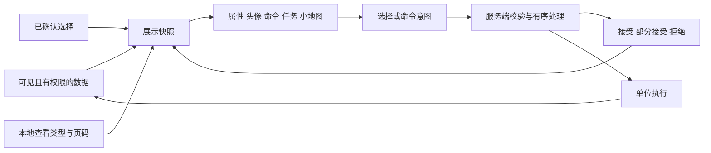
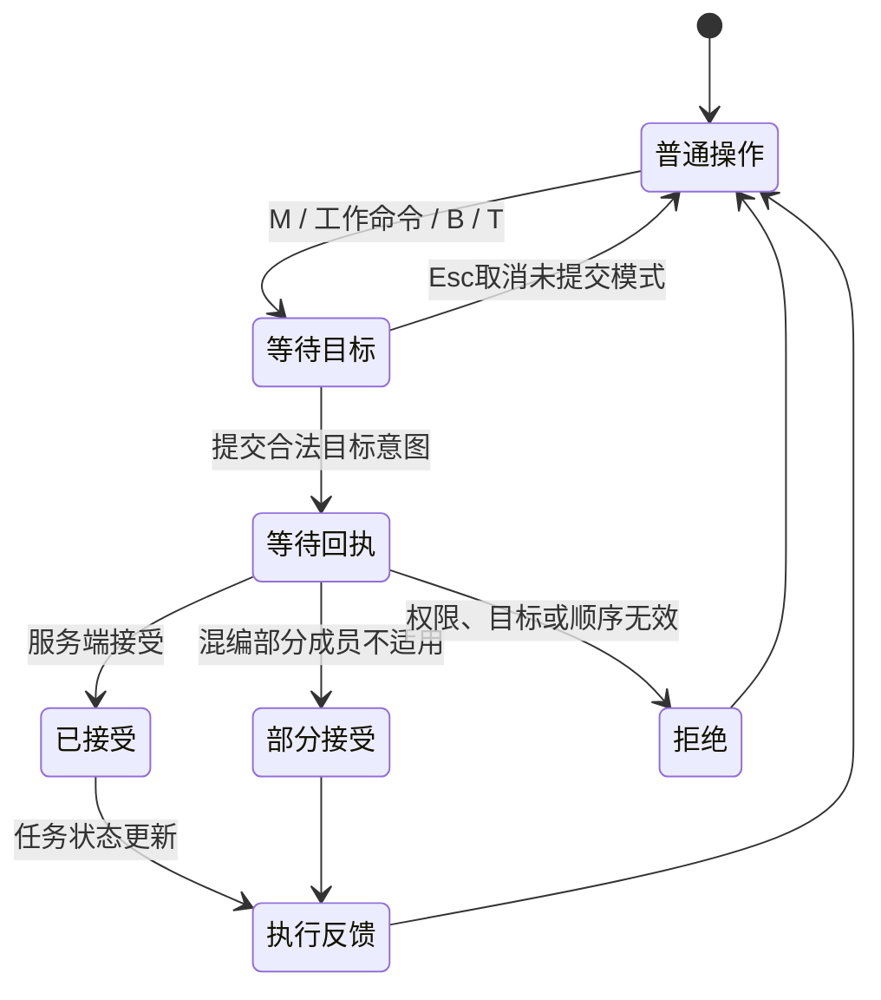

# 星际争霸 II 局内 UI 架构拆解

- 调研日期：2026-09-20。用途：GuLiStrike 指挥官局内 UI 的交互与表现设计。
- 基准：《虚空之遗》PC 标准对战；本地资料混有早期版本、战役、合作、自定义地图和录像界面，不直接等同于该基准。
- 方法：人工逐张查看本地 32 张图、核对公开规则和 UI 接口、检查项目原生代码及编辑器资产目录。本次没有运行 SC2 客户端，不宣称测出了其内部刷新频率、动画时长或网络实现。
- 证据标记：**【官】官方规则／公开接口；【观】截图可观察现象；【推】设计推断；【待】证据不足。**
- [逐图审计与缺失清单](星际争霸II局内UI参考审计.md)；[部队操作拆解](星际争霸II部队操作拆解.md)；[本次开发方案](../../20260920-星际UI拆解与指挥官界面重构.md)。

## 1. 架构结论与证据边界

**【推】局内 UI 的核心是让选择、查看、命令和执行结果形成闭环。** 四者需要关联，但不能合并为同一个状态。玩家查看一类单位，不必改变所有选中成员；命令按钮被按下，只证明输入已经提交；真正执行或失败，仍需要独立反馈。

暴雪公开 `ui.proto` 将观察面板分为 Single、Multi、Cargo、Production，编队单独记录；头像操作有单选、移除单个、保留同类、移除同类。这些是**公开接口事实**，不能据此推断客户端内部一定使用相同类、Widget 树或网络通道。[官方 UI 协议](https://github.com/Blizzard/s2client-proto/blob/master/s2clientprotocol/ui.proto)

官方指南明确描述命令提示中的名称与快捷键、编队召回／镜头定位以及 Shift 队列。该页面是历史指南；涉及后来修改的操作，按[部队操作文档](星际争霸II部队操作拆解.md)中的补丁校正处理。[官方特殊操作指南](https://news.blizzard.com/en-us/article/4552955/game-guide-special-control)

图示是 **GuLiStrike 的实现模型【推】**。其中 UI 不拥有任务，不以动画结束作为玩法完成条件，不从屏幕坐标反推出未经授权的单位。

## 2. 信息分区、阅读顺序与视觉密度

| 区域 | 输入与前提 → 作用对象 | 可观察行为与反馈 | 边界、用途与证据 |
|---|---|---|---|
| 顶部经济栏 | 无需选兵；悬停查看资源说明 | 资源及人口数值集中显示，变化不打断操作 | 【观】06、19、35；GuLi 使用本项目资源，不套用矿／气／人口规则 |
| 目标与阶段 | 当前模式存在任务或计时 | 左上目标、右侧阶段计时、完成提示 | 【观】16、17、31、32；战役与合作扩展不能当标准对战常驻项 |
| 警报与通信 | 事件产生；部分提示可定位 | 屏幕边缘文本、声音、头像及地图提示形成多通道反馈 | 【官】指南描述最近通信定位；【观】18、31；确切优先级与去重时间【待】 |
| 世界反馈 | 单位被选中、悬停或进入目标模式 | 选中圈、血条、放置轮廓、路径点直接贴近对象 | 【观】36、40；由 HUD 与世界表现共同完成，不全塞进底部面板 |
| 小地图 | 地图已知；鼠标定位或下令 | 全局分布与当前镜头范围并置 | 【观】06、34、40；雾区可见性来自玩法规则，渲染器不能扩大情报权限 |
| 编队条 | 已创建控制组 | 数字、代表图标、数量紧邻选择区；可快捷召回 | 【官】UI 协议；【观】06、19；组成员与“当前查看页”相互独立 |
| 选择面板 | 选择改变 | 单体属性与群体头像在固定区域替换，避免每次寻找窗口 | 【官】Single/Multi 面板；【观】13、29、35 |
| 肖像 | 存在当前展示对象 | 肖像帮助识别单位／种族，与数值卡分工 | 【观】05、07、35；截图不能证明具体动画或渲染技术【待】 |
| 命令卡 | 当前选择及可执行能力改变 | 图标、快捷键、可用状态、子页切换占固定槽位 | 【观】35 的建造页、36 的目标模式；不因禁用而让其他按钮跳位 |
| 队列／货舱／生产 | 所选对象有对应能力 | 固定区域切换为进度、乘员或生产项 | 【官】Cargo/Production 类型存在；本地截图未完整覆盖货舱操作【待】 |
| 提示与局内菜单 | 悬停或打开菜单 | 临时层解释命令，模态层接管输入 | 命令名和快捷键有【官】依据；本地没有完整菜单截图，细节【待】 |

**【推】阅读节奏分三级**：世界中心回答“发生了什么”，底部控制台回答“我操作的是谁、可以做什么”，顶部与地图回答“全局是否发生变化”。高频操作维持稳定位置，低频详细信息按需展开。将所有信息同时放在中央会增加遮挡；把所有状态藏在提示框里又会漏掉停止或拒绝。

### 2.1 布局比例与锚点

【观】以 06（1920×1080）为例，主要底部控制台约占画面最后两成高度，小地图向上突出；19、35 的主要区域顺序一致。由于截图来自不同模式、比例和 UI 版本，此处只记录近似归一化关系，不给出伪精确的统一像素尺寸。

| 结构 | 锚定策略【推】 | 对 GuLiStrike 的落地 |
|---|---|---|
| 经济、计时 | 顶边、右上或中上稳定锚点 | 保留世界中心；长数字不挤压相邻资源 |
| 小地图 | 左下独立方形区域 | 外框可缩放，内部保持地图宽高比；黑边不接受地图命令 |
| 选择与详情 | 底部中段可伸缩 | 24 个头像分页；超宽屏增加留白而非无限拉伸头像 |
| 命令卡 | 右下固定网格 | 5×3，空槽保持位置，目标模式说明覆盖局部内容 |
| 编队 | 选择区上沿 | 不跟随详情高度移动；数量变化不改变按钮宽度 |
| 提示框 | 依附控件并限制在视口 | 优先向上展开，不足时翻转；最终四边限位 |
| 菜单 | 视口中央独立模态层 | 不依附某个世界对象；关闭恢复原游戏焦点 |

### 2.2 皮肤与语义的分离

【观】06 的蓝金神族、17 的生物虫族、35 的金属人族外壳不同，但地图、选择、肖像、命令的空间关系仍然可辨认。种族皮肤因此可以改变轮廓、纹理和高光，而不改变基本操作心智模型。【推】GuLiStrike 采用深色工业面板，将材质装饰集中在框架，正文和小图标保持清楚；材质包中的登录、商店等示例流程不进入局内战斗。

文字至少区分标题、主要数值、次要说明和错误反馈。快捷键作为按钮角标，说明文字集中在提示框。颜色同时配合文字／形状：停止有“持续停止”标识，禁用有原因，等待有状态词；不能仅依赖红绿区分。

## 3. 选择、查看与命令的状态机

### 3.1 单选与多选

| 状态 | 面板输出 | 退出／中断 | GuLiStrike 规则 |
|---|---|---|---|
| 无选择 | 全局入口仍可用，单位区域显示操作提示 | 合法选择到达后替换 | B、T 独立于选择；M、S、Q 需符合各自条件 |
| 单个单位 | 名称、生命、已有属性、肖像和完整任务队列 | 死亡、失去控制权、重新选择 | 属性来自单位定义及可靠状态，未知值不补猜测 |
| 同类多个 | 单位头像和同类汇总 | 头像筛选、减选、死亡 | 显示总数、当前页与类型统计 |
| 混编 | 类型页签、成员头像、共同命令与分组状态 | 换页／换类型只影响查看；明确头像操作才修改选择 | Tab 不改变 Q 的全选作用域 |
| 同步中 | 维持可识别的等待状态 | 新快照到达 | 不用上一批单位的详细数据伪装当前已同步 |
| 非己方／不可控 | SC2 可查看但命令受限【观】07、32 | 重新选择 | GuLi 不因换皮新增敌军选择权限 |

头像操作的官方接口语义为单选、移除单个、保留同类、移除同类【官】。GuLi 落地时操作范围是**当前合法选择**，不同于世界 Ctrl 点选的“当前屏幕与 500 米范围交集”。界面提示必须说明这一区别。

24 个头像是 GuLi 本轮的分页设计参数，不是从 SC2 推断的最大选兵量。现有总体协议容量继续有效；页码、过滤器和可见控件数不限制真实选中人数。

### 3.2 目标模式与反馈闭环

【推】本模型区分本地目标模式、网络回执和业务执行。点击按钮的高亮不能代替服务器接受；接受不能代替到达；失败提示应包含原因，并允许下一次操作。Q 和停止属于已有即时入口，不能强行包装成需要地面目标的按钮。

### 3.3 子组与混编技能

【官】历史指南存在混编建筑使用 Tab 的描述；现代版本的具体子组优先级须结合补丁及实机核验。**本次 GuLi 的类型页签是信息过滤器**。Q 始终尝试对完整选择执行现有技能，卡片明确标注“全部选中单位”。技能可用性、冷却与拒绝应对应真实单位事实，而不是仅对应当前看见的 24 个头像。

## 4. 命令卡、任务与特殊面板

### 4.1 命令卡

每个现有命令采用统一显示契约：命令标识、名称、图标、快捷键、是否需要目标、适用成员、当前状态与不可用原因。可用性由业务判断，视觉层不决定能力。

| 输入与前提 | 作用对象与行为 | 中断／边界 | 反馈与用途 |
|---|---|---|---|
| M 或移动图标，再点地面 | 当前选择经服务端冻结后下达移动 | Esc 取消未提交目标；Shift 追加 | 地面目标、路径、接受结果，供重新部署 |
| S 或停止图标 | 命令涉及的成员停止移动与工作 | 工厂／运输中先安全退出；持久抑制自动工作 | “持续停止”或“等待安全退出”，避免看起来已停但随后自行工作 |
| Q 或技能图标 | 完整选择尝试原有技能 | 查看页签不改作用范围；不解除持续停止 | 可用性和回执，混编允许部分接受 |
| 采矿／返厂／施工／据点运输入口 | 具备能力的成员沿既有任务契约执行 | 无效目标不消耗资格、不替换有效任务 | 提示需要的目标类型与实际拒绝原因 |
| B 建造目录 | 选择建筑类型并进入既有放置流程 | 数字 0–9 留给编队；Esc 取消预览 | 费用、合法放置状态和创建反馈 |
| T 战术运输 | 沿用现有源点、落点与阶段流程 | 计时与安全落地由原业务管理 | 显示阶段、参与数、剩余时间和消息 |

空槽不填入未实现的 A 移动、点杀、坚守和巡逻。单位不适用时显示禁用原因，B/T 保持独立全局入口。

### 4.2 队列与特殊任务

【推】SC2 的生产队列、单位命令队列与 GuLi 的自动任务资格不应混称为同一种队列。GuLi 需展示三个独立维度：当前执行项、未来手动项、可恢复自动资格。

- 单选列出完整队列，手动上限沿用 32；自动任务不占该容量。
- 多选展示共同前缀、差异组数与各状态数量，不拼接成一条虚假的全军统一队列。
- “自动采矿／自动建造资格仍保留”与“当前正在执行自动任务”不同；S 后前者可存在、后者受抑制。
- 初始据点推进资格被消耗后不列为可恢复项。Q、查看、镜头与编队不改变此状态。
- 任务条目点击仅定位可用目标；无坐标或失效目标显示原因。首版不新增重排、单项删除等调度行为。
- 无合法自动目标时显示等待，不通过闪烁或反复插入任务误导玩家。

### 4.3 生产、货舱与模式扩展

【官】SC2 公开面板类型包含生产进度、生产队列、乘员及剩余容量。**本地截图未充分证明全部交互边界【待】**。GuLi 的兵营自动生产、工厂内矿车及据点／战术运输按现有业务显示；本轮不据此新增 SC2 的手动训练队列、传统运输机装载或战役升级树。

## 5. 小地图、镜头和输入层

小地图具备两套坐标：控件局部矩形、世界地图范围。先扣除边框和等比留白，再做坐标转换；无效区域不产生世界命令。地图缓存与动态标记分开，标记可见性服从原有授权数据。

GuLi 的左键／拖动控制镜头，右键产生地面移动，M 模式左键产生移动，Shift 保留追加语义。鼠标在地图内时不同时触发世界框选。当前镜头轮廓使用真实相机投影，定位继续服从地图边界和地形约束。

界面输入优先级【推】：模态弹窗 → 实际交互控件 → 小地图专用操作 → 世界目标／选兵。透明根 Canvas 不拦整屏，装饰控件不抢焦点。菜单打开仅暂停本地游戏输入，不暂停多人世界；提交过的任务继续执行。Esc 先关闭顶层 UI，之后才取消已有未提交目标／拖选，不转换为停止命令。

提示框绑定实际控件几何，边缘翻转后再限位。快速切换悬停时沿用同一展示层，避免重复创建窗口；关闭界面或角色切换时清理计时器、委托和焦点。

## 6. Dark GUI 资源与项目映射

本次通过 UE AssetRegistry 在指定逻辑目录确认素材包有 148 个 Widget 模板、231 种通用图标（多个分辨率），以及面板、按钮和条形组件。数量是本地版本资产盘点结果，不代表所有资源都适合局内 HUD。

| 资源类别 | 复用方式 | 项目约束 |
|---|---|---|
| UniversalPanel、Stroke、BottomPanel | 面板框架及九宫格边缘 | 保持原始纹理独立；尺寸变化不拉伸边缘 |
| Button、Icon、Actionbar 模板 | 提取布局和状态样式，项目控件负责行为 | 不引入示例登录、商店等业务图表 |
| Bars、ScrollBar | 血条、进度、列表滚动 | 数值来自已有状态；隐藏控件不继续无意义刷新 |
| target、arrows、users、hammer 等图标 | 镜头、移动、编队、建造等通用语义 | 在最终小尺寸检查轮廓和对比度 |
| 已有单位立绘 | 扫荡者、战争机器肖像及头像 | 原图保留，导入衍生纹理；不将参考图当成三视图 |
| 工程车静态肖像 | 由现有矿车、建造车模型生成 | 统一背景和裁切；运行时不增加每单位 SceneCapture |
| 缺失专用图标 | 必要时生成，登记源文件和用途 | 不在图片中烘焙快捷键或状态文字 |
| Aileron 字体 | 数字／拉丁标签可用 | 中文继续使用有对应字形的项目／引擎字体 |

颜色状态和图标映射集中维护，兵种 ID、建筑 ID、任务 Tag、命令标识是映射键。图片不能成为玩法资格或能力判断依据。

## 7. 实施难度与取舍

| 项目 | 难度 | 原因与处理 |
|---|---|---|
| 面板、按钮、资源栏换肤 | 低 | 已有真实数据与素材，主要工作是样式与尺寸 |
| 静态肖像、图标复用 | 低至中 | 缺口在工程车截取和小尺寸识别，不需要实时人物场景 |
| 编队条、队列摘要 | 中 | 行为存在，需接入实际状态与稳定布局 |
| 建造／运输整合 | 中 | 各有现成组件，输入焦点和目标阶段需统一 |
| 头像减选与同类筛选 | 中至高 | UI 不能伪造世界射线；需要服务端显式成员操作与可靠顺序 |
| 混编信息与技能范围 | 中至高 | 本地查看与完整选择作用域必须分开，错误反馈不能误指当前页 |
| 大部队头像表现 | 高 | 真实选择可能很大；采用数据缓存、24 控件分页及增量刷新 |
| 多分辨率／输入穿透 | 中至高 | DPI、超宽屏、模态层和世界命令交织，需要实机输入验证 |
| SC2 私有内部实现还原 | 不作为目标 | 公开资料无法证明内部类、线程、渲染和网络组织 |

## 8. 验收与未验证事项

本次实现验收以 GuLiStrike 为对象：空选／单选／混编／大部队分页、头像四种操作、Tab 后 Q 全选作用域、编队召回定位、队列与停止、B/T 全阶段、菜单焦点、五种分辨率、双客户端顺序及重连。自动化只运行已有相关用例，允许同步受影响旧预期，不能增加用例或放宽业务断言。

SC2 的下列问题仍需客户端实测或补充可靠资料：各补丁精确子组优先级、货舱面板的全部点击边界、提示延迟、所有种族动画时长、每种分辨率的精确控制台缩放、录像与标准玩家面板切换。截图中的数值与按钮数量不外推为全局规则。

最终交付的技术构建、实机验证和美术主观评价分别记录；分析文档本身不能作为运行验证通过的证据。
