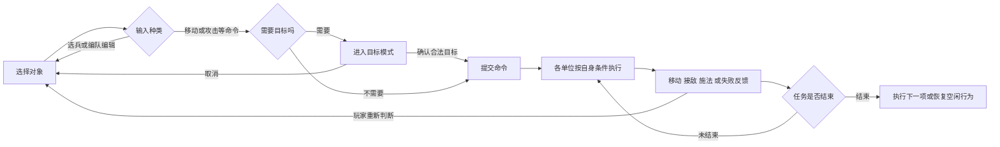

# 《星际争霸 II》部队操作逆向拆解

- 调研日期：2026-09-20。
- 参考范围：《虚空之遗》PC 标准对战，标准键位；补丁核对覆盖到本次检索到的 5.0.16b 正式公告。未读取本机客户端版本，不把检索日期当作游戏版本号。
- 用途：为 GuLiStrike 的指挥官操作提供设计参考。本文是玩法与交互研究，不是项目需求、改造决定或引擎算法说明。
- 验证方式：官方资料、公开交互定义与社区操作资料交叉核对。本次未运行 SC2 客户端、未逐帧观看对局或采集输入录像；下文场景是复核步骤，不是已通过的实机测试。

**核心判断【设计推断】**：部队操作的基础是让玩家稳定表达“谁，在什么约束下，做什么”，再把寻路、普通接敌和部分施法者分配交给系统。微操的价值来自改变目标、空间关系与投入时机；理解命令边界，比背一张快捷键表更接近这种体验。

## 一、证据与版本边界

全文使用四种标记：

| 标记 | 含义 | 使用限制 |
|---|---|---|
| 【官】官方规则 | 官方指南、正式补丁直接描述；公开接口作为补充佐证 | 历史指南不自动代表所有当前边界；接口注释不能替代真人鼠标操作验证 |
| 【观】可观察现象，资料记载 | 社区指南或作者报告的玩家可见行为 | 本次没有亲自实测；不写成内部实现事实 |
| 【推】设计推断 | 根据规则推导的体验、取舍和抽象模型 | 不冒充暴雪设计者原意 |
| 【待】待验证 | 来源冲突、版本不明或证据不足 | 不填写猜测的阈值、时序、容量与排序规则 |

**版本校正【官】**：2.0.4 加入全军选择入口、当前指令标记及更多血条选项；3.0 加入 Alt 编队移出其他组操作。较早指南可能缺少这些功能。[2.0.4 正式说明][sc2-source-01]、[3.0 正式说明][sc2-source-02]。

近期变化需要特别区分：

| 版本 | 与操作研究直接相关的变化 | 本文处理 |
|---|---|---|
| 5.0.15 | 调整部分技能的智能施法；提高雷神、坦克的友军推挤优先级 | 施法与让路均按单位/技能讨论，不归纳成所有单位共享的固定行为 |
| 5.0.16 | 调整人族子组优先级；增加运输单位的附近装载功能，并修改部分单位的命令、反馈 | 只引用明确相关的条目 |
| 5.0.16 Hotfix | 撤回虫后注卵调度调整 | 不把主补丁的这项调整作为现行规则 |
| 5.0.16b | 撤回附近装载功能、幻象继承施法者队列；继续调整子组选择与反馈 | 运输场景采用逐目标装载，不依赖已撤回功能；不假设召唤物自动继承命令 |

来源：[5.0.15][sc2-source-03]、[5.0.16][sc2-source-04]、[Hotfix][sc2-source-05]、[5.0.16b][sc2-source-06]。版本差异以同一事项后续正式修订为准，PTR 提案不作为已上线证据。

## 二、先分清四种状态

以下是解释玩家行为的模型【推】，不是对 SC2 内部类、网络协议或寻路结构的还原。

| 状态 | 回答的问题 | 容易混淆的另一种状态 |
|---|---|---|
| 当前选择 | 这次操作面向哪些对象？ | 选中不会自动让单位集合或停止旧任务 |
| 数字编队 | 以后怎样重新取回这批对象？ | 编队不是固定阵形，也不是自动补充同类兵的筛选器 |
| 当前子组 | 混编时，命令面板现在展示谁的技能？ | 切到坦克子组不等于只剩坦克被选中 |
| 各单位的命令/队列 | 已经接受了什么任务，下一步是什么？ | 换选另一支部队不会撤销已下达的命令 |

**图的边界【待】**：并非所有技能都可随时中断或都占用同一种队列。形态变化、引导、自动施法、瞬发技能的具体优先关系，应回到技能本身核对。

后续各表统一沿用六项描述：**输入与前提 → 作用对象 → 行为 → 中断与边界 → 反馈 → 战术用途**。其中“反馈”列是读者应观察的界面或战场信号，不表示本次测过反馈延迟。

## 三、选兵：先确定操作的作用范围

### 3.1 战场选择与头像选择

【官】点选、同类选择、矩形选择和头像面板选择有不同语义。下表主要依据暴雪公开的[战场交互定义][sc2-source-07]和[面板交互定义][sc2-source-08]，并与[玩家操作指南][sc2-source-09]交叉核对。

| 输入与前提 | 作用对象 | 行为 | 中断与边界 | 反馈 | 战术用途 |
|---|---|---|---|---|---|
| 左键点己方单位 | 命中的一个单位 | 替换当前选择 | 重叠模型的命中优先级【待】 | 选中标识、头像 | 救单兵、精确施法 |
| 左键拖框 | 框内可选对象 | 用命中集合替换选择 | 空框及军队、建筑、工人混合过滤【待】 | 拖框、选中数量 | 快速抓取一片部队 |
| Shift+点单位 | 命中单位 | 未选则加，已选则移除 | 不等于对整类减选 | 数量与头像变化 | 修正误选 |
| Shift+拖框 | 框内单位与旧选择 | 追加用途；接口明确提供 Add | 恰好框住一个已选单位的真人行为【待】 | 原选择是否保留 | 收拢附近增援 |
| Ctrl+点单位，或双击 | 当前游戏视野内同类 | 同类选择 | 不是全图同类；屏幕边缘范围【待】 | 该类选中标识 | 临时抽出一类兵 |
| Ctrl+Shift+点战场单位 | 视野内同类 | 同类追加用途 | 已选种子与形态变体的细节【待】 | 并集变化 | 保留主力并加入另一类 |
| 左键点多选面板头像 | 当前选择中的一个 | 缩小为该单位 | 作用域是面板成员 | 多选变单选 | 从拥挤单位中精确取兵 |
| Shift+点面板头像 | 该头像对应单位 | 从当前选择移除 | 不直接重写数字编队 | 头像消失 | 留下已分配任务的单位 |
| Ctrl+点面板头像 | 已选集合内的同类 | 只保留这一类 | 不补入屏幕外未选同类 | 面板过滤 | 分离坦克或施法者 |
| Ctrl+Shift+点面板头像 | 已选集合内的同类 | 移除这一类 | 与战场同组合键不同 | 该类头像消失 | 排除工人或辅助兵 |

**来源冲突【待】**：旧版[简化操作指南][sc2-source-10]把 Shift 选择笼统写作加/减；公开接口把矩形选择写为追加。社区[选择操作记录][sc2-source-11]还报告了单单位框选特例，该页本次仅取得搜索索引文本，正文抓取受限。这里保留分歧，不把 API 注释升级为覆盖所有鼠标边界的结论。

### 3.2 全军选择与选择容量

【官】F2 是全军选择的默认入口。暴雪曾明确讨论它把观察者带离侦察位置的问题，因此“军队”不能简单解释为“所有能普攻的对象”。[官方设计说明，Observer 段][sc2-source-12]。该文包含当时的提案，只用其明确陈述的 F2 现象，不把提案全部当作现行规则。

| 输入与前提 | 作用对象 | 行为 | 中断与边界 | 反馈 | 战术用途 |
|---|---|---|---|---|---|
| F2 / 全军按钮 | 游戏归类为可选军队的单位 | 执行全军选择 | 工人、特殊模式、乘员等完整过滤表【待】 | 总数与兵种构成 | 找回散兵、紧急汇集 |

【推】F2 本身只是选择；真正破坏分线任务的是随后的统一改令。使用它前应意识到侦察、包抄和防守单位可能进入同一操作范围。

【待】本文不写“无限选择”，也不把一代的 12 单位限制套到二代。当前客户端的选择上限、分页数量、超限截取规则未做实机确认。空地点击、空框和 Esc 是否改变选择，也不沿用 GuLiStrike 现有逻辑作推定。

## 四、编队与镜头：记住对象，定位注意力

### 4.1 数字编队的编辑

【官】Ctrl+数字设置，Shift+数字追加，数字键召回；重复追加不应理解为减选。官方接口分别提供 Set、Append、SetAndSteal、AppendAndSteal。[编队交互定义][sc2-source-08]。

| 输入与前提 | 作用对象 | 行为 | 中断与边界 | 反馈 | 战术用途 |
|---|---|---|---|---|---|
| Ctrl+0–9 | 当前选择、目标组 | 用当前选择覆盖该组 | 屏幕外旧成员可能被遗漏 | 组图标/成员数 | 建立主力组 |
| Shift+0–9 | 当前选择、目标组 | 把当前选择加入组 | 不是“从组里减掉这些人” | 组成员数 | 接纳增援 |
| 数字键 | 该组可选成员 | 召回选择 | 不发送战斗或集合命令 | 选中标识 | 隔屏控制 |
| 快速双按数字键 | 编队及其位置 | 召回并定位镜头 | 分散组的镜头锚点【待】 | 镜头跳转 | 快速检查战况 |
| Alt+数字 | 当前选择、各编队 | 设置目标组，并从其他组移出这些成员 | 会改变重叠编队关系 | 各组成员数 | 抽离包抄队 |
| Shift+Alt+数字 | 当前选择、各编队 | 追加到目标组，并从其他组移出 | 精确键位以当前配置为准 | 各组成员数 | 给独立分队补兵 |

来源：[特殊操作指南][sc2-source-09]、[3.0 的 Alt 编队说明][sc2-source-02]。公开接口对 SetAndSteal 的键位注释写作 Ctrl+Alt+数字，与玩家公告的 Alt+数字不完全一致；本文以玩家公告列主要键位，不宣称每种组合在每个配置中都同效。

【推】编队是可重叠的“对象书签”。从当前选择移除一名士兵后，若希望永久改变某个组，需要把剩余选择重新存回该组；选择变化与编队编辑分开理解，才不会误以为已经完成分兵。

【观】普通伤亡会减少可操作成员，新造同类兵需再次编入；不能把编队理解成自动补员模板。死亡图标消失时机、变形/合体/装载后的成员继承另列【待】。可核对社区的[编队使用记录][sc2-source-13]；本次只取得索引正文，未用其证明当前客户端边界。

### 4.2 镜头是另一套操作

| 输入与前提 | 作用对象 | 行为 | 中断与边界 | 反馈 | 战术用途 |
|---|---|---|---|---|---|
| 小地图左键 | 镜头 | 跳到地图位置 | 与小地图右键发令区分 | 视野区域变化 | 检查远处战场 |
| 方向键 / 中键拖动 | 镜头 | 平移视野 | 不改变已接收命令 | 场景滚动 | 跟进战线 |
| Ctrl+F5–F8；F5–F8 | 镜头地点 | 保存；召回地点 | 标准键位示例，非一代键位 | 跳转到固定位置 | 双线防守 |
| 空格 | 通知地点 | 定位近期事件 | 通知可能已过时 | 镜头与事件对应 | 响应被袭 |

来源：[简化操作指南][sc2-source-10]、[小地图镜头交互定义][sc2-source-07]；官方旧网页的功能键区间排版损坏，F5–F8 用[社区键位记录][sc2-source-13]补充。

【推】数字组适合追踪“正在移动的队伍”，地点书签适合追踪“需要反复检查的战场”。二者结合，才形成部队操作与注意力调度的完整链路。

## 五、基础命令：右键不是固定的移动按钮

### 5.1 先识别目标，再解释右键

【官】右键地面是移动，右键可攻击敌人是指定攻击；普通跟随也可由右键单位触发。[基础命令][sc2-source-14]、[跟随说明][sc2-source-10]。

【推】因此，同一屏幕位置只要目标命中不同，意图就可能从“攻击这个敌人”变成“走到这里”。普通兵、治疗单位、工人和运输相关单位的右键，也必须结合自身能力解释。混选时不能假设所有对象都接收同一种动作。

### 5.2 命令行为对照

本表主体为【官】，反馈列为阅读/复核时应关注的信号。

| 输入与前提 | 作用对象 | 行为 | 中断与边界 | 反馈 | 战术用途 |
|---|---|---|---|---|---|
| M 后点地面；或右键地面 | 可移动的所选单位 | 前往地点 | 普通单位不为沿途敌人停下作战 | 目标标记、位移 | 撤退、穿越危险区 |
| A 后点敌人；或右键敌人 | 能攻击该目标的单位 | 接近并攻击指定对象 | 追击可能破坏站位 | 目标、攻击动作 | 点杀关键兵 |
| A 后点地面 | 能执行的所选单位 | 前进并沿途接战可攻击的敌人 | 无法攻击的对象不按普通接敌处理 | 行进与接敌切换 | 推进、遭遇战 |
| S | 所选单位 | 停止并取消原任务 | 随后仍可能自动接敌追击 | 移动停止、可能再开火 | 临时停步开火 |
| H | 所选单位 | 原地攻击射程内目标 | 不主动走出位置接敌；仍可受伤 | 原位攻击 | 守口、防诱敌 |
| P 后点地面 | 可巡逻单位 | 在起点和目标间往返、接敌 | 交战后可回到巡逻任务 | 往返轨迹 | 看守通道 |
| 普通兵右键友军 | 可跟随单位 | 追随目标的位置 | 特殊右键能力可能优先 | 持续跟随 | 护送、跟进 |

规则来源：[基础命令完整说明][sc2-source-14]、[简化命令与键位][sc2-source-10]。

三个容易误判的结果：

- **S 与 H【官】**：前者结束旧任务，后者额外施加“不主动离开位置接敌”的约束。不能用 S 代替长期坚守。[停止与坚守对照][sc2-source-14]。
- **点杀与 A 地板【官】**：远处目标可能让后排绕行、阻塞，或追着撤退目标走。集火价值取决于有多少单位能持续攻击。[暴雪·单位控制][sc2-source-15]。
- **移动不接敌 ≠ 所有兵都不能移动射击【待】**：具体武器、锁定技能与移动的兼容性属于单位规则；本文的普通命令描述不能覆盖每种特例。

## 六、命令队列：安排时间顺序，而非固定动作脚本

【官】Shift 可以排入路径点及多种命令，小地图也能成为发令入口；官方明确指出队列有上限，但本文不填未经核对的数量。[特殊操作·队列][sc2-source-09]。公开交互同时区分目标坐标与是否入队。[命令交互定义][sc2-source-07]。

| 输入与前提 | 作用对象 | 行为 | 中断与边界 | 反馈 | 战术用途 |
|---|---|---|---|---|---|
| Shift+连续地点命令 | 发令时的选择 | 顺序执行各点 | 不是保证穿过直线上的所有地形 | 路径点、单位进度 | 绕路侦察 |
| 普通新移动/攻击命令 | 本次所选单位 | 改写可中断的旧任务 | 瞬发技能、形态变化不作同一推定 | 新目标与行为 | 紧急调整 |
| Shift+连续指定攻击 | 能攻击的所选单位 | 排入多个目标 | 目标中途失效的跳过细节【待】 | 当前目标变化 | 减少重复点杀 |
| S | 所选单位 | 取消旧任务并停止 | 不能当作长期禁追击 | 停步 | 终止错误路径 |
| 目标模式中取消 | 尚未提交的操作 | 返回普通输入 | Esc 的按钮语境与已执行动作取消需区分【待】 | 准星/预览消失 | 放弃误触技能 |

【推】队列应理解为每名执行者的后续任务。相同的指令序列遇到不同距离、速度、施法资源和阻挡，不代表全队同步进入下一步。普通改令也不应被理解为“一并改掉未选中友军的路线”。

### 6.1 完成与失效条件

| 情况 | 可写明的结论 | 不能擅自补出的细节 |
|---|---|---|
| 单个移动任务 | 到达目标后该任务可结束【官】 | 密集队伍的准确到达容差、终点分配【待】 |
| 指定攻击目标死亡 | 不再继续攻击该对象；无后续任务时不会自动继承某个远方进军目标【官】 | 有后续队列时每种失效目标的跳过时序【待】 |
| 巡逻、跟随、坚守 | 具有持续性；不能把其后排队动作假定为很快执行【推】 | Shift+H、Shift+S 等特殊队列组合【待】 |
| 失去视野、目标隐形 | 缺探测时不能把隐形敌人当成普通可选目标【官】 | 原攻击命令如何转为搜索、等待或结束【待】 |
| 目标被装载、瞬移或无法到达 | 需要重新评估任务是否仍成立【推】 | 重试次数、等待时长、改路和回退规则【待】 |

来源：[目标死亡与移动说明][sc2-source-14]、[隐形与目标合法性][sc2-source-16]。对不可达情况，不用“最终肯定到达”代替失败规则。

## 七、混编、技能与运输：一次输入由谁执行

### 7.1 子组不是重新选兵

【官】Tab / Shift+Tab 切换子组及其命令面板。[子组操作说明][sc2-source-10]。5.0.16 修改了人族子组优先级，说明显示顺序也属于版本规则。[正式补丁][sc2-source-04]。

【观】混选坦克与步兵后，仅 Tab 到坦克，不会使普通移动变成“只移动坦克”；要独立移动一类兵，应先缩小选择。这个差异也见于玩家的[子组操作问答][sc2-source-17]（本次取得索引正文，直接抓取超时）。本文不固定背诵每种兵的完整子组排序，也不保证重按编队键一定重置到哪一子组。

### 7.2 技能至少分成三种派发方式

| 输入与前提 | 作用对象 | 行为 | 中断与边界 | 反馈 | 战术用途 |
|---|---|---|---|---|---|
| 选多名有资源的施法者，指定一次法术目标 | 系统挑出的合格施法者 | 智能施法通常由一名执行【观】 | 不保证每次轮到不同单位；确切排序【待】 | 一次效果、资源扣除 | 保持群选连续施法 |
| 选多名可用兴奋剂的陆战队员，按技能 | 合格所选单位 | 可批量触发【观】 | 不等于所有无目标技能都批量 | 状态与生命变化 | 统一发起突击 |
| 右键可自动施法的技能按钮 | 拥有该技能的单位 | 切换自动施法状态【官】 | 必须是该技能支持的功能 | 按钮状态、触发效果 | 减少重复治疗等操作 |
| 按形态转换按钮 | 拥有该转换的单位 | 进入相应模式 | 中途接令、取消、队列保留按技能核对【待】 | 模型、按钮、可用能力变化 | 展开、撤收、转移 |

智能施法与兴奋剂的对比依据[社区 Micro 资料][sc2-source-18]的索引正文【观】；自动施法依据[官方操作指南][sc2-source-10]【官】。不采纳旧指南的“完整自动施法技能名单”作为当前全集。

【推】“一次目标确认选一名执行者”“所有合格成员一起做”“以后由单位自行触发”是三种不同契约。智能施法不等同于自动施法，也不等同于把目标确认绑定到连续按键的 Rapid Fire 设置。

**版本与失败边界【官/待】**：5.0.15 曾专门调整腐蚀喷雾和吞噬的智能施法，以减少对 Rapid Fire 的依赖；不能把通用教程的“最近且有能量”当作所有技能的完整选择算法。[5.0.15][sc2-source-03]。能量不足、超出距离、目标非法、未解锁、正在引导等情况须分开记录，不能统称“按键没响应”。

### 7.3 装载与卸载

以下使用有空余运载空间的医疗运输机及可装载地面兵作为例子【观】；具体手法见[玩家装卸操作记录][sc2-source-19]。这是作者报告，本次未复现其录像条件。

| 输入与前提 | 作用对象 | 行为 | 中断与边界 | 反馈 | 战术用途 |
|---|---|---|---|---|---|
| 选地面兵，右键运输机 | 可装载的所选兵 | 接近并尝试装入 | 容量、距离、单位类型限制 | 地面兵减少、货舱增加 | 战场撤收 |
| 选运输机，用装载命令点兵 | 运输机与指定乘员 | 发起接人 | 与地面兵主动接近不是同一个输入 | 运输机轨迹、货舱 | 接走伤兵 |
| 卸载命令 D 后点合法地面 | 所选运输机的乘员 | 到位置卸载 | 需有可用落位空间 | 卸载预览、落地单位 | 空投 |
| 点货舱成员图标 | 指定乘员 | 请求卸下单个成员 | 不能从动作名称推定无视地形 | 对应货舱变化 | 精确放出某兵 |
| 已移动时，D 后点运输机自身 | 相应运输机 | 资料报告可边飞边逐个卸载 | 多机、障碍和新版本行为【待】 | 连续落地与航迹 | 沿路展开 |

单个乘员卸载也有[官方面板交互][sc2-source-08]佐证。运输空间与单位大小有关，不应把“八个陆战队员”推广为“任何八个单位”。[暴雪·人族基础][sc2-source-20]。

【官】运输可以把受伤单位撤到后方，也可以越过障碍制造侧后方威胁；载具受到威胁时需考虑卸下乘员。[医疗运输机空投指南][sc2-source-21]、[常见失误][sc2-source-22]。5.0.16b 已撤回附近装载功能，本文不使用“一键装走附近所有兵”作为基准输入。

## 八、群体移动与微操：用空间结果解释手感

### 8.1 可观察行为，不推定内部算法

| 输入与前提 | 作用对象 | 行为或观察重点 | 中断与边界 | 反馈 | 战术用途 |
|---|---|---|---|---|---|
| 多兵向一个区域移动 | 所选群体 | 观察聚拢与互相绕行【观】 | 不承诺固定方阵、编号槽或朝向 | 队伍轮廓、后排进度 | 集结 |
| 密集单位通过窄口 | 地面部队 | 通过宽度限制同时接敌人数【官】 | 地面与空中行为不能混同 | 入口排队、出口展开 | 守口、分批突破 |
| 大单位穿过小友军 | 大小单位混合群 | 让路有单位优先差异【官】 | 坚守、敌军和完全封死的情形【待】 | 小兵是否被推开 | 保持重型单位通路 |
| 不同移速兵种长途移动 | 混编部队 | 可能拉开距离【官】 | 不能假设自动全队等速 | 前后距离、孤立单位 | 交战前二次集合 |
| 连续向不同地点改令 | 当前选择 | 观察转向与旧目的地放弃【观】 | 响应时间、减速和重规划时序【待】 | 朝向、速度、目标 | 躲技能、转移 |

依据：[单位控制中的掉队说明][sc2-source-15]、[窄口与站位][sc2-source-23]、[5.0.15 友军推挤调整][sc2-source-03]。

【推】“看起来像一团”可能同时涉及点击点、地形、单位尺寸、速度、可用攻击位置与后续指令。只看录像外观，不能证明系统使用固定阵形、流场、某种避让算法或全队统一终点预约。

### 8.2 典型微操的输入价值

| 输入与前提 | 作用对象 | 行为 | 中断与边界 | 反馈 | 战术用途 |
|---|---|---|---|---|---|
| 远程兵开火后后撤，再停步攻击 | 已选远程兵 | 拉扯、重建距离【官】 | 过早移动可能损失出手；逐兵时机【待】 | 射击与位移节奏 | 对抗短射程单位 |
| 对关键敌人集中指定攻击 | 能够接敌的兵 | 更快移除威胁【官】 | 绕路、追击与过量投入可能抵消收益 | 目标血条、己方闲置 | 点杀施法者 |
| 把小部分兵向侧面移动，再攻击移动 | 分离出的子集 | 改善接敌面【官/推】 | 过分展开可能被侧击 | 实际开火单位数 | 形成凹面 |
| 多次小框选，发向不同方向 | 临时小分队 | 分散密度【官/推】 | 统一改令可能使其重新聚拢 | 群体间距、范围伤害命中 | 散兵躲溅射 |
| 抽出受伤兵后撤或装载 | 少数受伤单位 | 保留后续输出机会【观】 | 操作成本可能影响主力指挥 | 血条、敌方换目标 | 保存战力 |

来源：[暴雪·单位控制][sc2-source-15]、[站位与拉扯][sc2-source-23]、[社区 Micro 资料][sc2-source-18]。

【推】这些操作都在重新分配有限资源：能够开火的位置、敌人的射击时间、己方存活时间，以及玩家的注意力。不能用按键次数或统一的“高 APM”替代效果判断。

## 九、反馈：让玩家知道命令进行到了哪一步

下表是面向设计复盘的观察框架【推】。官方依据包括[2.0.4 的指令标记和血条设置][sc2-source-01]，以及[5.0.16 的技能范围、卸载预览和视听反馈修正][sc2-source-04]。

| 输入与前提 | 作用对象 | 需要读出的状态 | 中断与边界 | 反馈渠道 | 战术用途 |
|---|---|---|---|---|---|
| 刚完成选择 | 当前集合/子组 | 这次究竟控制谁 | 不能只看一个代表头像 | 选中圈、头像、数量、命令卡 | 防止错发命令 |
| 进入目标模式 | 命令与候选目标 | 对象目标还是地面目标 | 非法目标是否仍保留模式【待】 | 光标、范围、目标预览 | 精确点击 |
| 确认移动/攻击 | 接令者与目的地 | 输入已提交到哪个目标 | 标记不等于所有单位已完成 | 目标图标、路径、语音 | 快速检查误触 |
| 施法或形态改变 | 实际执行者 | 开始、持续、结束或失败 | 动画不能独自证明造成伤害 | 能量、冷却、按钮、特效与音效 | 安排下一动作 |
| 接敌与受伤 | 战场局部 | 谁受集火、谁没有输出 | 血条显示受选项影响 | 血条、弹道、死亡反馈 | 救兵、重新站位 |
| 远处发生事件 | 另一路部队 | 是否值得切换注意力 | 告警可能落后于战况 | 小地图、通知、镜头定位 | 多线操作 |

【推】输入确认、执行状态与结果反馈要分别读：有回应语音不保证全队到位，看到攻击动作不保证命中，看到命令标记也不保证目标仍合法。5.0.16b 还修正了色盲模式的主子组选中颜色，说明子组可辨识性会直接影响操作。[正式修订][sc2-source-06]。

## 十、典型场景复核清单

这是文档覆盖检查与未来取证步骤，**本次均未实机执行**；不新增 GuLiStrike 测试文件、自动化用例或性能矩阵。示例中的组号与单位数量只用于隔离变量，不是游戏上限或平衡建议。

| 场景 | 操作顺序 | 应观察的结果 | 证据与未决点 |
|---|---|---|---|
| 1. 增援加入主力 | 主力存 1 → 单独选增援 → Shift+1 → 召回 1 | 原成员与增援同时存在 | 第四节【官】；重复追加不作减员 |
| 2. 从主力抽出包抄队 | 选主力中的子集 → Alt+2 → 分别召回 1、2 | 子集转入独立组；检查其他重叠组 | 第四节【官】；不会自动生成包抄路线 |
| 3. 混编独立移动 | 坦克+步兵 → Tab 到坦克 → 发移动；再 Ctrl 点坦克头像后移动 | 比较子组切换与实际缩小选择 | 第七节【观】；检查步兵是否也移动 |
| 4. 移动途中遇敌 | 相同初始布局，分别用右键地面与 A 地板 | 比较继续赶路与途中接敌 | 第五节【官】；使用普通陆战队员排除移动射击特例 |
| 5. 点杀与 A 地板 | 把目标放在敌军后方 → 分别指定攻击与攻击移动 | 比较绕行、目标集中和有效输出面 | 第八节【官】；不预设谁一定获胜 |
| 6. 停止与坚守 | 两批兵分别 S、H → 敌人靠近后退离 | 比较是否离开原位置追击 | 第五节【官】；推动与寻敌半径另验 |
| 7. 多段队列与插入改令 | Shift 排两个移动点 → 途中向第三点普通右键 | 检查旧路径是否被替换 | 第六节；仅验证普通移动，不外推瞬发技能 |
| 8. 目标消失 | 指定攻击 → 分别让目标死亡、离开视野、装载离场 | 分别记录停止、继续寻找、换目标或后续队列 | 死亡有【官】依据；其余路径【待】 |
| 9. 窄口与重型单位 | 混合大小单位通过窄口；改变友军是否坚守 | 比较拥堵、让路、出口展开 | 第八节；具体推挤条件【待】 |
| 10. 拉扯与散兵 | 射击后移动再停；另取子集向两侧移开 | 观察出手是否保留、距离和密度如何改变 | 第八节；不规定通用毫秒节奏 |
| 11. 群体施法 | 多名高阶圣堂武士确认一次风暴；多名陆战队员触发兴奋剂 | 比较执行人数与资源扣除 | 第七节【观】；同距、缺能量和重复输入【待】 |
| 12. 运输撤退 | 地面兵右键运输机 → 确认装载 → 飞离 → 地面卸载 | 跟踪地面兵、货舱、落位三种状态 | 第七节；不使用已撤回的附近装载 |
| 13. 选择修饰键边界 | 分别框住 0/1/多个单位，覆盖已选与未选；再比较头像点击 | 建立真人 UI 与接口注释的差异记录 | 第三节【待】；这是来源冲突，尚无实测裁决 |

## 十一、对 GuLiStrike 的可借鉴原则

以下全部为【推】，只用于下一次设计讨论。项目对照入口：[指挥官·战局选兵与移动](../../../Gameplay/指挥官/01-战局选兵与移动.md)。现有文档将 Shift 选兵定义为纯追加，并把最多 25 人的 ControlCohort 定义为内部临时分组；它们不能直接等同于 SC2 的选择修饰键和数字编队。

进一步的项目代码对照见[部队操作落地难度评估](星际争霸II部队操作落地难度评估.md)：按现有基础区分低、中、高和很高难度，说明最小可用范围、完整实现的额外工作与建议顺序。该评估为设计参考，尚未转为开发需求。

1. **优先保证作用对象可预测。** 精确选取、编队召回与技能子组分别表达不同意图；任何批量操作都应能回答“这次究竟影响谁”。
2. **用明确命令约束自动行为。** 赶路、主动接敌和坚守是不同战术承诺。右键复用可以减少输入，但误命中的后果也必须可读。
3. **给已发出的任务独立生命周期。** 玩家要能切走管理另一队；重新选兵不应被无意解释为取消旧任务。接令、到达、失效应有独立反馈。
4. **把群体顺畅和玩家阵形决策分开评估。** 避让可以降低无意义拥堵；是否聚拢、展开或牺牲整齐度则关系到战术。看起来整齐不等于更好控制。
5. **按技能定义批量语义。** 一次只选一个施法者、全体触发、自主施放各有用途。统一按钮形式不能掩盖执行人数差异。
6. **同时降低操作成本和误操作成本。** 自动选择全部军队很方便，也可能覆盖侦察与分线职责；编队移出、面板减选和镜头书签为精细控制提供补充。

最值得优先确认的风险是“同一个修饰键在不同作用域下语义变化”。若后续要把这些规则转成项目需求，最小取证应先复核第 13 个场景，并记录版本、键位、输入位置和前后成员；在此之前不照抄有争议的边界。

## 十二、待验证项与交付边界

| 待验证项 | 当前不能下结论的部分 | 最小可复核证据 |
|---|---|---|
| 选择边界 | 单单位 Shift 框选、空框/空地、屏幕边缘、混合建筑过滤 | 固定镜头的输入录像与前后选择计数 |
| 数字组生命周期 | 死亡、装载、形态改变、合体、空组的精确处理 | 连续记录组成员、当前选择与回调操作结果 |
| 智能施法排序 | 距离、能量、忙碌状态、队列如何影响执行者 | 给候选施法者可辨识位置，逐次记录资源变化 |
| 目标失效 | 失去视野、隐形、被装载、瞬移、不可达后的队列推进 | 分开控制原因，记录仍存在的目标与命令 |
| 让路与到达 | 闲置/坚守友军、敌军阻挡、混合体型的推挤和最终落位 | 同地图同布局对照，避免归因给未知算法 |
| 操作容量和时序 | 选择上限、队列上限、双击阈值、反馈延迟 | 明确客户端版本、速度、网络条件再测量 |
| 连续动作例外 | 引导、形态转换、自动施法、移动卸载的中断顺序 | 指定单位与技能逐项复核，不作全兵种推定 |

正式公告与公开接口可直接复核；部分社区页面仅取得搜索索引文本，已在使用位置标明。后续补充实机证据时，应记录客户端版本与键位配置，再更新对应的【待】项。

[sc2-source-01]: https://news.blizzard.com/en-gb/article/10053042/patch-2-0-4-now-live
[sc2-source-02]: https://news.blizzard.com/en-gb/article/19913940/heart-of-the-swarm-3-0-patch-notes
[sc2-source-03]: https://news.blizzard.com/en-us/article/24225313/starcraft-ii-5-0-15-patch-notes
[sc2-source-04]: https://news.blizzard.com/en-us/article/24259080/starcraft-ii-5-0-16-patch-notes
[sc2-source-05]: https://news.blizzard.com/en-us/article/24289266/starcraft-ii-5-0-16-hotfix-patch-notes
[sc2-source-06]: https://news.blizzard.com/en-us/article/24291949/starcraft-ii-5-0-16b-hotfix-patch-notes
[sc2-source-07]: https://github.com/Blizzard/s2client-proto/blob/master/s2clientprotocol/spatial.proto
[sc2-source-08]: https://github.com/Blizzard/s2client-proto/blob/master/s2clientprotocol/ui.proto
[sc2-source-09]: https://news.blizzard.com/en-us/article/4552955/game-guide-special-control
[sc2-source-10]: https://news.blizzard.com/en-us/article/6640645/game-guide-simplified-controls
[sc2-source-11]: https://starcraft-ii-mechanics.fandom.com/wiki/Selection_Operation
[sc2-source-12]: https://news.blizzard.com/en-us/article/20975163/starcraft-ii-multiplayer-major-design-changes
[sc2-source-13]: https://liquipedia.net/starcraft2/Hotkeys
[sc2-source-14]: https://news.blizzard.com/en-us/article/4552956/game-guide-basic-unit-controls
[sc2-source-15]: https://news.blizzard.com/en-us/article/4552957/game-guide-unit-control
[sc2-source-16]: https://news.blizzard.com/en-us/article/4546769/game-guide-cloaking
[sc2-source-17]: https://www.reddit.com/r/starcraft2/comments/10et08y/
[sc2-source-18]: https://liquipedia.net/starcraft2/Micro_%28StarCraft%29
[sc2-source-19]: https://www.reddit.com/r/starcraft2/comments/1t1lvr2/how_do_i_use_the_medivac/
[sc2-source-20]: https://news.blizzard.com/en-us/article/5740263/game-guide-terran-basics
[sc2-source-21]: https://news.blizzard.com/en-us/article/5740270/game-guide-terran-medivac-drops
[sc2-source-22]: https://news.blizzard.com/en-us/article/4552958/game-guide-common-mistakes
[sc2-source-23]: https://news.blizzard.com/en-us/article/6640646/game-guide-unit-positioning
