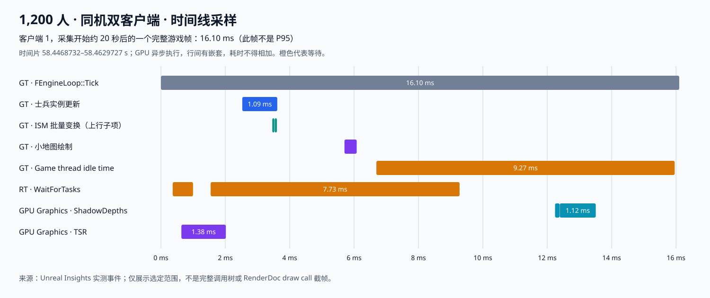

# 指挥官客户端性能剖析与相机勘误

2026-09-15。1,200 人持续移动、同机双客户端的主要限制在渲染链。游戏线程中，最大的已标记项目函数是 `AGuLiCommanderPresentationActor::RebuildLocalInstances`；小地图绘制其次。已经补采三份各约 40 秒的 Unreal Insights CPU/GPU 时间线，尚未采集 RenderDoc 的逐 draw call 截帧。

## 相同视角重采

沿用[容量报告](REPORT.md)的硬件、源码引擎、地图、在线增兵和折返路径：i9-14900KF、RTX4090、32GB，未 Cook 的源码 Editor `-game`，1920×1080/Epic，正式剔除距离。总人数为双方合计，未全选显示路径线，不保证全军同屏。只修正测量工具的相机锁定并增加显式 `-CaptureTrace` 入口，没有修改正式移动、渲染质量或人口上限。

三台客户端 CSV 的相机位置均为 `(-195886.1094, 110000, 59937.2383)`，方向相同，`View/Speed` 全部样本为 0。每台实际移动人数 P05=1,200，合法姿态捕获帧接收约 9.997Hz。服务器均约10Hz、无丢步。不存在并行编译或其他压测场景。

| 场景 | 整帧 P95 | 游戏线程 P95 | 渲染线程 P95 | GPU P95 | 本轮帧预算 |
|---|---:|---:|---:|---:|---|
| [一服一客](locked-profile-n1200-c1/analysis.json) | 11.064 ms | 8.324 ms | 11.041 ms | 6.802 ms | 60FPS通过 |
| [一服两客：客户端1](locked-profile-n1200-c2/analysis.json) | 18.572 ms | 9.333 ms | 18.564 ms | 16.691 ms | 30FPS通过，60FPS未通过 |
| 一服两客：客户端2 | 18.970 ms | 8.943 ms | 18.960 ms | 17.055 ms | 30FPS通过，60FPS未通过 |

整帧采用 `frames.csv` 去首秒口径；线程与GPU采用引擎 CSV，采集边界略有差异。不能把线程时间相加，也不能把 P95 倒数称为平均FPS。这些是带性能采集开销的单轮结果。

相同视角下，双客主要增加了GPU时间及渲染等待，游戏线程执行时间增长较小，支持“同机共享渲染资源影响明显”的判断。单客仍有渲染线程提交与等待成本，不能把所有场景统称为纯GPU瓶颈，也没有把双客FPS简单乘二估算分机容量。

## 哪些函数耗时

下表取双客客户端1。平均值是 Insights 总耗时除以游戏帧数；“自身”仅扣除已打点的子事件，仍包括未单独打点的内部函数，并非逐条CPU指令的独占采样。

| 函数或实际采样范围 | 平均包含子调用／帧 | 平均自身／帧 | P95 | 说明 |
|---|---:|---:|---:|---|
| [`AGuLiCommanderPresentationActor::RebuildLocalInstances`](../../Source/GuLiStrike/Commander/Presentation/GuLiCommanderPresentationActor.cpp) | 1.360 ms | 1.201 ms | 1.907 ms／次 | 约每帧一次；名册遍历、姿态消费、插值、客户端Mass镜像及实例整理 |
| [`UGuLiCommanderMiniMapWidget::NativePaint`绘制路径](../../Source/GuLiStrike/Commander/UI/GuLiCommanderMiniMapWidget.cpp) | 0.426 ms | 0.426 ms | 0.559 ms／次 | Widget Paint事件，约每帧一次；不是整个Slate系统 |
| `UInstancedStaticMeshComponent::CalcBoundsImpl` | 0.225 ms | 0.225 ms | 未单独导出 | 引擎边界计算，约每帧两次 |
| `UInstancedStaticMeshComponent::BatchUpdateInstancesTransforms` | 0.159 ms | 0.159 ms | 0.242 ms／帧 | 每帧两次，包含在实例更新的1.360ms中 |
| [`AGuLiCommanderHealthBarRenderer::Tick`中的UpdateInstances范围](../../Source/GuLiStrike/Commander/UI/GuLiCommanderHealthBarRenderer.cpp) | 0.111 ms | 0.111 ms | 0.151 ms／次 | 本轮可见血条数为0，不代表大量血条同时显示的成本 |

前两行及血条 P95 来自逐次CPU事件；ISM P95来自每帧CSV聚合，口径不同。客户端2相应实例更新为平均1.347ms、P95=1.877ms；小地图绘制平均0.427ms、P95=0.558ms。

实例更新的[直接调用树](locked-profile-n1200-c2/client1/insights/callees-presentation.csv)只有一个单独计时的子项——ISM批量变换。因而能确认约0.159ms在批量写入，其余约1.201ms在这个函数及未打点的内部路径中；尚不能给 `ConsumePoseChunks`、`EvaluateAuthoritativeTransform`、`UpdateClientMirrorEntity` 各自分配耗时。

源码还显示，移动时会复制/清空多组Transform数组、遍历完整名册，并在批量更新后调用 `MarkRenderStateDirty()`。调用树同时记录了 `CalcBoundsImpl`、`AddPrimitive (GT)` 和场景更新成本。后续优化应优先拆分这些阶段的计时，检查临时数组和场景代理更新链，再决定使用何种增量更新方式。这里没有把这些成本全部归因到同一个调用，也未实测任何优化收益。

其他引擎CPU范围：CSV中的UI平均1.700ms、P95=2.189ms，包含Slate/Viewport等多个入口；`WorldTickMisc`平均1.698ms、P95=2.277ms，与项目自有范围存在重叠，不能再叠加到实例更新上。`UpdateCoreCsvStats_BeginFrame`自身约0.256ms／帧属于这次采样环境的成本，不能当成玩法逻辑热点。

## 等待与GPU范围

双客客户端1渲染线程 `EventWait/Visibility` 平均8.373ms、P95=10.192ms。源码 `SceneVisibility.cpp` 中对应 `FVisibilityTaskData::ProcessRenderThreadTasks()` 的动态网格任务管线等待。因此不能描述为“可见性计算函数执行了10ms”，也没有证据把这段等待全部等同于GPU等待。

Insights中的 `Game thread idle time` 平均8.741ms／游戏帧，属于帧同步等待；不是另一块8.741ms游戏逻辑。`FRDGBuilder::CollectResources` 对应的CSV范围平均0.883ms、P95=1.111ms，包含子操作与任务等待。

GPU每帧范围来自剔除元数据后的引擎CSV。以下是整场景范围，不是某个士兵的渲染成本：

| GPU范围 | 双客客户端1平均／P95 | 双客客户端2 P95 |
|---|---:|---:|
| TSR超分辨率 | 1.822／3.045 ms | 3.117 ms |
| ShadowDepths阴影深度 | 1.583／2.606 ms | 2.943 ms |
| BasePass | 1.499／2.594 ms | 3.201 ms |
| Prepass | 1.425／2.476 ms | 2.838 ms |
| Lumen反射 | 0.804／1.394 ms | 1.384 ms |
| 体积雾 | 0.756／1.310 ms | 1.373 ms |

这些范围不能简单相加；另有未归类GPU时间。当前配置 `bUnitCastShadow=False`，不能把ShadowDepths直接归因于士兵投影。定位到具体地形、建筑、材质或draw call，仍需要额外的渲染资源级抓取，本轮没有这一证据。

## 时间片与原始采集



上图按“采集开始约20秒后的首个完整游戏帧”选取，并从[逐事件CSV](locked-profile-n1200-c2/client1/insights/frame-58.4468732.csv)绘制。是相同墙钟窗口下的选定事件，不是把CPU和GPU强行配为同一渲染帧；也不用于替代40秒分布判断。

- [单客40秒原始CPU/GPU时间线](locked-profile-n1200-c1/client1/client.utrace)，约457MiB。
- [双客客户端1时间线](locked-profile-n1200-c2/client1/client.utrace)，约272MiB；[游戏线程统计](locked-profile-n1200-c2/client1/insights/timers-gamethread.csv)、[渲染线程统计](locked-profile-n1200-c2/client1/insights/timers-renderthread.csv)、[游戏帧调用树](locked-profile-n1200-c2/client1/insights/callees-gamethread.csv)。
- [双客客户端2时间线](locked-profile-n1200-c2/client2/client.utrace)，约267MiB。
- [三份采样的结构化汇总](client-profile-locked.json)、[汇总脚本](summarize_client_profile.py)、[时间片绘制脚本](render_client_frame.py)。各trace目录保留导出命令和日志。

实际运行与编译均使用 `D:/UnrealEngine-5.7`。源码树没有现成Insights可执行程序，本次仅用已安装的 `C:/Program Files/Epic Games/UE_5.7/Engine/Binaries/Win64/UnrealInsights.exe`（5.7.4）离线解码，三份导出退出码均0；未运行Launcher Editor，也未覆盖项目模块。停止采集时有少量尾缓冲警告，原始日志保留；帧边界的计数可相差一两帧，不使用最后不完整帧作图。

UE5.7的统计导出器即使设置CPU `-threads` 仍包含GPU队列；源码 `TimingExporter.cpp:927–930` 明确启用所有GPU队列。汇总脚本通过单独GPU导出识别并排除完全相同的GPU行，避免误把GPU `SceneRender` 列为CPU热点。原始导出CSV保持原样。

## 对上一轮结论的勘误

旧采样器每0.5秒重新定位相机，但没有关闭相机移动Tick。`render-final-n800-c2`两客以及 `render-online-final-n1200-c2`客户端2的CSV存在持续相机位移，速度中位数约91,745cm/s。因此旧报告“相同固定视野”的说法不成立，旧单／双客差值不能单独证明共享显卡造成了全部退化。源码输入路径与持续移屏、定期重定位相符；旧采样没有记录输入来源，不能确定每次是鼠标边缘还是键盘。

本轮在压测相机首次定位后禁用其Tick，并以CSV逐帧位置/速度验证锁定；正式相机逻辑不变。先前观察到的帧耗时、真实移动人数、服务端预算、晚加入失败和2,000人在线姿态带宽问题仍有效，只撤回错误的镜头对照条件和过强的原因归纳。旧数据保留于[相机复核数据](client-hotspots.json)。

另修正CSV分析器：UE在文件尾附带完整表头和含1920/1080的元数据。旧解析会将部分元数据混入Fog/FX等列。现在以最后的完整 `EVENTS` 表头解释列，只统计 `FrameTime` 为有限数值的数据行。复核旧五台渲染客户端的FrameTime、GameThreadTime、RenderThreadTime和GPUTime统计均未改变；GPU子范围使用修正后的值。

## 构建与验证边界

- [源码Editor构建](editor-build-client-profile.log)与[源码Game构建](game-build-client-profile.log)均成功；[BuildId](editor-build-id-client-profile.json)一致：`26d441ba-b96a-4e7b-b104-c2c6cd3e663c`。
- 文档索引build、全量check和split合同检查均退出0；check为0错误、11项既有尺寸/任务数提示。[执行结果](profile-document-validation.json)与[旧归档正文哈希核对](archive-erratum-body-hash.json)已保存。
- 本轮仅调整采样工具和分析脚本，运行原已授权的1,200人一客／两客场景并增加性能采集。没有新增自动化用例或修改测试断言。前一轮61项既有用例通过是历史证据，本轮没有重新执行。
- 尚未测量打包分机、全军同屏、路径线全显示、全军血条、交火及长时多轮条件；未取得匹配30Hz基线。当前数据不证明客户端最大人数，也不提供10Hz或后续渲染优化的节省百分比。

复现时使用新的Label防止覆盖旧证据：

```powershell
./Scripts/run_commander_move_stress.ps1 -Population 1200 -Clients 1 -Seconds 40 -JoinBeforePopulation -CaptureTrace -Label profile-repeat
./Scripts/run_commander_move_stress.ps1 -Population 1200 -Clients 2 -Seconds 40 -JoinBeforePopulation -CaptureTrace -Label profile-repeat
```
