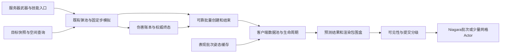

# 非Mass飞行弹丸六项性能优化 — 分析与开发方案

## 1. 结论与范围

采用普通 C++ 数据池、集中预测和现有 Niagara 批次，保持单一 `GuLiStrike` 模块。先减少空Actor变换、重复查询和提交，再迁移客户端预测数据；服务器已有数据池按实测优化。

用户本轮要求分析及开发文档。方案和目标均待实施，不代表优化收益；`not_run` 指优化后的验收尚未执行。

覆盖士兵、玩家地面机甲、僚机和Ship的弹丸表现及服务器弹池局部优化。重防号`WM01 / UnitTypeId=2`与玩家Ground席位分开；保留`WarMachine`标识。

前置合同以[20261004 飞行物启停实施记录](20261004-飞行物批量启停同步与实际时间网络预算.md)和[对应需求](../RequirementDocument/20261004-飞行物批量启停同步与实际时间网络预算.md)为准：飞行物只可靠批量同步创建/结束，周期状态只更新服务器本地活跃注册表；一次性加入补建、去重、墓碑与 Epoch 清理保留。每批最多 16 条、编码载荷最多 1000 字节。本次不恢复位置纠偏 RPC 或 Actor 移动复制。

[20260906 非Mass架构方案](20260906-非Mass大规模弹道与特效架构.md)可作分层背景，但其中机枪 Hitscan、飞行低频网络校正等历史设计不能覆盖当前实际飞行弹池和 20261004 的启停合同。

## 2. 基线、证据和未确认项

### 2.1 已有采样

日期为 2026-10-09，时间使用 Asia/Shanghai。环境是 Win64 Editor PIE，源码版 UE 5.7.4，地图 `/Game/Maps/LVL_CommanderMassPrototype`，同一进程内一个 Dedicated Server 和两个客户端；硬件 i9-14900KF、RTX 4090。质量档均为 3。此环境包含三套 World 的游戏线程工作，不等同于单客户端或打包性能。

两轮 15 秒有效 CSV 共约 30.15 秒、681 帧：平均帧时间 42.95 / 45.68 ms，约 23.3 / 21.9 FPS；GPU 约 12.5 ms。共同瓶颈是游戏线程。场景持续自动增援和战斗，两个窗口不能充当优化前后对照。

| 指标 | 数值与口径 | 可以证明的范围 |
|---|---|---|
| 08:47:25 CSV GameThread | 平均 45.70 ms，P95 56.74 ms，330 帧 | 同进程多 World 的整体游戏线程成本 |
| 对齐 Insights 战斗表现 | inclusive 1.265 ms/引擎帧，exclusive 0.760 ms，323 帧 | 两个客户端合计，包含多类表现；不是纯弹道成本 |
| 同窗口飞行预测 | inclusive 0.375 ms/帧，exclusive 0.180 ms | `AdvanceFlight` 范围，包含其 Actor 变换子调用 |
| 08:50:17 的 60 帧补充统计 | 战斗表现 inclusive 3.637 ms/帧 | 后续不同负载窗口，不能与上一窗口相加或直接比较 |
| 同一补充窗口飞行根组件移动 | 两客户端合计约 737 次/帧 | 说明 Actor Tick 关闭后，集中推进仍有组件移动成本 |
| 08:47:25 客户端池容量 | 每客户端 1280 个 FlightVisualActor | 容量包含空闲对象，不代表 1280 枚同时活跃 |

父子inclusive不能相加。0.375ms不包含全部目标解析、激光填充、提交和生命周期工作；当前优先级尚无前后收益数据。

原始入口：[PIE 分析报告](../../outputs/performance/PIE耗时分析_20261009.txt)、[Insights 汇总](../../outputs/performance/20261009-084725-confirmed/trace-summary.json)、[CSV 汇总](../../outputs/performance/20261009-084725-confirmed/csv-summary.json)、[补充统计](../../outputs/performance/20261009-084725-confirmed/stats-average.txt)。

### 2.2 当前路径

| 类型 | 服务器现状 | 客户端现状 |
|---|---|---|
| 机枪直线弹 | `GuLiProjectilePoolSubsystem`：Slots、ActiveSlots、ById；士兵 5 Hz，玩家/僚机由 30 Hz 运行时驱动 | 解析位置；多数用激光固定槽批次，玩家 Ground 还使用独立 Niagara 组件 |
| 逻辑追踪导弹 | `GuLiLogicalMissileSubsystem`：TArray、30 Hz，无逐弹 Actor | 本地预测及激光槽表现 |
| 抬升/曲线导弹 | `GuLiCombatEffectRuntimeSubsystem`：TMap、30 Hz，无逐弹 Actor | FlightVisualActor 预测；重防号用 GPU 导弹集群，其他定义可走独立 Niagara |
| Ship 弹丸 | 服务器 Actor、ProjectileMovement、碰撞及账本桥接 | 本地 FlightVisualActor 网格和静态环境反弹预测，不负责伤害 |

本轮未查询 Niagara 二进制资产图、派生蓝图完整回调或做新的运行采样。固定粒子数量、GPU 缓冲实际传输量、各来源弹丸比例和各阶段 P95 仍需后续专项确认。源码快照与 SHA-256 见[分析源清单](../../outputs/performance/20261009-nonmass-plan/analysis-source-manifest.json)。

## 3. 分层与模块责任

| 责任 | 现有归属 | 开发边界 |
|---|---|---|
| 网络与稳定身份 | `GuLiFlightEvent.*`、`GuLiFlightReplication.cpp`、ReplicationComponent | 继续使用 EffectId/ShotId、Epoch、Sequence；不发送本地池句柄 |
| 客户端生命周期与预测 | PresentationSubsystem、ClientFlightPresentation、FlightVisualActor | 在当前模块内增加私有预测数据与池实现；反向依赖 Mass 不是本次需要 |
| 姿态与枪口来源 | 已注册 Pose/Muzzle Provider | 保留稳定句柄回调；缓存不能绕过表现时间和 Provider 所有者有效性 |
| GPU 激光提交 | `GuLiCombatEffectLaserPresentation.cpp` | 槽位、灯光预算、终止淡出及清理合同不变 |
| 重防号导弹集群 | `GuLiMissileClusterPresentation.*` | 保留 64 槽批次、Generation、存活提交、历史尾迹和既有 LOD |
| 局部表现裁剪 | 当前 CommanderLOD 视图与效果消费接口 | 只作用于飞行表现消费者，不改变单位、矿点和危险预警的全局可见规则 |
| 服务器碰撞 | ProjectilePool、LogicalMissile、CombatEffectRuntime、Ship Ledger Bridge | 先测再优化；保留不同查询类型、目标运动历史和结算顺序 |

保持现有模块/依赖；私有预测与索引用普通C++类型。UObject引用留在UPROPERTY或明确的GC持有机制中，资产配置/Blueprint诊断按需反射，不换成无生命周期保证的裸指针。

## 4. 六项优化分析

### 4.1 空 Actor 变换：先消除场景工作，再迁移数据

**源码事实。** [ClientFlightPresentation](../../Source/GuLiStrike/Gameplay/CombatEffects/GuLiClientFlightPresentation.cpp)对被接纳的飞行事件获取池 Actor；[FlightVisualActor](../../Source/GuLiStrike/Gameplay/CombatEffects/GuLiFlightVisualActor.cpp)关闭 Actor Tick，但 `AdvanceFlight` 最后仍无条件 `SetActorLocationAndRotation`。只有 `ShipVisualClass` 路径从类默认对象加载实际网格。Presentation 的 Tick 每帧先推进，再处理可见性和 Niagara 路由。

**第一步。** 在激活时记录“是否有实际网格”的结果；纯 Niagara/激光对象继续更新 Prediction 和 PredictionTime，但不移动场景 Actor。仍有网格的 Ship 弹丸沿当前路径。模型绑定、首次显示和权威终止点更新需分别核对，不能直接删掉所有 SetActorLocation 调用。

**第二步。** 把 Recipe 的冻结运动部分、Prediction、PredictionTime、bStopped 移入 `FGuLiFlightPrediction` 私有数据，由统一函数推进和求显示位置。数据池服务所有飞行物，网格 Actor 池只承载需要网格的表现。迁移后激光头、速度方向、导弹集群 Submit 和终止点都从同一份预测结果读取。

保留直线解析求值、曲线/Ship 的 1/30 秒步长、残余时间插值、Ship 静态几何 Sweep、反弹摩擦/停止规则。客户端不增加伤害回调。数据预测不能依赖网格 Actor 是否显示；查询参数中的被忽略 Actor 在脱离 Actor 后需改为明确的等价对象集合，不能留下失效的 `this` 假设。

**收益与限制。** 第一步降低组件移动，不减少池 Actor 数、组件注册或 GC 占用。第二步才减少这些对象；1280 是历史池容量，不能据此承诺同量活跃对象的收益。

**完成判据。** 空网格飞行对象的逐帧 Actor 变换次数为 0；原预测位置/速度、终态和网格弹行为保持；另报数据池容量/活跃数与网格 Actor 数，保留旧 `ClientFlightActor*` 计数的字面语义，不把数据槽冒充 Actor。

### 4.2 查询缓存：按表现批次去重，失败也缓存

**源码事实。** [PresentationSubsystem](../../Source/GuLiStrike/Gameplay/CombatEffects/GuLiCombatEffectPresentationSubsystem.cpp)的 `ResolvePose` 已有 ShipPoseCache 弱 Actor 缓存，但缓存失效或找不到 Ship/Ground 目标时，会遍历世界 Actor；未命中的结果没有缓存。每枚追踪弹重复调用 ResolvePose。Tick 还逐弹调用软引用解析和 `UsesMissileClusterRendering`，后者在[Definition](../../Source/GuLiStrike/Gameplay/CombatEffects/GuLiCombatEffectDefinition.cpp)中查 DataTable 并比较资源路径。

**方案。** 在每个 World 的一次表现更新批次开始时采集服务器显示时间，并建立短期 PoseCache：键为完整 TargetHandle，值含成功/失败、Transform、UnitTypeId。相同句柄在该批次只实际解析一次，包括查找失败。结束批次清空或更新批次编号；BeginEpoch、Provider 注册/注销、World 销毁时失效。Tick 外 `TryGetWeaponAim` 等调用不直接沿用旧批次结果。

枪口缓存单独设计，至少区分来源、Slot、MuzzleIndex、机械/VAT 播放状态和实际采样时间。不能把同一单位的两个枪口、不同历史射击时间合成一项。[MechanicalMuzzlePresentation](../../Source/GuLiStrike/Gameplay/CombatEffects/GuLiMechanicalMuzzlePresentation.cpp)使用 `MechanicalPoseTimeSeconds` 对齐后坐力，并已有一次性 0.12 秒发射视觉偏移；这些时序保留。

创建飞行物时缓存已解析 Definition、渲染路由和稳定样式参数。资产/Catalog/表重载及资源可用性改变需明确失效路径；尚未就绪的资源仍允许后续恢复。已加载软引用的 LoadSynchronous 不等于每帧磁盘加载，需分别统计首次实际加载和后续查表，不能按函数名认定所有调用都阻塞。

进一步可按种子预计算曲线系数：[CombatEffectTypes](../../Source/GuLiStrike/Gameplay/CombatEffects/GuLiCombatEffectTypes.cpp)逐步重建FRandomStream并求高度、侧偏、相位和频率。缓存须保持随机取值顺序、零曲线分支及冻结Motion。

**已有缓存不重复建设。** GetCatalog 已缓存；MissileCluster 的 VisualProfiles 已缓存；CommanderLOD 的 EnsureViews 已按 GFrameCounter 缓存相机。优化针对实际重复项。

**完成判据。** 一个表现批次内每个 TargetHandle 的底层姿态解析不超过一次；失败目标的全场发现扫描不随追踪它的弹丸数增长。跨 World/Epoch、Provider 切换、双枪和历史姿态不串缓存。随机轨迹同种子、同输入保持原结果；此项 CPU 收益尚需分项测量。

### 4.3 活跃数组：先分流遍历，再做紧凑预测池

**源码事实。** Visuals 是混合效果 TMap；Presentation Tick 扫一遍，QueueSustainedGunfire 和 UpdateLaserPool 等还有针对同一容器的遍历。服务器直线弹已经有 Slots、FreeSlots、ActiveSlots、ById；逻辑导弹已有 TArray，不能重复宣称“首次引入对象池”。当前采样未把 TMap 查找/复制单独量化为热点。

**阶段一。** 生命周期事件维护 Flight、Laser、Field 等活跃索引，避免激光提交遍历范围场等无关效果。保持当前公共查询和 Visuals 冷数据结构，先统计每类访问数量。索引用稳定句柄或 ID，不长期缓存 TMap 元素地址；容器增删和回调会使地址假设失效。

**阶段二。** 若遍历/拷贝被实测确认，预测池采用稳定 SlotHeader（Generation、DenseIndex）＋FreeSlots＋DensePredictionData＋IdToHandle。RemoveAtSwap 后更新被移动项的 DenseIndex；外部句柄仍指向稳定槽，所有回收操作同时校验 Generation 和 Epoch。将位置、速度、预测时间等热数据与资源、网络身份、提示和组件引用等冷数据分开。

直线弹集中解析求值；追踪/曲线弹集中读取目标缓存再推进；反弹弹独立批次。RenderLocation 在主推进阶段计算一次，供激光和导弹消费。结束中的激光仍需保留现有 0.04 秒淡出状态，不等同于立即空槽。

当前预测独占约0.180ms，尚不足以证明并行划算。第一阶段在游戏线程集中处理；未来数学并行与UObject/Provider、Niagara、世界查询及伤害回调分别遵守线程约束。

**完成判据。** 生命周期操作与所有活跃索引一致；重复创建/结束、槽复用、清局和回调中增删不会错指。每类循环访问数量接近该类活跃数，稳态工作缓冲复用。只有测得总 CPU 收益超过维护开销才扩大容器重构范围。

### 4.4 Niagara 提交：静态/动态分离，控制实际工作量

**源码事实。** [LaserPresentation](../../Source/GuLiStrike/Gameplay/CombatEffects/GuLiCombatEffectLaserPresentation.cpp)的 `LaserBlockSize=1024`。每帧对所有批次整块初始化颜色、尺寸和灯光状态，再扫描激光、调用 11 组数组 setter、设置 Bounds；可见数少时仍保留固定槽合同。[MissileClusterPresentation](../../Source/GuLiStrike/Gameplay/CombatEffects/GuLiMissileClusterPresentation.cpp)每批 64 槽，Upload 重写多项样式、时间、数组和 Bounds；StartBatch 内 Upload 后，同一 EndFrame 还会调用 Upload。

**无需改资源的第一步。** 为批次记录活跃槽和上一帧使用槽；清理退出可见集合的槽及上一帧选中的灯光，保留空槽零透明/零启用合同。空批次在完成释放和清理后跳过数组构建。静态样式只在组件创建、质量切换、样式/配置失效时写；动态数组按内容或修订号判断是否需要提交。StartBatch 仍先配置再 Activate，相同帧相同修订的数据避免二次上传。

Laser 的颜色、长度、淡出、枪口寿命、最近灯光选择会动态变化，不能全部视为静态。特别是本帧灯光数变成 0 时，必须先关闭上一帧的槽。MissileTime、交接权重和退役尾迹的时间继续更新；没有位置变化不等于没有时间变化。固定 Bounds 只有确认包围盒未变化时才跳过 setter。

UE5.7 本地 ArrayFunctionLibrary 有完整数组和单索引 setter，但“CPU 只改脏槽”不等于“GPU 仅上传脏范围”。不为大量槽逐个调用 setter，也不把调用次数下降自动当作传输字节下降；需分别量化 CPU 数组整理、setter 调用和实际 GPU 更新。

**需要资源核对的后续选项。** 如果固定 1024 槽的空置/提交成本仍高，检查 Niagara 的粒子 Spawn、槽索引和数组容量合同后，再比较更小批次或更紧凑的活跃布局。更小批次可能增加组件数、System/Emitter CPU 开销；不直接把常量改成 64。玩家 Ground 的逐弹 Niagara 和高频命中装饰可分别评估共享系统，保留现有枪口、颜色、比例、生命周期与爆炸关键层。

Epic 建议通过减少系统实例及复用活跃系统降低开销；池化减少分配，但重激活仍有成本，GPU 粒子也保留 System/Emitter 的 CPU 工作。[Niagara 5.7 性能说明](https://dev.epicgames.com/documentation/en-us/unreal-engine/scalability-and-best-practices-for-niagara?application_version=5.7)

**完成判据。** 退出槽无残留弹体/灯光，复用槽无旧颜色/尾迹；静态参数不无条件逐帧重写，同帧同修订无重复完整提交。诊断同时记录活跃/容量、setter 数、CPU 输入字节估算和构建/提交时间；字节估算不冒充 GPU 带宽测量。涉及 Niagara 资源的阶段按项目特效制作流程及[美术规范](../RequirementDocument/GuLiStrike美术规范.md)验证，纯技术修复不自动重配色。

### 4.5 表现裁剪与频率分级：不把存活判断当成提交判断

**源码事实。** [CommanderLOD](../../Source/GuLiStrike/Commander/Presentation/GuLiCommanderLODSubsystem.cpp)的 ShouldRenderWorldEffect 在指挥官近景/战术相机下按相机层级直接放行，非指挥官视图主要看距离；它不对该点做视锥检查。相机本身已缓存。重防号导弹集群则已经使用覆盖近期历史的 Bounds、视锥、LOD、粒子/完整尾迹预算和交接，不能重复计算成新增能力。

**方案。** 新增或复用飞行表现专用 Bounds 查询：激光覆盖整段、弹体包含实际尺寸和短期运动范围，拖尾包含当前及历史尾迹。不能只用弹头点，避免弹头出屏后屏内激光/烟尾被截断。局部策略不改变全局单位显示和关键地面危险预警。屏幕边缘加适当余量及迟滞，减少反复重激活。

近处保持每帧显示和提交；远处先降低装饰复杂度、灯光和渲染数据提交频率，再评估低频样本的插值。直线位置可随时解析；追踪和反弹的固定步预测先持续运行，不能离屏冻结后重新可见时一次补跑整个寿命。资源释放只影响表现，数据状态仍接收终止、更新墓碑并清理预警。

**关键生命周期合同。** MissileCluster BeginFrame 每帧清 bSubmitted；EndFrame 把“未提交且未结束”的槽标为 Finished。Submit 间隔超过 0.20 秒还会改变 Generation。故不能通过跳过 Submit 实现降频。需继续每帧提交/标记存活，或明确拆分存活心跳、数据变更和 Upload 调度；EndFrame、终止通知、尾迹时间和 Generation 合同仍每帧维护。第一阶段保留每帧 Submit，只优化数据构建和冗余写入。

**完成判据。** 核心弹体/激光进入视野即时可见，屏内历史尾迹不断裂；远近切换不重播枪口，不产生假结束或旧槽复活。重新可见无积压预测尖峰；离屏结束和清局后数据/组件都回收。频率值是后续待测配置，本文不直接把所有表现降到 10/15 Hz。

### 4.6 服务器碰撞组织：保留运动历史与结算语义

**源码事实。** [ProjectilePool](../../Source/GuLiStrike/Gameplay/CombatEffects/GuLiProjectilePoolSubsystem.cpp)已有空间网格、相对移动球体窄相位、每域一次的 World ignore 集合和独立 StepHandles。士兵 5 Hz 保留完整 200 ms 目标运动历史，玩家/僚机走 30 Hz 域。Step 先推进后者，再按时机推进士兵；每域 BuildSpatialIndex 重新抓取目标并建格子，候选用 TSet 去重，每枚有效弹做世界 Sweep。Retire 先从容器摘除再伤害回调，回调可能换局。

[LogicalMissile](../../Source/GuLiStrike/Battle/Combat/GuLiLogicalMissileSubsystem.cpp)使用 Visibility 通道 Sweep；Runtime 曲线弹查 WorldStatic；数据弹查 WorldStatic/WorldDynamic 并忽略已注册战斗对象；Ship 还有 ProjectileMovement 及账本桥接。不同查询不是同一个合同，不能为了共享工具统一改通道或删除环境阻挡。

**第一步可行改动。** 把 Snapshot、GridBuild、CandidateQuery、NarrowPhase、WorldSweep、Commit/Retire 分开计时。维护域活跃索引/计数，减少 ContainsByPredicate 及按域筛全列表；复用已分配工作缓冲。若候选 TSet 明显昂贵，可评估目标索引访问戳＋候选数组，并处理重建、编号溢出和固定的首次命中平局规则。

**快照复用限制。** “相同 Now”不意味着目录仍相同。第一个域结算后可发生死亡、注册/注销、相位变化或 Epoch 切换；士兵域原本会读取新状态。Ledger 当前接口没有覆盖全部这些变化和姿态变化的全局修订号。因此第一阶段不跨结算域盲目复用 Snapshots；只在同一只读阶段复用确定不变的结果。后续若建立可靠失效/修订合同，再共享当前快照读取，两个域的 PreviousTargets、PreviousTime 和扫掠 Bounds 仍分开。

**并行限制。** 先冻结只读数据再批量计算数学候选，权威目标复核、世界查询和伤害提交保留当前安全顺序。纯数学并行不自动授权 UObject/Provider 或伤害回调并行。若批量预计算首目标后来死亡，需按原规则重新选择/回退，不能提交过期结果。每次结算前核对 Generation、Epoch、目标和源租约；换局立即终止旧批次。

**完成判据。** 移动目标穿越 200 ms 线段仍命中；遮挡先于目标、环境与动态物体阻挡、同一时刻平局、来源死亡后已接纳弹的冻结伤害来源、重复回调及跨局防串击保持。域频率、Sweep 半径/过滤和服务器权威不变。碰撞收益以分阶段 ms、候选数、Sweep 数和结算结果共同证明。

## 5. 开发顺序与任务清单

阶段A优化当前链路，B迁移预测池，C推进表现分级、资源合同和服务器优化。逐项实施/采样；任务清单不授权本轮运行或新增自动化测试。

- [x] 核对六项的现有调用链、已有优化和网络/时序约束，记录源码快照。
- [x] 对齐此前采样口径，区分容量、活跃数和不同时间窗口。
- [ ] A0：增加聚合阶段耗时/调用数量诊断，给出字段定义；默认关闭额外日志。
- [ ] A1：跳过空网格飞行 Actor 的逐帧变换，保留预测及 Ship 网格路径。
- [ ] A2：实现每 World、每表现批次的成功/失败姿态缓存及完整失效处理。
- [ ] A3：缓存固定渲染路由/配置，移除同帧同修订 Niagara 重复提交；动态时间继续更新。
- [ ] A4：记录阶段 A 的功能检查与同负载收益，确定是否进入数据池迁移。
- [ ] B1：抽取纯数据预测器，保留曲线、反弹、插值和冻结随机规则。
- [ ] B2：建立飞行数据池和稳定句柄；仅需要网格的弹保留 Actor 池。
- [ ] B3：维护分类活跃索引、热/冷数据和生命周期回调安全，复用渲染结果。
- [ ] B4：在测量支持时预计算曲线系数；同输入轨迹一致后再使用。
- [ ] C1：实现飞行专用 Bounds 裁剪，不改变单位或危险预警规则。
- [ ] C2：把存活标记与渲染提交调度分开，确认尾迹和 Generation 后才开放降频。
- [ ] C3：核对激光/其他 Niagara 资产容量合同，按测量决定更小批次或共享系统。
- [ ] C4：分项测服务器碰撞，按结果优化域索引和候选去重；条件满足后才考虑快照复用。
- [ ] 完成实际改动的代码静态检查、GC/依赖/接口及差异核对并记录结果。
- [ ] 作为实施最后一步，在对应 Map 准备并保存验证场景，回读相关实体数据后交付玩家。
- [ ] 按用户后续明确指定的运行范围采样/验收并记录结果，保留未覆盖边界。

## 6. 诊断与性能验收计划

### 6.1 分项诊断

复用现有 TRACE/CSV 及 GetCounters；新的日志仅聚合输出，不逐弹刷日志。计数按 World 分开，记录实际活跃数、可见数及来源比例。

| 范围 | 应记录的量 | 判断用途 |
|---|---|---|
| 预测与变换 | 直线/曲线/反弹活跃数，固定步次数，预测 ms，空/实网格变换次数 | 验证第1/3点，识别补算尖峰 |
| 查询 | 唯一句柄数，成功/失败命中，底层 Provider 次数，Actor 发现扫描次数/ms | 验证第2点，区分已有缓存和新去重 |
| 数据遍历 | 各列表访问数，分配/扩容次数，池活跃/容量，清理队列长度 | 验证分类和数据布局是否值得 |
| Niagara | 数组构建/提交 ms，setter 次数，批次活跃/容量，CPU 输入字节估算，组件数 | 验证第4点；GPU传输另测 |
| 裁剪/调度 | 视锥/距离/屏占比拒绝数，渲染提交数，存活心跳数，重激活数，重入峰值 | 验证第5点及生命周期没有混淆 |
| 权威碰撞 | 目标数、网格数、候选访问/去重后数量，各阶段 ms，Sweep 数，命中/阻挡/过期/拒绝数 | 验证第6点，避免只看总 Tick |

共享阶段与子函数 inclusive 指标分开，不求和成总帧成本；变更前后诊断边界保持一致，避免把工作移出旧计时范围就宣称加速。

### 6.2 受控对照与目标

后续采样沿用 `/Game/Maps/LVL_CommanderMassPrototype`、Win64 Editor PIE、同一 Dedicated＋两个客户端及固定镜头/视口/质量；单客户端或分进程结果单列。正式构建使用源码引擎 `D:/UnrealEngine-5.7` 和 `GuLiStrikeEditor Win64 Development`；本轮未构建或核验二进制配置。

工况分静默、直线、曲线、Ship反弹和混合战斗；500枚仅为既有受控负载。固定活跃量、来源占比、目标运动和相机，建议热身10秒、采集至少30秒、三个成对窗口，记录平均/中位/P95及最高负载帧。自动生产造成负载漂移时先校正场景。

建议阶段目标为客户端表现平均/P95各下降至少10%，整帧无超出基线波动的退化；不是已证实收益或60FPS承诺。基线波动达到该量级时先校正场景。第4节调用数量和功能合同均须满足。

1.265 ms与3.637 ms来自不同负载，不混用为绝对预算。各World和整个进程分别报告，不从Actor容量或理论复杂度换算FPS。

### 6.3 功能核对矩阵（实施后待执行）

| 工况 | 保持的结果 | 重点项 |
|---|---|---|
| 直线弹与快速移动目标 | 原寿命、散布、命中点及5/30Hz判定 | 第1/3/6点；200ms相对扫掠 |
| 曲线抬升/追踪，目标死亡或销毁 | 原随机轨迹、目标丢失/终止规则和无重复全场发现 | 第1/2/3点 |
| Ship 多次反弹/停止，环境及战斗目标碰撞 | 原网格方向、静态预测及服务器结算 | 第1/6点；蓝图回调需核对 |
| 双枪、机械/VAT后坐力、历史姿态 | 枪口、发射偏移与弹道时序一致 | 第2/3点；缓存键和时钟 |
| 临界屏幕边缘、弹头离屏而尾迹在屏内 | 激光整段/尾迹可见，迟滞不闪烁 | 第4/5点 |
| 远近切换、离屏结束、关闭/恢复特效 | 无假结束、补算尖峰、旧灯光或尾迹残留 | 第1/4/5点 |
| 批次空→非空，槽位复用、灯光数归零 | 新槽正确初始化，旧槽清零，时间持续 | 第3/4点 |
| 重复创建/结束、延迟终止、加入补建、Epoch切换 | 墓碑不复活、不重播旧枪口、旧局不伤新局 | 所有项；不新增周期位置同步 |
| 来源死亡、结算回调中换局或生成对象 | 冻结来源租约与原顺序生效，旧批次安全中止 | 第3/6点 |

复用现有诊断和入口，不新增自动化框架/测试文件；矩阵全部待执行。

## 7. 静态检查与场景交付

**本轮完成：** 核对21个源码及3篇合同、复核旧采样并留档方案和哈希。写入后执行索引构建与全量文档检查，见[验证记录](../../outputs/performance/20261009-nonmass-plan/document-validation.json)；不等于优化代码或运行验收。

**实现静态检查：** 核对时间/精度、GC持有、Generation/Epoch、交换删除索引、回调重入、墓碑、数组清理、查询过滤及复制/依赖边界，只覆盖实际改动。

**编译与运行：** 本轮纯文档不适用；后续按项目单独授权和指定范围执行。旧PIE不能验证未实施的优化。

**对应Map：** `/Game/Maps/LVL_CommanderMassPrototype`。历史四来源入口、`FlightEventsQAOrigin`标记及`FlightEventsQA_BounceWall`供复用，本轮未回读。`gs.Flights.Load 500 30`需要真实四来源和敌方目标；会启动游玩的准备脚本不属于静态检查。

**场景交付：** 作为实施最后一步，布置来源/目标、障碍、观察点和诊断入口，保存地图/资产；回读相关实体的所属Map、数量、变换、引用、碰撞和入口。旧记录不能替代本次核对。

**玩家步骤：** 观察四来源直线/追踪/反弹，开火时切换镜头及屏幕边缘，再核对目标销毁、换局、槽复用和中途加入。预期见矩阵，性能另采集；静态检查、场景保存和实体核对完成后进入待玩家验收。

纯方案没有新的玩家可观察效果，本轮不建无关场景，开发保持planned。

## 8. 风险、回退与结果入口

各项风险和完成判据见第4节。缓存异常回退原Provider；数据池分阶段迁移并保留旧冷数据；数组清理异常回退完整提交；降频异常恢复逐帧Submit；碰撞异常恢复原域历史/结算路径。各系统与整帧同时观察，六项不覆盖UI等全部热点。

阶段A/B/C分别交付范围与证据，回退只作用于局部实现。GPU直线解析显示需另核对Niagara合同和终止/时间精度，暂不并入首轮。

结果入口：[分析源清单](../../outputs/performance/20261009-nonmass-plan/analysis-source-manifest.json)、[文档验证记录](../../outputs/performance/20261009-nonmass-plan/document-validation.json)、[本轮增量归档](../Archive/20261009-非Mass飞行弹丸六项优化分析交付.md)。
